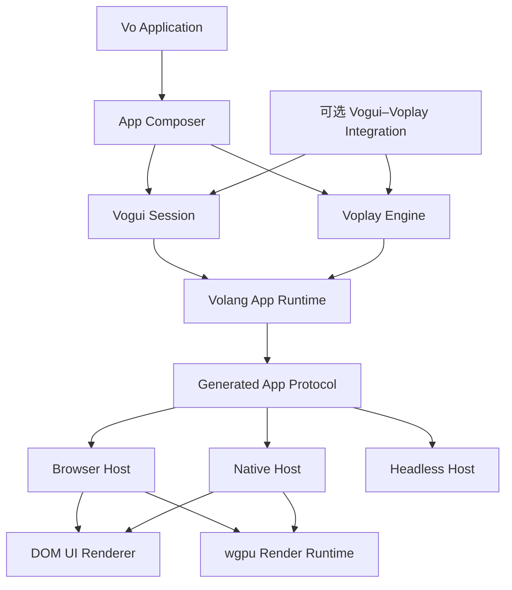
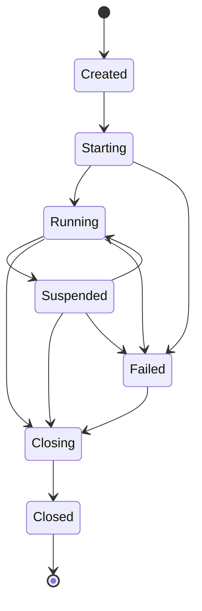
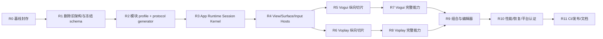

# Vogui 与 Voplay 全量重写：目标架构与完整开发计划

日期：2026-07-22

状态：重写前设计冻结候选

范围：Volang App Runtime、模块与产物模型、Vogui、Voplay、浏览器与原生宿主、测试、CI、发布和文档

## 1. 文档定位

本文定义 Vogui 与 Voplay 全量重写的目标架构、责任边界、核心协议、实施顺序和最终验收标准。开始实施后，本文作为跨仓库总设计；各仓库的局部设计只能细化本文，若改变本文中的依赖方向、所有权或协议原则，需要先更新本文并记录 ADR。

现有实现已经验证了大量产品需求，包括 Volang island、Vogui 语义控件、Voplay retained rendering、物理、资产、输入、多视图、浏览器 WebGPU 和 macOS Surface。重写会保留这些需求和验证经验，旧内部 API、旧协议、旧中间层和旧测试不承担兼容义务。

设计优先级固定为：

1. 所有权和关闭顺序清晰。
2. 一项能力只有一套正式实现。
3. 高频路径的成本与有效变更相关。
4. 公共概念少，组合路径清楚。
5. 浏览器与声明的原生平台共享同一语义。
6. 构建 profile 能真实移除依赖、代码和产物。
7. 错误可以分类、隔离、恢复和观测。
8. `vogui.Run(App)` 与 `voplay.Run(Game)` 保持易用。

## 2. 已冻结的架构决策

以下决策在重写开始前直接冻结，避免开发过程中反复形成多套骨架：

1. Volang 的 App Runtime 是共享运行基座，Vogui 与 Voplay 平级依赖它。
2. Voplay 删除对 Vogui 的直接依赖；Vogui 也不依赖 Voplay。
3. UI Overlay、游戏画面和编辑器通过 `Window -> View -> Surface` 组合。
4. 基础组合不要求额外框架依赖；高级联动放进独立集成模块。
5. 每个 App、UI、Engine、World、Renderer、AssetServer 和 AudioMixer 都有实例 owner。
6. 删除 active runtime、默认 backend selector 和其他进程级可变单例。
7. 共享设备或缓存必须由宿主显式创建并注入，生命周期通过普通所有权管理。
8. App Runtime 使用统一的 Session 与带类型 Channel；删除 GUI 专用事件 ID 和 Session 类型分支。
9. 共享 envelope、Vogui 协议和 Voplay 协议全部由机器可读 schema 生成 Vo、Rust 和 TypeScript 定义。
10. 协议热路径使用有界二进制编码；JSON 只用于诊断、离线报告和人工可读资产。
11. Vogui 使用实例化应用会话、不可变 UI 树、keyed reconciliation、事务化 patch 和持久事件身份。
12. Vogui 删除动态 `~>` 生命周期、全局 handler registry、全树缓存 marker 和 Preact 根渲染器。
13. Vogui Web 核心采用直接 DOM patcher；高级 widget 可以在隔离 widget 节点内部使用第三方实现。
14. Voplay 使用 `Engine + World + Schedule + subsystem projections`，删除 `State.FixedUpdate/Update/Draw` 作为核心模型。
15. Voplay 的 Vo World 保存游戏权威状态；物理、动画、音频和渲染各自保存面向子系统的投影。
16. Voplay 的稳定场景通过 change tracker 和 dirty queue 提取，禁止每帧全场景扫描和完整重编码。
17. 固定模拟 tick、展示 frame 和 GPU present 是三个独立时序。
18. Renderer 消费 `RenderWorld`，渲染路径固定为 Extract、Prepare、Cull、Batch、RenderGraph、Present。
19. 多视图与 RenderTarget 从第一版 RenderWorld 和 RenderGraph 开始即为基础类型。
20. Voplay 拥有游戏音频混音；共享运行时只提供低层 AudioDevice 能力。
21. profile 选择发生在模块解析和构建阶段，不提供运行时能力 fallback。
22. 旧实现封存在 Git 提交和本地标签中；重写树中不保留旧目录副本和长期兼容层。
23. AppSession reactor 只管理生命周期、registry、路由和 provider；每个 UiSession 与 Engine 使用各自的串行 executor。
24. framework 和 kernel 以 role-affine endpoint 连接；可变对象与内部 handle 不跨 actor、worker 或 WASM instance。
25. 原生组合只发布两种明确拓扑：单 WebView 内的 DOM/WebGPU 组合，以及单 GPU compositor 内的 retained UI/wgpu 组合。
26. 普通构建只接受精确 capability artifact；无精确产物时按 source policy 构建或失败，永不使用能力超集。
27. 构建期 AppBuildPlan 只列认证 host variant 与符合当前 trust policy 的精确 artifact；trusted host probe 在 factory/guest entry 调用前生成不可变 ResolvedAppRuntimePlan。
28. 每个 logic provider 使用独立 VmIsland/heap/GC；跨 island 与跨 role 只传 typed packet 或显式 byte lease。
29. Vogui 应用提交不等待 renderer 队列；每个 UiRoot 使用独立有界 presentation accumulator 追赶。
30. Voplay 的 entity lifecycle 与 value 由同一 RenderState transaction 原子提交；RenderEvent 只承载 one-shot。
31. `Run`/`Attach` 的源码级简洁入口在构建时降为 entry descriptor 与 owned init bytes；live App/Game 对象不跨 VmIsland。
32. Voplay InstanceGroupSupervisor/EngineControlStore 保存生命周期与 revisioned Render/Audio desired control state；故障 endpoint 只拥有可重建的 realized runtime state。
33. 独立 UiCommand lane 使用 `min_applied_revision` barrier；同一事务创建节点并 focus/measure 是合法路径。
34. 多窗口呈现按 `PresentationDomain` 独立调度；Engine 共享 RenderState，各 domain 独立 pulse、deadline 和 transient slot。
35. framework schema 使用 major compatibility fingerprint 与每 minor exact fingerprint 两级身份。

### 2.1 术语约束

| 术语 | 唯一含义 |
| --- | --- |
| AppRuntime Window | 平台顶层窗口、浏览器页面宿主或 headless 虚拟窗口 |
| AppRuntime View | Window 内的呈现区域，拥有尺寸、DPI、焦点和 Surface 层 |
| Surface | 挂在 AppRuntime View 中的 framework 内容层与输入目标 |
| Vogui UiRoot | 一个 Vogui RetainedTree 与 renderer attachment；挂在某个 UiSurface 上 |
| Vogui ViewBuilder | 执行 `App.View` 时构建短生命周期 UiNode arena 的 builder |
| Voplay RenderView | Camera、viewport、layer mask、quality 和输出目标的渲染描述 |
| Voplay RenderTarget | Renderer 内部可渲染、采样、复制或 readback 的图形资源 |
| Voplay RenderViewRef/RenderTargetRef | EngineControlStore 分配、跨 endpoint generation 稳定的逻辑引用；renderer 内部 realized handle 不公开 |
| PresentationDomain | 共享同一 display timing source 与 Surface deadline 的 RenderView 集合 |
| World | Vo 游戏权威 Entity/component 状态 |
| RenderWorld | Renderer 为展示保存的增量投影，不接受游戏系统直接写入 |

后续文档和 API 必须使用带前缀的名称，避免把 AppRuntime View、UiRoot 与 RenderView 混为一个概念。

## 3. 产品目标与范围

### 3.1 必须完成的产品场景

| 场景 | 最终能力 |
| --- | --- |
| 普通 UI 应用 | 路由、表单、复杂控件、主题、可访问性、IME、拖放、虚拟列表、异步任务和错误恢复 |
| 轻量 2D 游戏 | 固定 tick、Sprite/Tile/Text、2D 物理、音频、资产流式、UI Overlay |
| 风格化 3D 游戏 | retained 3D、层级、动画、物理、材质、阴影、地形、透明、多视图和后处理 |
| 编辑器与工具 | 多窗口/多 View、离屏预览、Inspector 协议、可编辑组件 schema、热重载和诊断 |
| 嵌入式运行 | 显式 Session、Engine 和 Host，支持外部事件循环、手动 step 和显式 shutdown |
| Headless | 无窗口逻辑、资产元数据、场景、确定性模拟和协议测试 |
| 多实例 | 同进程多个 UI Session、Engine、World、窗口和预览互不串线 |
| 浏览器 | DOM UI、WebGPU 游戏 Surface、Web Worker、真实输入、IME、恢复和视觉 smoke |
| 原生 | 按宿主拓扑声明真实窗口、Surface、输入、IME、手柄、音频、accessibility、恢复和关闭 smoke |

### 3.2 第一版可以延后的能力

以下能力保留扩展位置，不进入首个稳定版本的完成条件：

- rollback networking 和通用网络复制；
- 任意 wgpu handle 的稳定公共暴露；
- 用户随意重写整个 RenderGraph；
- 通用导航网格和大型世界分布式流送；
- 将每个控件映射为 AppKit/WinUI/GTK 等 OS-native widget tree；正式 native UI 采用 retained GPU renderer 与平台 accessibility bridge；
- 完整影视级渲染、通用 compute 框架和 clustered renderer；
- 第三方二进制插件 ABI 的长期稳定承诺。

这些延后项不能迫使核心协议增加空壳层或运行时 fallback。

## 4. 重写前基线与删除策略

### 4.1 基线封存

开始删除代码前，在三个仓库分别完成：

1. 审计未提交文件，排除无关修改和个人临时文件。
2. 运行一次现有基线验证，记录通过项、失败项、平台和命令。
3. 按仓库提交当前工作。
4. 记录 Volang、Vogui、Voplay 三个 commit SHA。
5. 分别创建本地标签 `pre-rewrite-20260722`。
6. 在总设计记录中写入三仓联合基线。

现阶段只要求本地 commit 和 tag。推送、发布和公共 tag 需要单独授权。

### 4.2 现有成果的处理方式

| 现有成果 | 重写中的用途 |
| --- | --- |
| Volang island、Host wait 与 extension 装载 | 提取调度、身份和关闭语义，重做 App Channel API |
| Vogui 控件、路由、主题、虚拟列表、Ref | 转化为产品能力清单和新的行为测试 |
| Vogui Rust/JS/Vo 手写 decoder | 用作跨语言 fixture，随后由生成协议替换 |
| Voplay retained 2D/3D 与 FrameGraph | 提取性能指标、渲染能力和视觉 fixture |
| Voplay Engine/AssetTicket/Input/Surface 改造 | 转化为生命周期和错误恢复验收 |
| 浏览器与 macOS smoke | 保留场景和观测项，重写宿主与驱动 |
| profile 报告 | 保留度量方法，改成消费者真实选择的产物 |
| 赛车、地形和材质能力 | 移入独立领域模块，继续作为高强度集成验证 |

### 4.3 直接删除范围

Volang 侧删除或替换：

- GUI 固定负数事件 ID；
- `StepResult.render_output` 这类框架专用字段；
- `GuiAppSession`、`RenderIslandSession` 和 `GuestSession` 的模式分支；
- 依赖定时轮询的 process-local island pump；
- 宿主重新解释 framework 私有 payload 的路径；
- 只能描述单 extension artifact 的旧 manifest 结构。

Vogui 侧删除：

- `currentApp`、`currentState` 和所有 package 级可变 registry；
- handler ID 重置与复用模型；
- 动态 `~>Init/View/ShouldUpdate/Destroy`；
- `__comp__`、`__cached__` 和依赖旧闭包的 DOM 缓存；
- 每次更新发送完整树的默认路径；
- Preact 根 reconciliation；
- 每个容器共享的 JS 全局 event config；
- Vogui 内部音频引擎；
- 三份各自手写且已经漂移的协议 decoder；
- 绑定上述结构的旧测试和 CI gate。

Voplay 侧删除：

- Voplay 到 Vogui 的 host、widget 和 audio 依赖；
- `SetXBackend` 系列 package global；
- Rust active runtime selector；
- `State.FixedUpdate/Update/Draw` 和绑定它的 StateStack 核心循环；
- monolithic `Scene3D` 固定大实体结构；
- Vo 场景 mirror 与 Rust RenderWorld 之间重复、模糊的权威状态；
- 主路径 monolithic Draw opcode stream；
- 同步阻塞资源请求和公共 response slot；
- 每帧扫描 Scene 和重建 DrawList 的代码；
- 通过 checked-in source patch 长期修补兄弟仓库的 CI；
- 赛车领域混入通用 scene package 的代码；
- 绑定旧协议、旧 façade 和旧全局 backend 的测试。

大删除单独形成提交，建议消息：

```text
chore: remove legacy architecture for full rewrite
```

## 5. 总体目标架构



### 5.1 依赖规则

| Owner | 可以依赖 | 禁止出现 |
| --- | --- | --- |
| `vo-app-protocol` | `no_std + alloc` 基础类型 | DOM、wgpu、Vogui、Voplay、VM 实现细节 |
| `vo-app-runtime` | VM、protocol、host capability traits | framework node、game world、渲染 pass |
| Browser/Native Host | app runtime、平台 API | 游戏实体和 UI 应用状态 |
| Vogui | app runtime、Vogui schema | Voplay Engine、物理和游戏 Renderer |
| Voplay | app runtime、Voplay schema | Vogui Node、DOM 和 UI handler |
| Integration | Vogui、Voplay、app runtime | 修改双方内部状态的后门 |

依赖方向由 CI 静态检查。任何反向 import、Cargo dependency 或 JS import 都直接失败。

### 5.2 三层所有权

1. `AppRuntime` 拥有 OS event loop、平台设备和显式共享服务。
2. `AppSession` 拥有 VM、Channel router、Capability set、Window/View/Surface handle、任务和关闭令牌。
3. Framework instance 拥有自己的模型与资源：Vogui 拥有 UI tree 和 Message；Voplay 拥有 World、Schedule 和子系统 endpoint。

可共享 GPU device、字体缓存或内容缓存时，由 `AppRuntime` 创建 `DeviceHub` 或 `SharedCache` 并显式传入。默认构造器可以创建私有实例，绝不读取隐式全局当前值。

## 6. Volang App Runtime 设计

共享层公开 composition 概念固定为 `AppRuntime`、`AppSession`、`Window`、`View`、`Surface` 和 `PlatformRequest`。`PlatformHost` 是 AppRuntime 的 adapter trait；framework/provider binding、lane 和 device lease 是内部实现概念。

### 6.1 建议物理模块

```text
volang/lang/crates/
  vo-app-protocol/       # ID、envelope、capability、错误和生成 codec
  vo-app-runtime/        # Session reactor、VM bridge、channel、任务和生命周期
  vo-app-host-native/    # 可选原生参考宿主；不进入 core/no_std
  vo-web/                # 浏览器 runtime 与 Web host adapter
```

`vo-app-runtime` 保持框架无关。是否将 native adapter 保留为独立 crate，可以依据最终依赖树调整；crate 划分不能改变本章开头冻结的 AppRuntime、AppSession、Window、View、Surface 和 PlatformRequest 公共概念。

### 6.2 核心对象

```text
AppRuntime
  ├─ HostCapabilities
  ├─ DeviceHub (optional)
  └─ AppSession[]

AppSession
  ├─ SessionHandle / SessionEpoch / SessionTraceId
  ├─ VmSupervisor
  ├─ SessionReactor
  ├─ ChannelRouter
  ├─ TaskRegistry
  ├─ Window/View/SurfaceRegistry
  ├─ ProviderInstance[]
  ├─ FrameworkExecutor[]
  ├─ Diagnostics
  └─ CancellationTree
```

`AppSession` 是唯一生命周期与路由入口。framework 通过注册 Channel 和 SurfaceProducer 接入，宿主不读取 framework 私有 payload。`SessionReactor` 不执行 UI Update、游戏 tick、渲染或音频工作；这些工作只进入所属 executor/endpoint。

源码中的 `vogui.Run(App)`、`vogui.Attach(context, App)`、`voplay.Run(Game)` 和 `voplay.Attach(context, Game)` 由 typed generator/编译器降为启动描述：

```text
AppEntryDescriptor/GameEntryDescriptor {
    entry_factory_id
    code_artifact_digest
    entry/schema/config fingerprints
    required provider template
}

EntryLaunch {
    descriptor
    owned encoded init data
}
```

bootstrap island 只传 descriptor 和受 schema 约束的 owned init bytes。`VmSupervisor` 在目标 `ui.logic`/`game.logic` island 的 code mapping 内解析 factory，并在那里创建 AppDriver/Game instance。捕获 bootstrap heap object、closure、`any`、borrowed slice 或 allocator ownership 的启动配置在分析/编码阶段拒绝。低层 `NewSession`/`Install` 接受 `EntryLaunch`；源码级 `Run(App)` 与 `Install(Game)` 继续作为生成语法糖，因此简单入口不牺牲 island 隔离。

### 6.3 生命周期



生命周期规则：

- `Start` 只能调用一次；失败后进入 `Failed`，仍然执行完整关闭。
- `Suspend` 停止 presentation、输入激活和非后台任务；固定 tick 是否暂停由 Engine policy 决定。
- `Resume` 重新协商 Surface、尺寸和设备状态。
- `Shutdown` 幂等；所有 pending request 都获得 terminal result。
- `Suspend` 在停止输入前为所有按键、pointer capture、gamepad button 和 IME composition 合成 release/cancel；provider 在 deadline 内确认或被隔离。
- InitialInstanceGraph 的 required provider 全部进入 `Ready` 后 Session 才能进入 `Running`；optional provider 只能按计划中冻结的 disable policy 失败，不能临时换实现。
- `Drop` 只能发出非阻塞 cancellation、登记泄漏诊断并交给 owner 回收；不得等待线程、调用 guest 或执行同步 FFI。正常路径必须显式 `Shutdown`。

关闭顺序固定为：

1. Session 进入 `Closing`，撤销新的业务 ingress、input/presentation grant 和普通 lane credit；保留当前 SessionEpoch 的 reserved Control/Completion/Diagnostics lane。
2. 广播 cancellation，禁止创建新的长生命周期任务。
3. 调用 framework/provider `Close`；Vogui 关闭 Subscription、Effect、ResourceStore 和 renderer，Voplay 关闭 AssetServer、AudioMixer、Renderer 和子系统 endpoint，并归还 framework-scoped lease。
4. 在声明的 deadline 内 drain 最终 completion 和 diagnostics；TerminableWorker/ChildProcess 卡死时强制隔离，CooperativeInProcess 卡死时 AppRuntime 进入 poison/process-restart policy 并停止宣称进程内回收完成。
5. AppRuntime 取消遗留的 session-level request、timer、stream、Channel 和 task。
6. Registry 幂等 detach Surface、关闭 View/Window，释放 session-host lease 并隔离遗留 orphan lease；遗留 framework 资源记为 invariant/leak fault。
7. interrupt、shutdown、join child island，随后关闭 VM 与 HostServices owner。
8. 所有合法 Close ACK、terminal completion 与 child-island join 收敛后，原子移除 router entry、递增/失效 SessionEpoch，并拒绝该 epoch 的任何后续 packet。
9. 释放 session-local cache 和显式共享引用，输出最终 owner/leak summary。

`Closing` 期间旧业务 packet 一律返回 Closed；只有已登记 RequestId/wake token 的 terminal completion 和 reserved lifecycle ACK 可以使用关闭前的 SessionEpoch。BridgeTransport、worker 与 native provider 都遵循同一判定，避免关闭 ACK 被 stale 检查提前丢弃。

### 6.4 Session Reactor、Framework Executor 与线程模型

每个 Session 的生命周期、registry 和路由状态由一个 reactor 串行修改。每个 `UiSession` 和 `Engine` 分别拥有串行 `FrameworkExecutor`；慢 UI Update 不占用 Engine tick executor。Render endpoint、Asset endpoint 和 Audio endpoint 各自只修改本 actor 拥有的状态。平台线程、worker、GPU thread 和 audio callback 只能投递 packet，或操作明确归属于该 actor 的实时数据。

`VmSupervisor` 拥有 Session 内全部 guest 执行单元：

- App composer 可以使用轻量 bootstrap island；每个 `ui.logic` 与 `game.logic` ProviderInstance 创建独立 `VmIsland + FrameworkExecutor`。
- 每个 VmIsland 拥有独立 heap、GC、scheduler、fiber table 和唯一执行 actor；只读 code mapping 与验证后的 immutable artifact bytes 可以共享。
- 普通 Vo object、`any`、closure、fiber、borrowed slice 和 allocator ownership 不能跨 VmIsland；跨 island 只使用 generated typed packet、immutable BufferLease 或 transferable buffer。
- native 与 browser 使用相同隔离语义；thread/worker 只是 placement。一个 island 的 guest call、GC 或 panic 不占用另一个 island 的 executor。
- VmSupervisor 负责 cancellation、wake、interrupt、join 和最终 heap diagnostic；FrameworkExecutor 不查找全局当前 VM。

`ResolvedAppRuntimePlan` 冻结两类执行参数：

```text
ExecutionMode = HostedActor | Manual
PlacementDomain = BrowserMain | BrowserWorker
                | NativeMain | NativeThread
                | NativeChildProcess
                | WebViewMain | WebViewWorker
                | AudioControlActor | ManualCaller
```

- `HostedActor` 由宿主创建 actor/thread/worker，并由 waker 驱动。
- `Manual` 只用于 headless、测试和外部事件循环；调用者收到 wake 后显式 pump，也可以为确定性测试主动 step。
- placement 在 provider instantiate 前冻结；运行中改变位置需要新的 ResolvedAppRuntimePlan generation 和 provider/Session restart transaction。
- actor-affine handle 只能由所属 actor 解引用；跨 actor 只传有界 typed packet。

原生默认拓扑：

```text
OS main thread       : Window events, View/Surface creation, event-loop wake
Session reactor      : lifecycle, registry, routing, provider supervision
UI executor          : Vogui Update/build/reconcile
Logic executor       : Voplay simulation schedule and extraction
Render thread        : RenderWorld, GPU prepare/submit, device recovery
Audio callback       : lock-free command consumption and mixing
Background pool      : I/O, decode, asset cooking tasks
```

浏览器默认拓扑：

```text
Main thread          : DOM/canvas composition, focus/IME, host bootstrap
Session worker       : Session reactor, bootstrap island and VmSupervisor
UI dedicated worker  : Vogui child island, Message processing and build/reconcile
Logic dedicated worker: Voplay child island, simulation and extraction
Render worker        : 同一 Rust/WASM renderer；能力允许时使用 OffscreenCanvas
Browser task sources : file/network decode and platform events
```

执行位置变化通过 Host adapter 完成，renderer 语义和协议保持同一实现。若平台需要主线程 WebGPU，同一 renderer runtime 可以放置在主线程；不增加第二套 JS renderer。

当前 4ms `recv_timeout` pump 要替换为 wake-driven 路径：

- 原生使用 event-loop proxy 或专用 notifier；
- 浏览器使用 `MessagePort`/worker message；
- VM 内部事件使用 generation-aware wake key；
- `runtime_poll` 只在对应 waker 报告可读后调用；空 poll 只允许作为竞争条件处理，不形成 timer pump；
- idle Session 不产生轮询 CPU 和周期性唤醒。

### 6.5 Channel 与背压

Session Channel 分为：

| 类型 | 语义 | 背压策略 |
| --- | --- | --- |
| Control | Start、Suspend、Resume、Close、capability | 有序、不可丢弃 |
| Input | 离散输入与连续状态 | key/text 不丢；pointer move、resize 可按目标合并 |
| Request | 资源、剪贴板、对话框、查询 | request ID 关联；有 timeout/cancel |
| Framework | Vogui patch、Voplay transaction | 有序；按 framework revision 校验 |
| Presentation | pulse、resize、visibility | 至多一个待处理 pulse；尺寸保留最新值 |
| Diagnostics | trace、counter、错误 | 有界缓冲；低优先级记录可采样 |

所有队列显式设置容量。队列满时必须执行声明的合并、拒绝或 backpressure 行为，禁止无限增长。

逐 lane 规则：

- Sequence 在消息成功入队或最终发射时分配，producer 尝试失败不消耗序号。
- Diagnostics 等允许采样的 lane 携带 `drop_count` 和 `gap_allowed`，消费者据此解释缺口。
- ReliableInput/Control 满载时返回 `WouldBlock`；producer 不能阻塞 UI/audio thread，应转成声明的 bounded state snapshot/resync，无法恢复时以 `QueueOverflow` 关闭对应 scope。
- Close/Cancel 使用保留槽或独立原子关闭位，确保普通流量无法饿死关闭。
- Bulk lane 使用 byte credit；所有 lane 同时限制 message count 和 byte count。
- coalesced 输入保留完整最新状态和自上一可靠边界以来的 edge summary，避免合并后 stuck state。

### 6.6 平台 Capability

基础 capability contract：

- monotonic clock、wall clock 和 timer；
- task wake 和 cancellation；
- Window、View、Surface 与 display pulse；
- pointer、keyboard、text、IME、focus、gamepad 和 haptics；
- cursor、pointer capture 和 relative pointer；
- clipboard；
- file dialog、drop、VFS byte source；
- URL/navigation 和 document metadata；
- AudioDevice；
- accessibility bridge；
- diagnostics、logging 和 crash context。

Capability 在 Session 启动时协商，包含名称、版本、限制和权限。framework 请求缺失能力时得到结构化错误；高层 API 可以选择降级功能，但运行时不能静默安装另一套实现。

### 6.7 错误模型

统一错误至少包含：

```text
ErrorCode
Scope: Process | AppRuntime | Session | InstanceGroup | Provider | Framework
     | Window | View | Surface | Request | Resource
Severity: Info | Recoverable | Fatal
Operation
OwnerId
Message
CauseChain
RetryHint
ContextFields
```

错误分类：

- ProtocolViolation；
- CapabilityUnavailable/Denied；
- GuestPanic/GuestExit；
- HostFailure；
- Cancelled/Timeout/Closed；
- SurfaceLost/Outdated/ZeroSize；
- DeviceLost；
- ResourceFailed；
- InvalidHandle/StaleGeneration；
- QueueOverflow；
- PoisonedRequiresProcessRestart；
- InvariantViolation。

可恢复错误进入 owner 的恢复状态机；fatal 错误关闭对应 scope。一个 Session 的失败不能使其他 Session 丢失输入、设备或资源身份。

GuestPanic/GuestExit 的关闭 scope 由已解析 plan 固定：bootstrap/session.vm 为 Session；dynamic framework logic 为所属 InstanceGroup 并先尝试其 restart policy；Initial required group 使用显式 failure_scope。只有 VM/Session 基础设施损坏升级 Session，CooperativeInProcess hang 升级 AppRuntime poison。错误处理时不能临时把 group fault 扩大为 Session。

共享 DeviceHub 使用 `DeviceId + DeviceGeneration`。只有 DeviceHub 可以重建物理 device；generation 变化广播给全部 lease owner，各 renderer 独立重建 pipeline、target 和 residency。单个 Engine 只能归还自己的 lease，无权销毁共享 device。Renderer 局部 fault 与 DeviceHub 全局 DeviceLost 使用两套故障 scope 和测试。

## 7. 统一协议与生成体系

### 7.1 Schema 所有权

协议分为三份事实源：

1. Volang 拥有 App envelope、Session、Capability、View/Surface、平台输入和通用错误 schema。
2. Vogui 拥有 UI snapshot/patch、Message/event、widget、effect result schema。
3. Voplay 拥有 tick、RenderState transaction、subsystem、asset、audio、render 和 diagnostics schema。

Volang 提供统一 generator。每份 schema 生成：

- Vo 类型、常量、encoder 和 decoder；
- Rust 类型、encoder 和 bounded decoder；
- TypeScript 类型和 bounded decoder；
- golden fixture 和 schema fingerprint。

生成代码受仓库 artifact policy 管理，CI 重新生成并检查无 diff。任何一端都不得手写重复 enum、tag 或字段顺序。

### 7.2 外层 Envelope

App envelope 只使用 App Runtime 自己的协议版本。framework schema 在 Channel 打开时绑定：

```text
ChannelOpen {
    schema_id
    payload_major
    major_compat_fingerprint
    supported_minors[] { minor, exact_schema_fingerprint }
    channel_epoch
    lane_policy
    packet/count/byte limits
}

ChannelAccept {
    selected_payload_minor
    selected_exact_schema_fingerprint
    negotiated_limits
    endpoint_handle
}
```

Channel 绑定成功后的热路径逻辑字段：

```text
magic
app_protocol major/minor
session_handle + session_epoch
channel_handle + channel_epoch
payload_message_kind
flags
sequence
reply_to/request_id
payload_length
payload
```

`major_compat_fingerprint` 只覆盖该 major 内永远不变的 wire core、tag/length 规则和 compatibility contract；每个 minor 的 `exact_schema_fingerprint` 覆盖该 minor 的完整规范。双方只选择列表中 minor 与 exact fingerprint 都相同的条目，ChannelAccept 回显精确结果。AppBuildPlan/ResolvedAppRuntimePlan、artifact identity、日志和 crash report 保存被选择的两级身份；普通 packet 不重复携带。编码使用 little-endian。外层只负责路由、版本、相关性和边界；framework payload 保持独立 schema，避免所有能力进入一个巨型协议。

App core major 不兼容时关闭 Session；Vogui/Voplay schema 不兼容时只关闭对应 endpoint/provider，其他 framework Surface 可以继续运行。

### 7.3 身份与 revision

| 身份 | 结构 | 规则 |
| --- | --- | --- |
| SessionHandle | `index:u32 + generation:u32` | wire/router 唯一 Session key；slot 复用递增 generation |
| SessionEpoch | Session 启动/重启单调值 | 拒绝旧进程、旧 transport 和旧 completion |
| SessionTraceId | 随机 128 位诊断身份 | 只用于日志、trace 和跨进程关联，不参与路由 |
| ChannelHandle | `index:u32 + generation:u32` | Session 内路由身份；注册时冻结用途和 schema |
| Handle | `index:u32 + generation:u32` | slot 复用必须递增 generation |
| RequestId | Session 单调 64 位 | reply、cancel、timeout 一一关联 |
| Sequence | Channel 单调 64 位 | 检测重复、乱序和缺口 |
| Revision | framework 事务单调 64 位 | patch 必须声明 base/new revision |
| TickId | Engine 单调 64 位 | 输入、物理、音频和 replay 对齐 |
| PresentationDomainId | Engine-scoped generational handle | 绑定独立 timing source、visibility 与 submit deadline |
| FrameId | PresentationDomain 内单调 64 位 | 与 PresentationDomainId 一起对齐 presentation 和 GPU 诊断 |

事件、资源、Entity、Window、View、Surface、RenderTarget 和 NodeRef 都使用带 generation 的 handle。裸数组下标、进程全局递增 handler ID 和字符串 ref 不进入稳定协议。

所有 wire/router path 统一使用 SessionHandle + SessionEpoch 与 ChannelHandle + ChannelEpoch。所有 wire u64 在 TypeScript 生成物中固定映射为 opaque `bigint` 或 `{lo:u32, hi:u32}`，禁止映射为 `number`。

### 7.4 事务与恢复

framework 的状态提交使用：

```text
Begin(base_revision, new_revision)
Operations[]
Commit(checksum/summary)
```

消费者只在完整验证后切换可见状态。base revision 不匹配时返回 `ResyncRequired`，生产者发送受限 snapshot。半包、非法操作或超限不会污染当前可用状态。

跨 owner 的资源请求、Vogui Event/UiCommand packet 和 Voplay RenderState transaction 都携带 owner identity；涉及已提交状态的 packet 同时携带对应 revision，从协议层消除串线。

大事务使用有界 snapshot stream：

```text
snapshot_id
base/new revision
chunk_index/chunk_count
total_bytes
content_hash
```

stream 受 byte credit、deadline 和 cancellation 约束。consumer 先执行 preflight validation，再用 journaled apply 或 staging structure 提交；不要求复制整棵 UI tree/RenderWorld。超出 staging budget 时保持 last-good revision，并关闭 endpoint 或请求更小的 resync。

### 7.5 演进规则

- App major 不兼容时拒绝 Session，framework major 不兼容时拒绝对应 Channel；
- minor 只增加 length-delimited optional section 或双方声明支持的字段；每个 minor 都有独立 exact fingerprint；
- core message 的未知 kind 立即失败；
- optional extension section 可以按长度跳过；
- capability handshake 记录支持的 schema range 和限制；
- major compatibility fingerprint 与 selected minor exact fingerprint 一起进入 Channel 握手、构建产物、日志和 crash report；
- release 只组合经过 CI 验证的 fingerprint 集合。

### 7.6 安全与性能规则

- 每个 frame、字符串、数组、树深度、操作数和资源 payload 都有上限；
- decoder 在分配前验证长度和乘法溢出；
- 未知 tag、非法 UTF-8、trailing bytes 和重复字段明确报错；
- 热路径不使用 JSON、base64 和 map[string]any；
- 大 payload 使用 chunk 或已拥有 byte buffer，避免多次复制；
- encoder 使用可复用 buffer 和字符串/样式 intern table；
- decode 后的 slice 尽量借用到事务提交点，跨线程时才转移所有权；
- Rust fuzz、跨语言 golden 和恶意大小 fixture 是 required gate。

## 8. Window、View、Surface 与输入组合

### 8.1 组合模型

```text
Window
  └─ View
      ├─ SurfaceLayer: Voplay GPU surface
      ├─ SurfaceLayer: Vogui overlay
      └─ SurfaceLayer: diagnostics / inspector
```

`Window` 对应平台顶层窗口或浏览器页面宿主；`View` 定义逻辑区域、DPI、安全区和可见性；`Surface` 是 framework 产生内容和接收输入的绑定。一个 Window 可以包含多个 View，一个 Engine 可以向多个 View 提供 RenderView，一个 Vogui Session 可以挂载多个 root。

`SurfaceLayer` 声明：

- z-order；
- bounds、clip 和 transform；
- opacity；
- hit-test 区域；
- focus/IME 能力；
- pointer propagation；
- presentation mode；
- framework owner。

Voplay Surface attach 时同时登记 `PresentationDomainId -> timing source/Surface route`。App Runtime display scheduler 把 pulse 直接送到该 domain 的 RenderEndpoint，并按可合并 policy 通知 LogicEndpoint Frame；路由不经过 Window 全量扫描。

浏览器使用 DOM、canvas 和 CSS layer 实现。原生只支持下列经过单独构建与认证的拓扑，两者遵循同一命中、焦点和关闭语义：

| 宿主拓扑 | 内容组合 | 输入/IME | Accessibility | Surface owner | 发布用途 |
| --- | --- | --- | --- | --- | --- |
| `webview-native-host` | 同一个 WebView 内组合 Vogui DOM layer 与 Voplay WebGPU canvas | WebView 采集后由 App Runtime 统一路由 | DOM semantics 经 WebView 平台桥 | WebView/browser compositor | Studio 初始纵向切片、兼容型 native app |
| `gpu-native-host` | 同一个原生 GPU compositor 组合 Vogui retained `UiSurface` 与 Voplay wgpu Surface | 原生 Window adapter 采集并统一路由 | Vogui semantic tree 经原生 adapter | DeviceHub 与原生 compositor | 高性能正式 native app |

`webview-native-host` 的 authority 固定在 native backend：

| PlacementDomain | Owner |
| --- | --- |
| NativeMain/NativeThread | AppRuntime、SessionReactor、VmSupervisor、UiSession model、Engine Logic/Asset 与 platform capability |
| WebViewMain | DomRenderer、DOM input/IME bridge、WebView Surface host |
| WebViewWorker（可用时） | Voplay WebGPU RenderEndpoint；不支持时由经过认证的 WebViewMain variant 承载 |

native 与 WebView partition 通过有界、typed `BridgeTransport` 连接，使用同一 App envelope、credit、epoch、waker 和 cancellation；禁止同步 native↔WebView guest call。WebView process crash 只使 remote renderer/surface ProviderInstance generation 失效：native UiSession model 与 SimulationWorld 保留，输入冻结，WebView 重建后从最新 UI/RenderWorld snapshot 恢复。native backend/VM fault 才升级为 Session 或 AppRuntime fault。

DOM WebView 覆盖独立 CAMetalLayer/DXGI/Vulkan Surface 的隐式混合路径不列为正式拓扑。这种组合涉及双 compositor 的 z-order、透明度、pointer passthrough、IME、色彩空间和恢复竞态；未来若有需求，必须作为第三种宿主拓扑单独设计和认证。macOS 是两个拓扑的首个认证平台；其他平台通过各自完整 smoke 后才能写入发布 manifest。

### 8.2 输入规范化

Host 只采集一次原始输入，转成统一事件：

- monotonic timestamp；
- window/view/surface target；
- device 与 contact identity；
- physical key、logical key 和 modifiers；
- text 与 composition 独立；
- pointer position、delta、pressure、tilt 和 buttons；
- wheel 的 pixel/line/page 单位；
- gamepad snapshot、连接状态和映射；
- focus、visibility 和 capture 状态。

路由规则：

1. pointer capture 优先于 hit test。
2. 无 capture 时按 layer 从上到下 hit test。
3. keyboard 和 IME 发给 focused surface。
4. global shortcut 必须显式注册 scope 和优先级。
5. UI handler 的 capture、passive、prevent-default 和 propagation 需求在渲染事务中声明，使浏览器能同步处理默认行为。
6. Voplay 在路由完成后生成不可变、带 TickId 的 `InputFrame`。
7. Surface 关闭或设备断开会合成 release/cancel，禁止 stuck key、button 或 pointer。

### 8.3 多实例要求

- 两个 DOM root 的 event callback 始终回到各自 Session。
- 两个 Engine 可以共享 DeviceHub，同时保留独立 World、queue、asset scope 和 shutdown。
- 一个 Engine 关闭后，另一个 Engine 继续 presentation。
- 一个 View resize 不修改其他 View 的 DPI、camera 和 input transform。
- stale Session、View、Surface 或 event generation 只产生诊断，不触发新 owner。

## 9. 模块、Capability 与产物裁剪

### 9.1 Volang 模块模型需要同步升级

当前一个 `vo.mod` 只能描述一个 extension artifact，消费者无法真实选择 Voplay/Vogui profile。重写早期需要扩展模块系统，使依赖请求、锁文件、源码构建和发布产物使用同一能力集合。

目标模型包含：

- 模块声明 additive capability 与便捷 profile；
- dependency 可以请求 capability/profile；
- resolver 对同一模块的 capability 请求做确定性合并；
- `vo.lock` 记录规范化 capability set、target、toolchain、四个裁剪图、schema fingerprint，以及 published artifact digest 或 source recipe identity；
- extension 可以声明多个合法 artifact profile；
- source build 的 Cargo features、Vo package graph 和 JS entrypoint 来自同一选择；
- 没有精确合法产物时，构建从源码生成或明确失败；
- 禁止自动改选 full 产物。

概念 manifest：

```toml
[profiles.core]
capabilities = ["core"]

[profiles.2d]
capabilities = ["core", "render2d", "physics2d"]

[[extension.artifacts]]
profile = "2d"
native = "..."
wasm = "..."
js = "..."
```

具体 TOML 语法由 `vo-module` 设计确认。语义要求优先于表面格式。

### 9.2 Capability 解析规则

1. capability 名称由发布模块拥有，使用规范化稳定字符串。
2. profile 只是 capability 集合的命名别名。
3. 同一模块的传递请求先取规范化并集。
4. resolver 对并集执行互斥、target 和 policy 校验；任何冲突直接失败。
5. resolver 只选择 capability 集合完全相等的已发布 artifact，能力超集也不匹配。
6. 没有精确发布产物时，仅在依赖提供 source 且当前 source-build policy 允许时构建精确集合；其余情况失败并列出缺失组合。
7. artifact 必须精确声明能力集合、role artifact set、ABI 与 schema fingerprint。
8. package import 可以声明所需 capability，缺少时在分析阶段报告。
9. artifact cache key 包含模块版本、target、capability set、toolchain、schema hash 和 role。
10. 发布 registry 保存每个 artifact 的 digest、SBOM 和 capability manifest。

解析算法固定为：

```text
normalize(requested capabilities)
-> union transitive requirements
-> reject conflicts/unsupported target
-> find exact published role artifact set
-> exact source build when policy permits
-> fail with actionable diagnostic
```

lockfile 对每个模块记录请求来源、规范化集合、target、toolchain、Vo package graph digest、Rust feature graph digest、JS chunk graph digest、最终 artifact recipe graph digest，以及每个 role 的 published digest 或 source recipe identity。后续构建重放 lock 时不得重新扩大集合。

artifact 记录分两种模式：

```text
PublishedArtifact = registry identity + immutable binary/content digest
SourceRecipe = source digest + recipe/generator/toolchain identity
             + normalized capability/target + four graph/ABI/schema digests
```

SourceRecipe 的最终 binary digest 在首次 materialize 前未知，因此不伪造进 lock。普通 build 按 recipe 生成内容寻址 artifact，并把实际 digest、输入和环境写入工作树外的只读 cache attestation。`ResolvedAppRuntimePlan` 只在所有 recipe materialize 完成后生成，并引用实际 attestation digest。release 对 source recipe 执行独立重建比对，确认 reproducible 后发布 artifact manifest。

### 9.3 裁剪必须贯穿四个图

每个 profile 同时裁剪：

- Vo package/import graph；
- Rust crate/Cargo feature graph；
- JS entrypoint/chunk graph；
- 最终 native/WASM/assets artifact。

运行时 capability flag 只用于平台动态能力，例如 clipboard 权限或 WebGPU 可用性；它不能代替构建裁剪。

### 9.4 Schema 编译与用户代码生成

协议、Vogui typed App adapter 和 Voplay component store 共用一个小型确定性 schema compiler library。入口职责分开：

- `vo-schema-compiler` 负责 parse、normalize、fingerprint、diagnostic 和多语言 IR；
- `vo generate` 是普通应用与模块可依赖的正式入口，并允许 extension 注册受治理 generator provider；
- `vo-dev` 只包装 Volang/Vogui/Voplay 仓库内的 generation check、fixture 和治理任务；
- Vogui 发布 typed App adapter generator，Voplay 发布 component/store/query generator；
- Vogui/Voplay generator 同时生成 AppEntryDescriptor/GameEntryDescriptor、目标 island factory table 和 init-config codec；
- generator 输出先进入 build VFS 或内容寻址 cache，再进入名称解析和类型分析；普通 build 不写工作树；
- 仓库选择跟踪生成源时，只有显式 `vo generate --write` 可以更新，并由 CI 校验无漂移。

生成 cache key 至少包含 generator identity/version、schema fingerprint、toolchain、target 和 capability set。诊断必须指向用户 schema 的文件与 source span，并附生成阶段和稳定错误码，不能只指向缓存中的生成代码。

entry descriptor 只能引用命名 factory 与 owned、可编码 init config。构建分析必须拒绝把 live App/Game value、closure capture、普通 Vo object identity 或 borrowed memory 填入跨 island launch；目标 VmIsland factory resolve 和 entry construction 进入生成器 golden 与 runtime conformance。

### 9.5 产物策略

- 普通 build 不修改 `vo.mod`、`vo.lock` 和 tracked generated artifact。
- source materialization 只写内容寻址 cache/attestation；显式 module update 命令才修改 lock。
- generator 输出登记到各仓库的受治理 artifact manifest。
- release 从干净、带 tag 的同一提交生成全部目标产物。
- source archive、native library、WASM、JS、profile report 和 digest 绑定同一 build identity。
- 重写完成后删除跨仓库 source overlay；依赖改动先进入 owner 仓库，再更新精确 pin。

## 10. Vogui 目标架构

### 10.1 产品定位

Vogui 重建为：

> 实例化 Vo 应用状态机、语义 UI 树、增量协调器和可插拔平台 renderer。

核心公共概念控制在：

1. `App`：初始化、消息更新、视图和订阅。
2. `UiSession`：模型、队列、树、资源和错误的唯一 owner。
3. `ViewBuilder`：纯声明式 UI builder。
4. `RetainedTree`：稳定身份和局部协调结果。
5. `Renderer`：执行 snapshot/patch 的平台适配器。

Effect、Subscription、Resource 和 Scope 是明确的数据类型，生命周期归属于上述 owner，不形成额外运行时层级。

### 10.2 应用 API

Vo 当前没有语言级泛型。用户编写强类型 `Model`、`Message` 与函数，构建阶段为每个 App 生成 typed adapter；运行时内核只调用固定、非泛型的 `AppDriver`。`any` 只存在于 App owner executor 内部的 `ModelSlot`/`MessageSlot`，不能进入 Channel、Effect packet、renderer 或另一个 island。

用户层概念 API：

```text
App {
    Init(context) -> model, effects, error
    Update(model, message, context) -> model, update_result, effects, error
    View(model, root_context, view_builder) -> Node
    Subscriptions(model, subscriptions_builder) -> error
    OnError(error_context) -> Recovery
}

Run(App) -> error
NewSession(AppEntryDescriptor, OwnedInitData, Services) -> UiSession
UiSession.AttachRoot(app_view) -> UiRoot
UiSession.Shutdown()
```

这里的 `Run(App)` 是源码级生成入口：构建产出 AppEntryDescriptor 与 init-config codec，运行时只把 descriptor/owned bytes 交给目标 UI VmIsland，并在该 island 内构造 AppDriver。任意 live App value 都不会从 bootstrap island 传入 UiSession。

内核合同固定为：

```text
AppDriver.Schema() -> { app_build_id, model/message fingerprint, model_abi, transaction_mode }
AppDriver.Init(InitContext, ModelSlot, UiTransactionOut) -> DriverResult
AppDriver.Update(ModelTxnSlot, MessageSlot, UpdateContext, UiTransactionOut) -> DriverResult
AppDriver.Build(ModelSlotView, RootContext, BuildRequest, ViewBuilder) -> DriverResult
AppDriver.BuildSubscriptions(ModelSlotView, SubscriptionBuildRequest, SubscriptionBuilder) -> DriverResult
AppDriver.DispatchMapper(MapperId, TypedPayloadSlot, MessageSlot) -> DriverResult
AppDriver.DropModel(ModelSlot)
```

`Schema()` 实际返回 `app_build_id`、model/message schema fingerprint、transitive model ABI fingerprint、snapshot/migration capability 和 transaction mode；`AppCodeEpoch` 由 UiSession 在每次安装 driver 时单调分配。`BuildRequest` 是 `Root | Scope { ScopeId, ScopeBuilderId }` 的 tagged union。生成 adapter 拥有唯一 ScopeBuilderId dispatch table，不依赖 closure registry。

`TypedPayloadSlot` 由已协商 schema 的 decoder 创建，只在 owner executor 调用 mapper。生成 adapter 负责静态 payload 类型断言、mapper/scope/subscription table、model/message fingerprint、transaction/snapshot/drop glue 和 source-span diagnostic。手写 `AppDriver` 是低层扩展入口，普通应用不直接使用。

上下文边界：

```text
RootContext {
    ui_session, ui_root, app_view, surface
    metrics_revision, logical_size, scale_factor, safe_area
    theme_revision, locale_revision, capabilities
}

UpdateContext {
    ui_session, source_ui_root?, source_surface?, source_app_view?
    event_sequence?, event_revision?, monotonic_time
    capability_snapshot, cancellation_scope
}
```

一个 `UiSession` 的 model 由全部 UiRoot 共享；每个 root 的 hover、focus、scroll、measurement、animation 和 compositor state 归 renderer。attach/detach root 是 UiTransaction 边界。metrics、theme、locale 或 capability revision 变化会产生 root-qualified environment Message；renderer 直接更新 layout/style/text presentation cache，应用只有在声明结构依赖时才返回对应 dirty request。Scope、Effect、Subscription、NodeRef 和资源 lease 均携带 UiSession/UiRoot scope，事件来源通过 `UpdateContext` 可见。

规则：

- `Update` 只产生 candidate model 与 staged output，完成整个 UiTransaction 后才替换 committed model。
- `App.View` 是纯构建阶段；Effect、资源变更、导航和窗口命令只能由 Update/Subscription 发出。
- 可复用 UI 组件是普通纯函数。
- 模型可以是不可变值、persistent structure 或显式领域对象；transaction mode 决定失败后的恢复范围。
- first-party typed mapper 把 `PressEvent`、`TextEditEvent` 等转换为应用 Message。
- typed adapter codegen 是标准构建路径，generator 通过第 9.4 节的正式入口运行。
- `vogui.Run(App)` 创建默认 AppSession、Window/View 和 renderer。

App schema 必须选择 transaction mode：

| Mode | 失败恢复合同 |
| --- | --- |
| `immutable_value` | generated adapter/compiler 保证 committed graph 不可变；candidate 使用 persistent root，可以直接丢弃 |
| `generated_write_journal` | Update 只能通过生成的 ModelTxn 写屏障修改；记录 first-write undo/page clone，提交与回滚成本同实际写入量相关 |
| `restart_on_failure` | 不承诺回滚，任何 driver/build 错误直接 RestartSession |

前两种模式承诺 UiTransaction 失败后继续使用旧 model。`generated_write_journal` 禁止未登记的 raw alias、跨事务可变引用和绕过屏障的 custom mutator；opaque/环状领域对象需要作为 immutable handle、提供生成 journal adapter，或选择 `restart_on_failure`。neutral reload snapshot 是低频迁移能力，不在每次 Update 前编码。性能 manifest 记录 transaction mode、journal entries/bytes/time；热路径不允许隐式 full-model snapshot。

### 10.3 局部失效

小应用可以返回 `DirtyAllRoots`。大型应用使用显式 Scope：

```text
NoChange
DirtyScope(scope_id)
DirtyRoot(ui_root_id)
DirtyAllRoots
```

Scope 身份与局部调用合同：

```text
ScopeId = UiRootId + keyed_scope_path + generation
ScopeDescriptor = ScopeId + revision + ScopeBuilderId
ScopeBuilder(model_view, RootContext, ScopeId, ViewBuilder) -> Node
```

首次完整 build 登记静态 `ScopeBuilderId` 与 keyed path。局部失效时，UiSession 直接调用 dirty scope 的静态 adapter，并显式传入当前 candidate model；Scope descriptor 不保存捕获旧 model 的闭包。动态集合必须使用稳定 key。

dirty set 先规范化：

1. `DirtyAllRoots` 覆盖其他请求，`DirtyRoot` 覆盖该 root 内的 Scope。
2. 同一 root 内祖先 Scope dirty 时，后代请求并入祖先，只调用祖先 builder。
3. 新增、删除、移动或 re-key Scope 必须让最近已存在父 Scope dirty。
4. 删除 Scope 会使 generation 失效，并原子释放 subtree、event、ref、resource 和 subscription diff。
5. nested Scope 的 keyed path 只在所属 UiRoot 内解析；不同 root 的相同 key 互不关联。
6. 请求未知或 stale ScopeId 返回结构化 diagnostic；开发模式可以升级为全 root rebuild 以验证失效声明。

这套机制替代隐藏的 `ShouldUpdate`：

- 失效依据由模型显式提供；
- RetainedTree 中的 clean subtree 持有仍然有效的 EventToken；
- Scope 删除时执行统一资源、订阅和事件清理；
- 开发模式报告重复 key、无 key 大重排、错误 revision 和遗漏父 Scope dirty；
- instrumentation 记录 root/scope builder invocation，性能 gate 验证局部更新没有调用 root builder 或 sibling scope builder。

### 10.4 ViewArena 与 RetainedTree

公共组合式 Node 只在当前 ViewBuilder 构建期间有效。dirty Scope 使用新的局部 flat arena；clean Scope 只在新 arena 中产生 `RetainedScopeRef`，永远不引用旧 arena 的 Node handle。内部 arena 包含：

- node kind table；
- parent 和 children range；
- text table；
- typed property block；
- interned style ID；
- semantic/accessibility block；
- event binding descriptor；
- resource reference。

`Node` 是 arena handle，不能保存进 model 或跨 render 使用。开发构建校验 arena generation。

每个 UiRoot 拥有独立 RetainedTree：

- generational NodeId slot-map；
- retained ScopeId/subtree table 与 parent scope index；
- keyed child index；
- unkeyed position/kind 协调；
- property/style/text/semantics/event 独立 revision；
- subtree 删除直接释放该 subtree；
- string、style、immutable resource descriptor 可在 UiSession 内 intern。

协调规则：

1. 相同 parent、key、kind 复用 NodeId。
2. key 改变等价于删除和创建。
3. unkeyed child 只适用于稳定短列表。
4. property 通过字段 ID 和 change bitmap 比较。
5. tree hash 可以快速跳过完全相同 subtree。
6. Scope reconcile 只访问新建 arena 与对应 retained subtree，不遍历 clean sibling。
7. Snapshot 只用于首帧、renderer 重启和 revision 恢复。
8. 常规更新只产生 PatchBatch。

### 10.5 UiTransaction 与 Patch 模型

一次 Message 处理使用单个 `UiTransaction`：

1. `Update` 从 committed model 产生 candidate model/model journal、dirty set、SubscriptionUpdate、staged Effect 与 command。
2. runtime 规范化 UI dirty set 与 subscription owner set，只为受影响 UiRoot/Scope 执行 build/reconcile/BuildSubscriptions，并生成 candidate RetainedTree、event/ref/resource lease diff 和 Subscription diff。
3. 提交前只检查 candidate tree、schema、patch 可编码性和 UiSession 本地 staging budget；不依赖任何 renderer lane 的即时容量。
4. 对支持失败恢复的 transaction mode，任一 root build/schema/budget 失败时丢弃全部 candidate，不启动 Effect，不改变 Subscription。其他 mode 直接进入 RestartSession。
5. 全部检查成功后，原子切换 committed model、所有受影响 RetainedTree、binding table、lease、Subscription 与 CommitRev。
6. 提交后把每个 root 的 durable patch 合并进独立 presentation accumulator，再启动 staged Effect。多窗口 renderer 的可见时刻可以不同，应用提交和其他健康 root 不受卡顿 root 影响。
7. renderer apply 失败只使该 renderer/root 进入 poisoned/resync 状态；已经提交的应用 model 不回滚。

每个 UiRoot 保存有界追赶状态：

```text
last_acked_revision
observed_applied_revision
desired_revision
latest_sent_revision
at_most_one_inflight_batch
bounded_pending_delta | snapshot_required
renderer_retirement_leases_until_ack
```

lane 满、root hidden/suspended 或 ACK 延迟时只设置待 flush；pending delta 超过 byte/op 上限后丢弃并转为“从当前 RetainedTree 生成最新 snapshot”。同一 root 最多保留一个在途 batch、一个 pending accumulator 和一个 snapshot marker，不为每个历史 revision 保留 tree/patch。renderer 恢复后直接追到 desired revision。

应用侧 lease diff 在 commit 生效；旧 renderer revision 仍可能引用的资源进入 retirement lease set，直到对应 ACK、renderer generation 关闭或 snapshot replacement 完成。retirement count/bytes 超预算时冻结该 root、关闭旧 renderer generation 并强制 snapshot，其他 root 和 model 继续运行。

focus、scroll、measure、selection 和其他 renderer-local、不可合并操作使用独立 reliable `UiCommand` lane，携带 RequestId/deadline、UiRoot/AppCodeEpoch、`min_applied_revision`，引用节点时再携带 NodeRef/binding generation。由当前事务创建或改绑的节点把新 CommitRev 作为 barrier；无节点且与树无关的 command 可以使用 revision 0。

每个 UiRoot 保存独立、受 count/byte/deadline/future-revision-window 限制的 pending-command staging。command 先于依赖 Patch 到达是合法顺序；renderer 仅在 applied revision 达到 `min_applied_revision` 后执行。snapshot replacement 越过目标 revision 时同样可以执行，但必须重新校验 live binding/generation。节点在 barrier 前删除、renderer/root generation 改变或 deadline 到期时返回明确 terminal UiCommandResult。队列拒绝、staging 超限或 renderer unavailable 会在应用 model 提交后产生结构化失败 Message，不回滚 UiTransaction，也不阻塞平台线程。

最小操作集合：

```text
CreateNode
DeleteSubtree
InsertChild
RemoveChild
MoveChild
SetText
SetProperty / ClearProperty
SetStyle
SetSemantics
BindEvent / UnbindEvent
BindRef / UnbindRef
AttachResource / DetachResource
BeginAnimation / CancelAnimation
```

PatchBatch 携带 UiRootEpoch、AppCodeEpoch、base revision、new revision 和操作摘要。renderer 先在轻量 mirror/staging model 校验身份、树关系、资源和语义，再提交可见状态。验证失败保持上一 applied revision 并请求 snapshot。

### 10.6 事件与 Message

身份：

```text
NodeId     = index:u32 + generation:u32
EventToken = index:u32 + generation:u32
EffectId   = index:u32 + generation:u32
ResourceId = index:u32 + generation:u32
UiRootEpoch = u32
CommitRev  = u64
```

renderer 返回路径统一为单一有序 `UiReturn` lane，按顺序承载 ApplyAck、Event 和 UiCommandResult。renderer 在产生某 revision 的 Event 前必须先把该 revision 的 ApplyAck 放入该 lane。ApplyAck 使用保留槽；continuous event 可合并，discrete event/command result 满载时冻结该 root 输入并触发 QueueOverflow recovery，不能阻塞平台线程或静默丢弃。Event packet 至少包含 UiRootEpoch、AppCodeEpoch、renderer 已应用 revision、EventToken、event sequence 和静态 payload。

事件规则：

- EventToken 与 Retained node/event kind 绑定，普通 render 不重新分配。
- binding 替换或节点删除会增加 generation。
- UiRootEpoch、AppCodeEpoch 或 EventToken generation 不匹配时以 O(1) 拒绝。
- event revision 高于该 root 的 latest sent revision 属于协议错误；按 UiReturn 顺序处理 ApplyAck 后，Event 可以单调推进 observed applied revision。
- event revision 较旧时，只要 token 仍 live、binding generation 未改变且事件顺序合法，仍然接受；CommitRev 用于顺序、诊断、受控输入和 resync，不负责全局失效事件。
- `once`、debounce、throttle 和 pointer capture 状态归属于 EventToken/renderer。
- pointer move、resize、scroll 可以合并。
- key press/release、文本、IME、drop 和 accessibility action 可靠有序。
- capture、passive、prevent-default、stop-propagation 在 binding descriptor 中声明。
- event payload 先按绑定 schema 解码，再通过 MapperId 在所属 UiSession executor 产生 Message；不会携带 `any` 或 closure 跨 Channel。
- Message 只进入所属 UiSession 的有界串行 queue。

标准 typed mapper：

- Press；
- TextEdit；
- Selection；
- Key；
- Pointer；
- Wheel；
- Focus；
- Resize/Scroll；
- Drop；
- AccessibilityCommand。

框架内部删除 dynamic method call 和任意 JSON handler payload。

### 10.7 NodeRef 生命周期

`NodeRef` 是 UiSession 分配的 generational handle，绑定范围包含 UiSession、UiRoot、NodeId 和 binding generation。AppCodeEpoch 不属于 logical ref identity。状态固定为：

```text
Created/Unbound -> Bound -> Unbound
Bound -> PendingRebind -> Bound       # renderer restart/snapshot
任意状态 -> Closed                    # root/session close or handle release
```

- `CreateRef` 只分配逻辑 handle；`BindRef`/`UnbindRef` 随 UiTransaction patch 原子修改 renderer table。
- Scope 删除、node re-key 或 ref 改绑会递增 binding generation；旧 command/result 以 O(1) 拒绝。
- focus、scroll、selection 和 measure command 携带 NodeRef、expected binding generation、AppCodeEpoch 与 `min_applied_revision`。
- renderer applied revision 尚未达到 barrier 时有界 staging；达到或越过 barrier 后，只在 binding 仍 live 且 generation 未变时执行。未来 AppCodeEpoch/UiRootEpoch、倒退的 command sequence 或超过协商 future-revision window 的 barrier 属于协议错误；单纯早于 Patch 到达不构成错误。
- measure result 携带 NodeRef generation、metrics revision、layout revision、坐标空间和 requested command ID。
- renderer restart 或 App driver reload 时 logical NodeRef 保留，统一 unbind 并进入 `PendingRebind`；最新 snapshot 成功后重新绑定。旧 epoch command/result 被拒绝。UiRoot epoch 改变或关闭时 handle 直接失效。
- NodeRef 不保存平台 DOM/native 指针，也不能跨 UiSession 使用。

### 10.8 Effect 与 Subscription

Effect 是一次性、可取消请求：

- delay；
- VFS/fetch stream；
- file dialog；
- clipboard；
- navigation/history；
- Window/View command；
- focus、scroll、measure；
- UI resource load；
- background task；
- platform capability call。

每个 Effect 声明 App/UiRoot/Node scope、成功 MapperId、失败 MapperId、AppCodeEpoch、deadline 和 cancellation policy。完成结果通过 EffectId generation 与 AppCodeEpoch 校验，然后产生普通应用 Message。

Effect 是用户层的声明/映射抽象，不拥有第二套执行器。runtime 按 kind 只走一条底层路径：focus/scroll/selection/measure 降为 10.5 的 UiCommand，沿用同一 RequestId、`min_applied_revision`、pending staging 和 UiReturn result；clipboard/file dialog/navigation/VFS 等降为 App Runtime PlatformRequest；timer/background task 进入 TaskRegistry。任何 kind 都必须在生成表中绑定唯一 executor/lane，禁止 UiCommand 与 Effect 各自执行同一操作。

Subscription 采用 owner-qualified 增量声明，runtime 按 stable key 做 diff：

```text
SubscriptionUpdate =
    Unchanged
  | DirtyOwners(ScopeId[] / UiRootId[] / AppOwner)
  | ReplaceAll

SubscriptionBuildRequest =
    AppOwner
  | UiRoot(UiRootId)
  | Scope(ScopeId, SubscriptionBuilderId)
  | All
```

简单应用可以一直返回 `ReplaceAll`；大型应用应把 subscription 集合归属 App、UiRoot 或 Scope，并只标记实际变化 owner。生成 adapter 维护 SubscriptionBuilderId dispatch table，局部请求直接调用对应 builder，不调用其他 owner。Scope 删除无需重建，runtime 直接取消该 owner 的完整集合。每次调用记录 builder count、diff count、bytes 和耗时，稳定的大型 subscription 集合必须保持零 builder 调用。

标准 Subscription 类型：

- timer/interval；
- animation clock；
- resize/visibility；
- route/location；
- global shortcut；
- pointer stream；
- file drop；
- resource watch；
- platform lifecycle。

Scope 销毁自动取消 Effect、Subscription、observer 和资源 lease。测试使用 virtual clock，不依赖真实 sleep。单 Scope 性能合同包含该 Scope 的 subscription diff；`ReplaceAll` 的成本单独计量，不能用于需要 O(change) gate 的 profile/fixture。

### 10.9 Router

route table、匹配状态和 typed Message 由 UiSession Router 管理；平台 URL/history/deep-link 由 AppRuntime Window 的 `NavigationHost` 管理。Router 必须先取得 `NavigationLease`：

- 每个 Window/document 只有一个 primary URL lease owner；其他 UiSession 使用 memory history、显式 subpath namespace 或独立 Window。
- browser History API、document URL 和 popstate 只由 primary owner写入/监听；native deep link 先到 AppRuntime，再按 Window/namespace/priority 分发。
- owner close 不隐式把 URL 控制交给任意 Session；只有冻结的 transfer policy 和接受方 ACK 可以转移 lease。
- 同一 Window 的多个 Router、primary owner close、deep-link 冲突和 namespace 隔离进入 required test。

Router 与 App model 通过 typed Route Message 交互：

- route schema 声明 path segment、query、hash、参数 codec、默认值和稳定 RouteId；generator 产生 encode/decode、Link builder 和 typed mapper；
- route table 支持嵌套 layout、index route、redirect、not-found、error boundary 和 lazy module capability；
- NavigationHost 对接 History API、back/forward、document title、外部 URL、native deep link、窗口恢复和应用激活；
- navigation 是可取消 Effect，提交成功后发出带 NavigationId 的 location Message；redirect 有深度上限和 cycle detection；
- Link 的 pointer、keyboard、modifier、新窗口和外部 URL 行为遵守平台约定，prevent-default policy 在 binding 中预声明；
- 每个 AppRuntime View 保存独立 scroll/focus restoration entry；共享 model 的多个 UiRoot 可以选择 `FollowSessionRoute` 或绑定独立 `RouteScopeId`；
- route attach/detach、back/forward 与 model/UI commit 使用 revision 关联；解码失败进入 route error boundary，不向应用传半解析参数。

### 10.10 受控文本输入、IME 与表单

文本编辑需要在 host 立即响应，同时保持模型权威：

```text
EditSequence
Text
Selection
CompositionState
ReplacementRange
```

renderer 立即显示本地输入并发送编辑事件。Vo commit 回传已确认 sequence；较旧 commit 不能覆盖更新的本地编辑。IME 活跃时，普通 value patch 延后到 composition commit，显式 cancel command 可以中止组合。

统一语义覆盖：

- physical key 与 logical key；
- CompositionStart/Update/Commit/Cancel；
- selection/replacement；
- clipboard MIME offer；
- drag enter/over/leave/drop；
- 外部 FileHandle 和异步 chunk 读取；
- focus scope 与恢复；
- validation、help、error 和 form submit。

协议文本 offset 统一使用 UTF-8 byte offset，并校验 code-point boundary。DOM adapter 负责 UTF-16/UTF-8 映射。

### 10.11 Layout、Style 与 Theme

portable Layout 使用静态类型：

- block、row/column flex、wrap、grid、stack/absolute；
- min/max size、margin、padding、gap；
- align/justify、aspect ratio、overflow/scroll；
- intrinsic text/image size；
- `Auto/Px/Percent/Fraction/MinContent/MaxContent/FitContent` 长度。

标准 API 不接受任意 CSS property 字符串。DOM renderer 以浏览器 layout 为准，通过 observer 和异步 measure 返回结果；native renderer 使用同一语义的 layout/text engine。

Style 采用 typed fields 与 enum，按内容 hash intern。解析顺序：

```text
renderer defaults
-> Theme tokens
-> control variant
-> reusable StyleId
-> inline typed override
-> hover/focus/pressed/disabled state
```

Theme 支持 light/dark、high contrast、reduced motion、density、typography scale、locale、RTL、subtree override。主题切换更新 token table，不重建整个节点树。

任意 CSS 和 UnsafeHTML 移入明确的 `vogui/domunsafe` profile。

### 10.12 控件与状态所有权

| 状态 | Owner |
| --- | --- |
| value、checked、selected、dialog open、validation | App model |
| hover、pressed、focus-visible、scroll | Renderer |
| pointer capture、IME composition、selection edit buffer | Renderer |
| popup geometry、virtual viewport、measurement cache | Renderer |
| animation progress | Renderer |
| collection data、业务选择 | App model |

portable core controls：

- Text、RichText、Image、Icon；
- Button、Link；
- TextField、PasswordField、TextArea；
- Checkbox、Switch、RadioGroup、Slider；
- Select、ListBox、Combobox；
- Form、Label、Help、Error；
- Progress、Spinner；
- Tabs、Disclosure、Accordion；
- Dialog、Drawer、Tooltip、Popover；
- Menu、ContextMenu；
- List、Table、Tree、ScrollView、VirtualCollection；
- Portal、Overlay、Toast、FocusScope、LiveRegion。

每个控件的规范必须包含 durable props、renderer ephemeral state、semantic events、键盘行为、accessibility、focus、降级策略和 conformance fixture。

Markdown、code editor、chart、calendar、file explorer、rich editor 放入独立 widget package。第三方 UI 库只能在隔离 widget 内部使用；DOM core 不依赖它们。

### 10.13 Accessibility

Accessibility tree 从同一 RetainedTree 派生，使用 typed role、label、description、value、relations、states、live region、actions、focus order、locale 和 bounds。

要求：

- 交互控件缺少 accessible name 时，开发模式失败。
- Dialog 自动建立 focus scope、初始焦点、Escape dismiss 和背景 inert。
- Menu、Tabs、RadioGroup、ListBox 使用标准 roving focus。
- DOM 映射 semantic HTML/ARIA。
- native 映射平台 accessibility adapter。
- 同一 conformance fixture 验证 DOM 和 native semantic snapshot。
- 自动键盘遍历与 accessibility tree gate 进入 CI。
- 每个声明平台在发布前执行真实辅助技术 smoke。

### 10.14 Animation

动画运行在 renderer presentation clock。Vo 发送目标状态和 animation descriptor：

- property transition；
- keyframe；
- spring；
- enter/exit；
- keyed move；
- layout transition；
- scroll animation。

AnimationId 与 NodeId generation 绑定。节点删除、目标替换或 UiRoot 关闭时取消。默认动画不产生逐帧 Vo 消息；只有应用显式订阅 completion 时才返回 message。reduced-motion 由 renderer 自动应用。

### 10.15 UI ResourceStore

Vogui 只管理 UI 资源：Image、Font、Icon/SVG、Cursor、本地化文本和可选 Canvas paint asset。

资源所有权分为逻辑 source 与 renderer residency：

```text
UiResourceStore (UiSession owner)
  └─ ResourceId, type, locator/content hash, source revision,
     bytes/metadata lease, logical state, reload descriptor

UiRendererResourceCache (每 renderer actor owner)
  └─ ResourceId + source revision + renderer generation
     + DeviceGeneration(optional) -> decoded/resident handle
```

UiSession 只调度 source fetch、维护逻辑 lease 和发布不可变 bytes/metadata；DOM image/font decode 归 DomRenderer/WebView，GPU decode/upload 与 residency 归 retained renderer actor/DeviceGeneration。通用字节流由 App Runtime 提供；显式共享 byte cache 由 AppRuntime 实例拥有。跨 actor 通过有界 resource lane 与 BufferLease/transferable buffer，UiSession executor 不等待 decode/upload。

规则：

- node attach 增加 lease，subtree 删除释放 lease；
- pending load 在最后 lease 消失时取消；
- hot reload 保持 ResourceId 并递增 source revision；
- late completion 同时校验 ResourceId generation、source revision、job generation、renderer generation 与可选 DeviceGeneration；
- renderer/WebView/device 重建从 UiResourceStore 当前 source revision 恢复自己的 cache，不能复用旧平台 handle；
- 同一 ResourceId 可以在多个 UiRoot/renderer 拥有独立 residency，任一 renderer 关闭只释放自己的 cache；
- file event 只传 FileHandle 和元数据，内容通过异步 stream 读取；
- Vogui 不拥有通用音乐、3D audio 和进程级 mixer。

所有暴露 Image/Font/Icon 的 profile 都链接同一最小 `UiResourceStore + renderer residency` 实现。full/editor 只增加 importer、watch、inspection 或高级格式；禁止为 minimal/overlay 另建 URL/embedded resource fallback。

### 10.16 Widget Provider、Inspection 与代码热重载

高级 widget 使用稳定 `WidgetKindId` 与 typed props/event schema。每个 provider 在 Channel 握手时声明支持的 kind、schema range、measure/semantics 能力、placement 和 profile requirement。公共生命周期 packet 固定为：

```text
WidgetInstanceHandle = index:u32 + generation:u32

Create(instance, kind, props, node_id, props_revision)
ApplyProps(instance, base_props_revision, change_bitmap, typed_props)
ProviderEvent(instance, ui_root_epoch, app_code_epoch, renderer_generation,
              props_revision, provider_sequence, widget_event_kind,
              typed_payload)
MeasureRequest(instance, request_id, constraints, metrics_revision, props_revision)
MeasureResult(instance, request_id, measured_size, layout_revision, props_revision)
SemanticsSnapshot(instance, props_revision, semantic_revision, subtree)
Dispose(instance) -> optional DisposeAck(instance)
```

provider 分两类：

- renderer-local provider 与 renderer 位于同一 actor，可以在 layout 阶段同步执行 bounded、无 I/O、无跨 actor 的 measure/semantics 函数。
- remote provider 只能使用上述 revisioned async packet。renderer 使用 schema 声明的 initial size/placeholder 与最近有效 measure/semantics cache；新结果到达后按 generation/revision 校验并触发局部 layout/semantic invalidation。

交互式 remote widget 的 schema 必须提供 initial role/name/action/focus semantics，异步结果只能细化，不能让等待期节点从 accessibility tree 消失。

UiTransaction 与 renderer layout 都不能同步等待 remote provider。request 有 deadline/byte budget；late result O(1) 拒绝。WidgetInstanceHandle 由 renderer 实例分配并绑定 UiRoot/NodeId；所有 provider packet 都携带完整 handle，index 与 generation 任一不匹配即拒绝。Dispose 在本地立即递增 generation，remote ACK 只用于资源诊断。provider fault 按 widget schema 进入 placeholder + typed failure Message、root freeze 或 provider restart，不能留下半存活平台对象。

remote provider 不能看到 MapperId，也不能直接向 UiSession/Mapper 投递 Message。ProviderEvent 只提交 schema-owned WidgetEventKind 与 typed payload，先回到拥有 WidgetInstanceHandle 的 renderer；renderer 校验 handle、UiRootEpoch、AppCodeEpoch、renderer generation、props revision 与 provider sequence，再从当前 node binding 查找 WidgetEventKind 对应的 live EventToken/applied revision，包装为标准 Event 并放入同一 UiReturn lane。MapperId 只由 UiSession 的 EventToken binding 解析。这样 ApplyAck/Event 顺序、多同代 widget 路由、Dispose 后 late event、reload epoch 和 queue overflow 统一遵守 10.6 的合同。

DOM、GPU-native 或 headless provider 缺少必需 WidgetKind 时在 Session Start/UiRoot attach 前失败。只有 schema 明确声明的 generic rendering 或 placeholder policy 可以降级，宿主不能按名称猜测替代 widget。

UI Inspection 是只读、revisioned endpoint，提供：

- UiRoot/Scope/Node identity 与 semantic tree；
- computed layout、style source、theme token 和 focus chain；
- event/ref/resource/subscription owner；
- dirty reason、builder invocation、reconcile/patch/apply 时间和分配；
- renderer capability、poison/resync 与 accessibility diagnostic。

编辑命令经独立 typed endpoint 写回 App Message 或开发态 style override，并携带 expected revision；Inspection 不持有 model、Node 或平台对象指针。

代码热重载是 UiSession owner 执行的两阶段安装事务：

1. reload request 先在 UiSession 串行 executor 内检查 active Effect。存在任何未声明可 hold/转移的 Effect 时立即返回带 blocker EffectId/kind 的 `ReloadBusy`，旧 driver 与旧 lane 继续正常运行；该 Effect 的 terminal completion 仍由旧 driver 恰好消费一次，调用方可在其完成后重试。检查与 barrier 建立之间不让出 executor，因此不会插入新的旧 driver Message 或 Effect。
2. blocker 为零时，在同一 executor turn 内为 reload 预留 hold queue 的 count/byte budget、设定 preflight deadline 并插入 sequence barrier；当前 Update 与 barrier 前已排序 Message 全部处理完毕，barrier 后旧 epoch event/completion 按原 sequence 进入 hold queue。此时仍 active 的 Effect 都已声明可 hold/转移并继续运行，其 completion 进入 hold queue。保留旧 driver/module、AppCodeEpoch、Subscription、Effect、NodeRef binding 和 renderer tree；commit 前禁止为 reload 取消或破坏旧 Effect。高水位时暂停可背压来源并冻结新平台 input ingress，平台线程只投递 abort signal，不同步等待。
3. 旧 driver 把 model 编码为中性、版本化 snapshot。即使 schema 名称相同，也不把旧 ModelSlot 内存直接交给新代码。缺少 neutral snapshot/migration capability 时按 schema 声明直接 RestartSession。
4. 在旁路 candidate 中加载新 module，校验 app build/transitive ABI/schema，decode 或显式 migrate 新 ModelSlot，并构建全部 UiRoot、完整 Subscription set、widget binding 与资源 lease；这一阶段不修改旧运行态。
5. 新侧全部验证成功后执行唯一 commit point：UiSession 分配新 AppCodeEpoch，原子替换 driver/model/tree/subscription desired set，NodeRef 进入 PendingRebind，并向 renderer 提交 replacement snapshot。此后才取消旧 Subscription/Effect、失效旧 mapper/widget callback；这些旧异步 owner 只产出 terminal cleanup 状态，不再调用任何 mapper。
6. preflight deadline、hold high-watermark/overflow 或 commit 前任一步失败都会由 UiSession executor 原子中止 candidate、撤销输入冻结、恢复旧 lane，并按原 sequence 把 hold item 合并回旧 Message queue。由于 budget 在 barrier 前预留且高水位先暂停 ingress，可靠事件不丢失、平台线程不阻塞；continuous source 继续遵守原 lane coalesce policy。
7. 新 snapshot ACK 后重新绑定 logical NodeRef；旧 ModelSlot、callback 和 drop glue 由旧 driver 释放，旧 module 在相关对象全部归零前保持 pinned。
8. commit 后的失败按新 driver 的 renderer resync/RestartSession policy 处理。旧 epoch hold item 获得明确 Cancelled/StaleEpoch terminal result，不能被新 mapper 消费或静默遗失。

Subscription 在成功 reload 后从新 candidate 的完整集合安装，即使 key 相同也不复用旧 callback。每个 reload step failure、旧队列残留、Effect completion race、rollback 后继续交互都进入故障测试。

### 10.17 DOM Renderer

每个 UiRoot 一个 `DomRenderer` 实例，拥有：

- root/ShadowRoot；
- NodeId 到 DOM Node table；
- typed property applier；
- root event delegation；
- NodeRef table；
- observer、resource、overlay 和 animation registry；
- applied revision；
- AbortController cleanup。

默认使用 renderer-owned ShadowRoot，隔离样式、portal 和多实例；提供显式 light-DOM 模式。

DOM renderer 直接执行 Vogui patch，不再构造第二棵通用 VDOM。它先在轻量 mirror 完整验证 batch 和预计算 DOM 操作，再顺序修改真实 DOM。浏览器 API 在 apply 中抛异常时，无法保证从未出现短暂的部分 DOM 可见状态；renderer 必须立即冻结该 root 输入、标记 root poisoned、detach 或隐藏受损 root，并用最新 snapshot 构造 replacement root。只有完整成功后才推进 applied revision。

关闭 UiRoot 时统一释放 listener、observer、style、portal、resource 和 pointer capture。

### 10.18 Native GPU Renderer

Native renderer 与 DOM renderer 执行同一 RetainedTree/Patch 语义：

```text
Patch apply
-> style resolve
-> dirty layout roots
-> text layout
-> hit-test index
-> accessibility tree patch
-> paint list
-> GPU UI pass
```

要求：

- layout dirtiness 传播到最近 formatting root；
- paint 与 layout dirtiness 分离；
- text cache key 包含 font/style/width/locale/direction；
- hit test 使用空间索引；
- accessibility 使用稳定 NodeId；
- GPU device loss 后重建 painter resource；
- UI painter 产出 UiSurface；App compositor 或独立集成模块可以把该 Surface 安排到共享 GPU composition pass，Vogui core 不导入 Voplay RenderGraph；
- 平台差异集中于窗口、输入、字体发现和 accessibility adapter。

该 renderer 只用于 `gpu-native-host`，与 Voplay renderer 在同一 DeviceHub/compositor 中提交独立 layer。`webview-native-host` 继续使用 10.17 的 DomRenderer 与 WebView semantics，两条路径不共享平台 node table。首个 GPU-native renderer 先认证 macOS；Windows/Linux 在真实 window、text/IME、accessibility、GPU composition 和 recovery smoke 全部通过后加入 manifest。

### 10.19 Vogui profiles

profile 由三个轴规范化，再映射到有限发布别名：

```text
host     = headless | browser | native-webview | native-gpu
renderer = fake | dom | retained-gpu
controls = minimal | full | editor
composition = standalone | overlay
extras = [] | dom-unsafe
```

非法组合在 resolver 阶段失败。所有含交互控件的 profile 都包含 role/name/state/action/focus semantic core；可以裁剪平台 accessibility adapter、inspection 工具和高级 widget，不能裁掉控件基本语义。

| Profile | 能力 |
| --- | --- |
| `headless` | App、reconciler、protocol、fake renderer |
| `web-minimal` | browser host、DOM core、基础 semantics、Text/Image/Button/TextField/layout、resource core/DOM residency |
| `web-full` | web-minimal、portable controls、resource watch/advanced formats、animation、browser accessibility adapter |
| `web-editor` | web-full、virtual collection、inspection 和 editor widgets |
| `native-webview-minimal` | native WebView host、DOM minimal、resource core/DOM residency 与平台 bridge |
| `native-webview-full` | native WebView host、DOM full 与平台 bridge |
| `native-webview-editor` | native-webview-full、virtual collection、inspection 和 editor widgets |
| `native-gpu-minimal` | native GPU host、layout/text/painter、resource core/GPU residency、基础 controls 与 native semantics adapter |
| `native-gpu-full` | native-gpu-minimal、完整 controls、resource watch/advanced formats、animation/accessibility adapter |
| `native-gpu-editor` | native-gpu-full、virtual collection、inspection 和 editor widgets |
| `web-overlay-minimal` | browser DOM、layout/text/image/resource residency/input/semantics、透明 overlay |
| `native-webview-overlay-minimal` | 单 WebView DOM overlay、layout/text/image/resource residency/input/semantics |
| `native-gpu-overlay-minimal` | retained GPU layout/text/image/resource residency/input/semantics、透明 UiSurface |
| `dom-unsafe` capability | raw HTML/CSS，只能附加到明确的 DOM host profile |

`overlay-minimal` 是 portable controls/composition capability alias，必须与一个明确 host/renderer 组合，不能单独解析成 artifact；`dom-unsafe` 同样不能单独解析。`resource-core` 是所有 Image/Font/Icon 路径共用的唯一逻辑 source/residency 合同，不等于 full resource tooling。profile 必须裁剪 Vo package、Rust crate、JS chunk、资源和最终 artifact。`web-minimal` 中出现全量 widget 库、音频、native renderer 或 Voplay renderer 都应失败；任一 overlay-minimal artifact 中出现 editor widget 也应失败。

### 10.20 Vogui 错误与恢复

错误域：App、Protocol、Renderer、Resource、Platform、Session。

恢复动作：Continue、RebuildScope、RebuildUiRoot、RestartRenderer、RestartSession、CloseUiRoot、CloseAppView、ExitApp。

规则：

- UiTransaction build 失败丢弃 candidate model 和全部 staged side effect，保留上一已提交 revision。
- patch 验证失败不修改当前 renderer tree。
- DOM apply 异常冻结并替换 poisoned root，使用最新 snapshot 重建；应用 model 保持已提交状态。
- renderer restart 不重启 App model。
- session restart 产生新 epoch，取消旧 Effect、Subscription 和 Resource completion；code reload 另产生 AppCodeEpoch。
- host error overlay 独立于 Vogui renderer。
- diagnostics 记录 SessionHandle、SessionTraceId、AppViewId、UiRootId、revision、NodeId、token、owner 和 recovery action。

## 11. Voplay 目标架构

### 11.1 产品定位与公共入口

Voplay 重建为：

> Vo 游戏逻辑运行时、数据驱动 World、确定性调度、资产图、物理、动画、音频混音和可扩展实时 renderer。

简单入口保留：

```text
voplay.Run(Game) -> error
```

默认入口消费模块解析阶段已确定的 capability/role artifact set，负责创建 AppSession、默认 `EngineDesc` 和完整 shutdown；存在 render role 时创建 Window/AppRuntime View/Voplay Surface，`core` 则使用 Headless Host。它不在运行时选择 profile。高级入口：

```text
session := app.NewSession(...)
engine := voplay.NewEngine(session, EngineDesc)
engine.Install(GameEntryDescriptor, OwnedInitData)
engine.Start()

engine.StepTicks(count)   # headless/test
engine.Pause()
engine.Resume()
engine.Shutdown()
```

源码层 `voplay.Run(Game)` 与 `engine.Install(game)` 由生成器降为 GameEntryDescriptor + owned init bytes。VmSupervisor 在目标 game.logic island 内解析 factory、构造 Game 并执行 Configure/Start；bootstrap island 的 live Game object、closure capture 或普通 Vo object identity 不会跨 island。

概念 Game API：

```text
Game {
    Configure(builder)
    Start(context) -> error
}
```

`Configure` 只登记静态结构：plugins、component schema、systems、stage 依赖、asset loader、render feature、默认 RenderView 和 fixed tick policy。配置完成后冻结 registry、component ID、schedule、capability 和 shader ABI。

`Start` 创建初始 Entity、Scene、RenderView、资源请求和领域状态。暂停、恢复、resize、device recovery 和退出通过 typed engine event 与 system condition 处理，避免继续扩大 Game 接口。

### 11.2 Engine 所有权

```text
Engine
  ├─ EngineId
  └─ InstanceGroupSupervisor
      ├─ Lifecycle/CancellationTree/endpoint generations
      ├─ EngineControlStore
      │   ├─ RenderControlState/RenderControlRevision
      │   └─ AudioControlState/AudioControlRevision
      ├─ LogicEndpointHandle
      ├─ AssetEndpointHandle
      ├─ RenderEndpointHandle (optional)
      ├─ AudioEndpointHandle (optional)
      └─ Diagnostics

LogicEndpoint
  ├─ Clock/TickState
  ├─ SimulationWorld
  ├─ Schedule/InputDomain
  ├─ PhysicsRuntime[]
  ├─ SimulationAnimation
  ├─ PresentationState
  └─ RenderOutbox

AssetEndpoint
  ├─ AssetGraph/CPU node
  ├─ importer/decode tasks
  └─ content cache lease

RenderEndpoint
  ├─ RenderWorld
  ├─ realized RenderView/RenderTarget registry
  ├─ compiled Renderer/RenderGraph resources
  └─ per-device residency

AudioEndpoint
  ├─ realized buses/sources/voices
  └─ realtime callback bridge
```

`EngineId` 是跨 role 的总身份；每个 endpoint handle 都是独立 `index + generation`，只能由声明的 actor/WASM instance 解引用。可变 World、RenderWorld、AssetNode、pipeline、voice 和内部 runtime handle 不能跨 actor；Engine façade 只投递 typed packet。InstanceGroupSupervisor 是 Engine 生命周期、取消树、endpoint generation、failure policy 与 shutdown 的唯一 authority。

`EngineControlStore` 是 Voplay 提供、与 group supervisor 同一串行 control mailbox 执行的小型状态组件，不创建新线程/actor，也不运行 tick/render/audio 工作。它拥有跨 role generation 稳定的 RenderViewRef、RenderTargetRef、AudioBusRef、PersistentSourceRef 以及 revisioned desired descriptor；endpoint 只保存由当前 generation 实现出的本地 handle。LogicEndpoint fault 不会销毁该 store。

为避免 Logic tick 同步等待 supervisor，Start 时 EngineControlStore 向获批 producer 发放有容量和 generation 的 `ControlRefAllocatorLease`。Game/Logic 可以在 `ControlTxnBuilder` 内本地分配 `ProvisionalControlRef<K>`，并在同一 RenderControl/AudioControl transaction 内用它表达 descriptor 之间的引用。它是 builder-local、producer-scoped 的独立 opaque 类型；生成器不给它实现 component/storage/packet/snapshot/save/replay codec，也不允许赋给 `SimulationWorld`、`PresentationState`、`RenderOutbox` 或任何跨 actor API。只有提交确认产生的 `StableControlRef<K>` 可以离开 control completion safe point。Ref 状态机固定为：

```text
Provisional(producer-scoped)
  -> Desired(engine-scoped) -> Realizing(endpoint generation) -> Live
Desired/Realizing/Live -> Realizing                 # endpoint/device recovery
Provisional -> Rejected                             # control transaction 未提交
Desired/Realizing -> Rejected | Tombstoned          # permanent realize failure/delete
Live -> Tombstoned                                  # fenced destroy
```

`ControlCommitAck(control_transaction_id, control_revision, promotions[])` 只表示 EngineControlStore 已原子接收 desired descriptor；每个 promotion 把 builder-local token 转成 Engine-scoped `StableControlRef<K>`。ACK 进入 Logic control-completion lane，并只在下一个 pre-tick/control safe point 以 `ControlCommitted` typed message 发布；从该 safe point 起，Stable Ref 才能写入 World/Presentation、dependent packet 或 recovery snapshot。`RealizationResult(ref, control_revision, endpoint_generation, Live|TransientFailure|PermanentFailure)` 单独报告 endpoint 实现状态；TransientFailure 保持 Desired/Realizing 并按 policy 重试，PermanentFailure 使 Ref Rejected/Tombstoned 并产生 terminal control error。

Logic recovery capsule 记录 `observed_control_revision`，并只编码已在 safe point 发布的 Stable Ref。EngineControlState snapshot 保存全部 committed descriptor、ControlTransactionId 与 promotion/adoption metadata；Logic 若在 Store commit 后、safe-point publication 前崩溃，新 generation 会在恢复 tick 开始前收到尚未 observed 的 `ControlCommitted` adoption batch。重复 ACK/adoption 按 transaction ID 和 revision 幂等，旧 producer 的 Provisional token 永远不恢复。只有未提交的 Provisional Ref/allocator lease 绑定 producer generation；新 Logic generation 从 EngineControlState snapshot 获得全部已提交 Ref 与新的 allocator lease。snapshot cut、Store commit 与 ACK delivery 的所有排列都不会产生 Store 中不存在的持久 Ref，也不会重复创建 desired descriptor。

role artifact 规则：

- Browser 可以为 logic、render、asset、audio 使用不同 WASM artifact，也可以将同一 bytes 以不同 role 实例化多次；WASM 实例内 handle 永不跨 worker。
- Native artifact 可以由同一 dylib 暴露多个 ProviderFactory，每个 role 仍创建独立 ProviderInstance 与 handle arena。
- `ResolvedAppRuntimePlan` 固定 role → artifact → placement → schema 映射；缺少必需 role 或 actor affinity 不匹配时在 Start 前失败。
- endpoint 运行中不能迁移 actor；恢复通过关闭旧 generation 并实例化新 endpoint 完成。

| 状态 | 唯一 Owner |
| --- | --- |
| Engine 生命周期与取消树 | InstanceGroupSupervisor |
| Entity 分配和 generation | LogicEndpoint/SimulationWorld |
| gameplay component | LogicEndpoint/SimulationWorld |
| system 顺序与 TickId | LogicEndpoint Schedule/Clock |
| 原始输入 | AppSession |
| tick 输入快照 | LogicEndpoint InputDomain |
| dynamic body pose | LogicEndpoint PhysicsRuntime，在明确 stage 写回 SimulationWorld |
| Asset DAG、ticket、CPU artifact | AssetEndpoint |
| GPU residency | RenderEndpoint DeviceAssetCache |
| 展示镜像 | RenderEndpoint/RenderWorld |
| presentation-only logic state 与输出 backlog | LogicEndpoint PresentationState/RenderOutbox |
| RenderView/RenderTarget/graph desired descriptor 与稳定 Ref | EngineControlStore RenderControlState |
| realized RenderView/RenderTarget、compiled graph/transient graph resource | RenderEndpoint |
| bus/persistent source desired state 与稳定 Ref | EngineControlStore AudioControlState |
| realized bus/source、one-shot voice 与 realtime bridge | AudioEndpoint |

Engine 生命周期：

```text
Created -> Configuring -> Starting -> Running <-> Suspended
Running/Suspended -> Recovering -> Running | Failed
任意活动状态 -> Stopping -> Stopped
```

Start 只成功一次，Shutdown 幂等，Failed Engine 只关闭自己的 scope。Engine 进入 Running 前必须完成 Game Start transaction、提交初始 EngineControlState，并取得 required Render/Asset endpoint 的对应 control Ready ACK；AudioEndpoint 可以按计划以 ReadyLocked 满足 Ready gate。

Engine public handle 对应 AppSession registry 中的 Voplay InstanceGroup。generic supervisor 持有 lifecycle/cancellation/endpoint generation，Voplay EngineControlStore 作为该 group 的 typed control-state attachment；LogicEndpoint 只拥有 Game 配置、Schedule、World、Clock 与 presentation logic state。所有生命周期转换都由 supervisor 串行提交，endpoint 只能报告 Ready/Suspended/Fault/Closed。

role recovery 合同：

| Fault role | 恢复范围 |
| --- | --- |
| Render | 独立创建新 generation，依次应用 RenderControlState snapshot、RenderOutbox 最新 compact RenderState snapshot，再由其中 AssetRef 需求重建 residency |
| Asset | 由稳定 AssetId/AssetRef 与 source/cooked cache 重建 graph；Logic/Render 重绑引用，未终结 ticket 按 policy 重发 |
| Audio | 从 AudioControlState snapshot 重建 bus 与 persistent source，并按每 source 的 ResumeTimeline/Restart/Stop policy 恢复；one-shot 使用 DroppedBeforeDispatch/OutcomeUnknownOnAudioRestart terminal diagnostic，不跨 generation 重放 |
| Logic | supervisor 让 Engine 进入 Recovering；只有启用 compatible full World/Clock/Presentation snapshot policy 时创建新 LogicEndpoint 并重连其他 role，其余情况关闭所属 InstanceGroup 并进入 Failed |

restart 总是更换 endpoint generation/channel epoch，旧 completion 和 handle arena 全部失效。Render/Asset/Audio 的独立恢复不能修改 SimulationWorld；Logic 恢复期间其他 endpoint suspend 或呈现最后完整状态。

Logic recovery capsule 中 World/Clock 使用确定性 snapshot；可选 PresentationState 使用独立 presentation snapshot，明确排除在 save/replay hash 外；control header 记录 observed_control_revision。三者 fingerprint 任一不兼容就执行 plan 的 fail/close policy，禁止部分恢复后继续 tick。

dynamic RenderView/RenderTarget/graph/audio control transaction 先取得 ControlCommitAck，再异步得到 RealizationResult；transient failure 保留 desired state 并进入 retry/fault policy，permanent failure 按上述状态机终结 Ref。Render endpoint recovery 顺序固定为 control snapshot → RenderState snapshot → AssetRef residency rebind → domain pulse；Audio endpoint recovery 固定为 control snapshot → asset stream rebind → device activation。旧 Engine-scoped Ref 保持有效，本地 realized handle 永远不越过 endpoint generation。

### 11.3 World 与 Entity

Entity：

```text
Entity { index:u32, generation:u32 }
```

约束：

- O(1) allocate/free；
- stale handle 始终拒绝；
- Entity 只在所属 World 有效；
- 协议、存档和 inspection 都携带完整 generation；
- debug build 记录 WorldId；
- despawn 统一清理 component、hierarchy、physics、render、audio 和 scene scope 引用。

World 只保留六类数据：

1. Component：Entity 数据。
2. Resource：World 级状态。
3. Event：stage 间有界双缓冲事件。
4. Command：延迟 structural mutation。
5. ChangeJournal：增量提取事实源。
6. Snapshot：确定性、存档和未来 rollback 基础。

### 11.4 Component Store 与 Vo codegen

组件存储选择 sparse-set：

- dense entity array；
- 强类型 dense values；
- sparse slot index；
- added/changed/removed journal；
- per-store revision；
- swap-remove；
- O(1) lookup/add/remove。

Vo 没有语言级泛型，高频 component 不能依赖 `any` store。实施方案：

1. Voplay 提供非泛型 `SparseIndex`、`ChangeJournal` 和 `QueryPlan` 基础。
2. 内建 component 从 machine-readable component schema 生成强类型 Vo store、codec、delta 和 inspection metadata。
3. 游戏通过 `vo generate` 的 Voplay provider 声明自己的 component schema，构建 VFS 在类型分析前生成同样的强类型 store/query adapter。
4. 高级用户可以手工实现统一生命周期接口。
5. 生成物进入 governed artifact 或内容寻址 build cache，CI 检查 schema、fingerprint 与代码一致；普通 build 不修改工作树。
6. hot path 不存 `any`，不进行 interface 分配和反复类型断言。

`ComponentId` 由 canonical module identity、package path、type name 和 schema major 派生，generator 在模块闭包内做全量碰撞检查；显示 ID override 也必须通过 registry 唯一性验证。schema fingerprint 进入 build identity、save/replay header 和 role artifact handshake。

Component schema 定义：

- stable component name/ID；
- fields、defaults 和 serialization；
- change granularity；
- simulation/presentation 分类；
- subsystem extraction；
- editor metadata；
- profile requirement。

### 11.5 Query 与 structural mutation

Query 在 Configure 后预编译并缓存：

- required component set；
- excluded set；
- changed-since revision；
- optional tags；
- smallest dense store 作为驱动；
- stable iteration policy。

默认 deterministic Query 按稳定 Entity identity 或生成的稳定 order key 迭代，不能依赖 sparse-set `swap-remove` 后的偶然 dense 顺序。允许性能优先的 unordered Query 时，System 必须声明 nondeterministic/presentation-only，且不能写入 deterministic SimulationWorld 状态。

System 使用生成的强类型 store 读取值，Query 只筛选 Entity。spawn、despawn、add、remove、reparent 在 stage 内写入 CommandBuffer，stage 结束统一应用，防止迭代器失效和半结构状态。

World 维护按 component 和 subsystem 划分的 ChangeJournal。Renderer、Physics、Inspection、Save 和 networking 只能消费 journal 或 snapshot，禁止各自扫描整 World。

### 11.6 Transform 与 Scene

统一 World 同时支持：

- Transform2D / GlobalTransform2D；
- Transform3D / GlobalTransform3D；
- Parent / Children；
- TransformDirty；
- Visibility / RenderLayers。

层级使用 dirty-root queue 和迭代传播。要求覆盖 reparent、keep-world、parent 删除、cycle 拒绝、深层树和 subtree 失效。单根变化只遍历受影响子树。

Scene 定位为 World 的生命周期、序列化和流式分区：

- SceneAsset；
- Prefab/Blueprint；
- SceneInstance；
- additive load/unload；
- scene-local AssetScope；
- activation transaction；
- WorldPartition chunk。

authoring 与 runtime identity 分离：

```text
AuthoringObjectId = SourceAssetId + LocalObjectId
PrefabInstancePath = [stable nested prefab instance segment...]
RuntimeObjectKey = RootSceneInstanceId + PrefabInstancePath + AuthoringObjectId
Entity = runtime index + generation
```

`SceneObjectGuid` 是 scene SourceAssetId 下的 LocalObjectId 便捷表示；`PrefabLocalId` 是 prefab SourceAssetId 下的 LocalObjectId；`SceneInstanceId` 对应 RootSceneInstanceId。每个 prefab placement 拥有稳定 instance segment，因此同一 prefab 多次实例化、不同 prefab 的相同 local ID 和 nested prefab 都得到唯一 RuntimeObjectKey。

SceneInstance 保存 `RuntimeObjectKey -> Entity` 映射。prefab override path 携带 PrefabInstancePath、AuthoringObjectId、ComponentId 与 FieldId。hot reload、partition unload/reload 先按稳定 key reconcile，再在 stage boundary 原子执行 create/update/remove；丢失 identity、重复 key 和 schema migration 失败均终止该 scene transaction，不留下半更新 World。

SceneAsset/component/joint/camera/script 字段中的对象引用使用版本化 `AuthoringObjectRef`，禁止序列化 runtime Entity：

```text
AuthoringObjectRef =
    PrefabRelative { relative_prefab_path, local_object_id }
  | SceneLocal { source_asset_id, local_object_id }
  | ExternalBinding { binding_key, expected_type, required }
```

- PrefabRelative 结合当前 PrefabInstancePath 解析，使 nested prefab 的内部引用自动绑定到同一实例。
- SceneLocal 解析为当前 RootSceneInstanceId 下的 RuntimeObjectKey；跨 scene 只能通过显式 ExternalBinding，由装配者提供目标 RuntimeObjectKey/稳定领域引用。
- 每个引用声明 expected component/object type 与 required/optional policy；optional unresolved 得到 None + diagnostic，required unresolved 使 activation/reload transaction 失败。
- activation、hot reload 和 partition reload 先在 staging map 完成全部引用解析、cycle/类型/可见性校验，再与 entity/component 变化同一 stage-boundary transaction 提交。
- Runtime 系统可以缓存 Entity，但必须同时保存 RuntimeObjectKey 与 mapping revision；mapping revision 改变时重新解析，禁止把 Entity 写回 SceneAsset。

`scene2d`、`scene3d` 继续提供易用 façade 与 bundle builder，但不再拥有独立 Entity 模型和 Renderer mirror。

### 11.7 System Schedule

调度器区分三个状态域：

```text
SimulationWorld       # gameplay 权威状态，进入 snapshot/hash/replay
PresentationState     # HUD、camera smoothing、presentation animation 等展示状态
RenderOutbox          # LogicEndpoint 持久、跨 tick/pulse/ACK 的有界渲染输出状态
TransientFrameContext # 当前 stage/pulse 的 ExtractBuilder、FrameBuilder 与临时 allocator
```

核心 stage：

```text
Startup
PreTick
Input
Gameplay
PrePhysics
Physics
PostPhysics
PostTick
Extract
Frame
Shutdown
```

`PreTick` 到 `PostTick` 每个 fixed tick 执行；`Extract` 在模拟提交点执行；`Frame` 对每个 PresentationDomain 的 coalesced pulse 最多执行一次；`Shutdown` 只执行一次。

访问合同：

| Stage | SimulationWorld | PresentationState | TransientFrameContext/输出 |
| --- | --- | --- | --- |
| Tick/Physics | 按声明读写 | 不访问或只发 presentation command | 不访问 |
| Extract | 只读 | 只读 | 写 transient ExtractBuilder，随后提交 RenderOutbox |
| Frame | 只读 | 按声明读写 | 写 transient FrameBuilder/Canvas/DebugDraw，随后提交 RenderOutbox |
| Render actor | 不持有 | 不持有 | 只消费 RenderOutbox packet；frame-local context 完成后销毁 |

PresentationState 不进入 simulation snapshot、save hash 或 replay state hash。Configure 阶段拒绝 Extract/Frame 对 simulation component/resource 的 write declaration，也拒绝 deterministic Tick system 读取 PresentationState。Mode、HUD、camera smoothing 和 debug UI 必须选用与语义相符的状态域。

每个 System 声明：

- stable name；
- stage；
- component/resource read/write set；
- before/after；
- run condition；
- deterministic 标记；
- profiling label。

Configure 结束时调度器：

1. 检测依赖循环。
2. 计算稳定拓扑序。
3. 验证访问冲突、状态域、stage 和 owner policy。
4. 固化 schedule hash。
5. 输出可检查的执行图。

Vo system 第一版按稳定顺序串行执行，Rust I/O、decode、render 和 audio worker 并行。未来只有无冲突 system group 可以并行，且确定性模式能强制稳定串行。

旧 StateStack 退出 Engine core。可选 Mode plugin 可以实现 mode stack、pause policy、system condition、scene scope 和 overlay policy。

### 11.8 SimulationTick 与 PresentationFrame

`SimulationTick`：

- 固定 dt，默认 60 Hz；
- 单调 TickId；
- gameplay、physics 和 simulation animation；
- headless/manual step/replay；
- deterministic RNG 与 state hash。

`PresentationFrame`：

- 归属于 PresentationDomain，跟随该 domain 的 display/manual pulse；
- 每 domain 单调 PulseId/FrameId；
- interpolation alpha；
- view、culling、render graph 和 presentation audio；
- visibility/surface suspend 不改变 simulation 时钟。

`PresentationDomainId` 表示共享同一 timing source、visibility 与 submit deadline 的 RenderView 集合。通常一个 Window/Surface timing source 对应一个 domain；同刷新率且由同一 compositor 原子提交的 views 可以合并，offscreen/headless 使用显式 manual domain。RenderState/RenderRevision 在整个 Engine 共享，pulse/transient/present outcome 按 domain 隔离。

时序固定为：

1. 每个 `PostTick` 提交新的 SimulationRevision，随后 `Extract` 只读该 revision，通过 transient ExtractBuilder 产生 change set；存在 durable change 时分配新 RenderRevision 并合并进 RenderOutbox。
2. App Runtime 把 domain pulse 直接投递 RenderEndpoint，同时向 LogicEndpoint 投递可合并的 Frame notification。RenderEndpoint 不等待 Logic reply，并以 deadline 前最近完整 RenderState/control/transient 输出呈现静态或动态场景。
3. LogicEndpoint 只在 tick/stage safe point 为对应 domain 运行最多一次 `Frame`，读取最新 committed SimulationWorld，更新 domain-qualified PresentationState，并通过 transient FrameBuilder/Canvas/DebugDraw 产生输出；durable presentation change 分配共享 RenderRevision，transient stream 携带 PresentationDomainId/FrameId 与 required RenderRevision。
4. notification 等待超过 Frame budget 时按 domain 合并或跳过；simulation 不等待 Frame。RenderEndpoint 在 frame-local context 计算最终 interpolation、culling 和 graph，LogicEndpoint 不接收 GPU completion 来修改 SimulationWorld。

因此 Extract 与 Frame 的 durable 输出由单调 RenderRevision 统一排序；SimulationRevision 与 domain FrameId 只作为来源元数据。无 durable/transient change 的 tick/logic Frame 不产生 Render packet，但每个可见 domain pulse 仍直接驱动 RenderEndpoint 呈现已保留状态。暂停 simulation 后，Frame 仍可更新 camera smoothing/HUD PresentationState，SimulationWorld hash 保持不变。一个 domain hidden/zero-size/suspended 不阻塞其他 domain。

主路径不从 renderer 同步等待 logic reply。LogicEndpoint 与其他 endpoint 使用独立有界 lane：

| Lane | 内容 | 满载规则 |
| --- | --- | --- |
| RenderState | entity spawn/despawn、component upsert/remove、transform/material 与全部可重建投影 | 合并到 RenderOutbox；携带 required RenderControlRevision；超预算转 compact snapshot |
| RenderTransient | 每 PresentationDomain 当前 FrameId 的 Canvas/DebugDraw/短生命周期 overlay | 每 domain latest-only 单槽覆盖，携带 required Render/RenderControl revision，不进入 snapshot |
| RenderEvent | 无法从当前状态重建的 one-shot visual event | 携带 required Render/RenderControl revision；独立 terminal sequence，溢出使 RenderEndpoint fault/restart |
| RenderControl | view/target/domain/graph desired transaction 与 recovery snapshot | EngineControlStore 独立 revision/ACK；保留槽且超预算转 snapshot |
| AudioControl | bus/persistent source desired transaction | 独立 revision/ACK；超预算转 snapshot |
| AudioEvent | 带 TickId 的 one-shot voice | 携带 required AudioControlRevision；独立 terminal sequence，不跨 endpoint generation 重放 |
| Control | lifecycle、suspend、resize、recovery | reserved lane 且不可丢弃 |
| Asset completion | artifact ready/failure | 先注入明确 SimulationTick，再由系统产生状态变化 |

RenderOutbox 保存：

```text
channel_epoch
last_acked_render_revision
at_most_one_inflight_commit
pending_projection_accumulator
pending_bytes
snapshot_cut?
per_domain_latest_transient[PresentationDomainId]?
last_acked_event_sequence
```

EngineControlStore 分别保存 RenderControlRevision/AudioControlRevision、at-most-one in-flight transaction、bounded pending accumulator 与 snapshot cut。RenderControlState 包含稳定 Ref、descriptor、PresentationDomain/Surface binding、graph template/feature config；AudioControlState 包含 bus topology、persistent source、asset、loop/transport anchor 与 restart policy。compiled graph transient resource 使用 frame/graph-local ID，不进入稳定 Ref 或 control snapshot。

跨 lane 因果屏障固定如下：

- 所有引用 RenderViewRef、RenderTargetRef、PresentationDomainId 或 control-owned Feature/graph ref 的 RenderState/RenderTransient/RenderEvent packet 携带 `required_render_control_revision`；AudioEvent 携带 `required_audio_control_revision`。
- endpoint 只有在对应 control revision 已提交且所引用 Ref 达到 Live 后消费 packet。提前到达的 durable state/event 进入受 count/byte/deadline 限制的 staging；RenderTransient 继续按 domain latest-only 覆盖。
- RenderControl descriptor 若引用 camera Entity/RenderState object，额外声明 `required_render_revision`；renderer 可以创建 realized shell，达到两类 revision 后才激活 view。
- control 永久拒绝或 Ref tombstone 时，依赖 RenderEvent/AudioEvent 返回 terminal `FailedControlUnavailable`，RenderTransient 丢弃并计数，RenderState 保持 last-good revision 并请求 resync 或使 RenderEndpoint fault，禁止部分 apply。
- control barrier staging 到 deadline 时使用同一 lane-specific policy，并把 event terminal code 设为 `FailedControlTimeout`；deadline 不能通过无限延长 accumulator 绕过。
- 删除 control Ref 的 transaction 必须携带 retirement fence：最后可能引用它的 RenderRevision、per-domain FrameId 和 EventSequence/AudioEventSequence。endpoint 在 fence 全部 terminal 后销毁 realized handle；fence 之后引用 tombstone 的 packet 立即失败。

每个 RenderState transaction 携带 `channel_epoch + RenderCommitId + base/new RenderRevision + required RenderControlRevision + source SimulationRevision/(PresentationDomainId, FrameId)`。spawn/despawn/upsert/remove 在同一 transaction 原子 apply，不需要跨 lane commit。每次 SimulationWorld/PresentationState 提交后，changed row 与 existence change 从 transient builder 复制或转移到 pending accumulator，随后即可释放 World journal/builder。

RenderEvent 只含 one-shot，携带独立 EventSequence、EventId、target Engine/RenderViewRef/PresentationDomain scope、deadline、`min_render_revision` 与 `required_render_control_revision`；renderer 达到两类 revision 前进入受 count/byte/deadline 限制的 staging。ACK 只表示 terminal result，至少包含 `Executed`、`DroppedBeforeDispatch`、`OutcomeUnknownOnRendererRestart`、`Failed`；收到或进入 staging 都不能 ACK。`Executed` 的统一时点是 render actor 已成功调用 event handler，并把其 render-local state/commands 提交到目标 domain 的 frame submission；无需等待 GPU fence。累计 ACK 只能越过连续 terminal EventSequence，乱序 terminal result 先保存在有界 completion window。

one-shot 不进入 snapshot 且永不自动重放。renderer generation 重启时，supervisor 对确定尚未 dispatch 的 event 合成 `DroppedBeforeDispatch`；已经 dispatch 但缺少 terminal record 的 event 合成 `OutcomeUnknownOnRendererRestart`，表示可能已执行，调用方只能诊断/补偿，不能重放。该 Unknown 状态诚实覆盖“frame submission 已完成、terminal record 尚未跨 actor 可见”窗口。需要跨恢复保持或要求 exactly-once 的效果必须建模为幂等 RenderState。

RenderTransient 由 FrameBuilder 产出，每个 PresentationDomain 只保留最新 FrameId；renderer 未达到 required RenderRevision/RenderControlRevision 时等待或跳过，过期 stream 直接覆盖。renderer restart 后等待各 domain 下一次 pulse，不从 snapshot 恢复旧 Canvas/DebugDraw。

renderer 对 RenderState transaction 完整验证并原子 apply，成功后回送 RenderCommitId/RenderRevision ACK。重复 ACK 幂等，乱序、未来 commit/ACK 或 channel epoch 不匹配触发 resync/协议诊断。

ACK 落后超过 revision、时间或 byte 上限时，producer 丢弃可被覆盖的旧增量，记录 snapshot cut，以受 byte credit 的 compact RenderState snapshot 重建新基线。renderer 重启从最新 snapshot 开始，不重放无界历史。

renderer 保留最近两个 simulation transform sample；Frame 在两者之间插值；logic 延迟时继续呈现最近完整状态。任何 lane 满载策略都不能阻塞 simulation executor。

Catch-up policy 包含 accumulator 上限、max ticks 和 drop-time/slow-motion/pause-and-report 选择。策略进入 replay header。display rate、pulse 合并、丢帧比例与 GPU 完成顺序不进入 simulation hash；相同输入与 completion tick 在不同 pulse 序列下必须得到同一最终 SimulationWorld hash。

### 11.9 确定性与 Replay

首版保证同 target、同 build、同 seed、同 InputFrame 和外部 completion 序列产生相同 hash。

确定性约束：

- wall clock、display pulse、GPU 和异步任务完成顺序不直接进入 simulation；
- map iteration 不影响系统输出；
- physics configuration 固定；
- asset ready、network 和 host result 在明确 TickId 注入；
- RNG 由 World/stream 拥有，禁止隐式进程 RNG；
- snapshot schema 版本化；
- replay 保存 build identity、profile、schedule hash、component schema hash 和 catch-up policy。

### 11.10 InputDomain

App Runtime 采集原始事件，Voplay 在 tick 边界生成不可变 `InputFrame`：

```text
InputFrame {
    tick
    timestamp_range
    keyboard
    pointers/touches
    wheel
    gamepads
    focus
}
```

Text/IME 仍可作为游戏内文本服务事件，但不混入 physical key polling。

要求：

- stable DeviceId、pointer/contact ID；
- connect/disconnect/focus loss 合成 release；
- ActionMap 从 immutable frame 求值；
- action definition 可保存、重绑定和版本化；
- rumble 是带 RequestId 的输出 command；
- 同一 display frame 执行多个 tick 时按时间边界切片 press/release；
- Vogui 消费后的 UI 输入不会进入游戏 ActionMap；
- Gamepad 热插拔后不存在 stuck state。

### 11.11 Engine Protocol 与 FFI

Voplay schema 消息域：

- Control；
- Tick/Input；
- RenderState/RenderControl/RenderTransient/RenderEvent；
- Physics；
- Asset；
- Render；
- AudioControl/AudioEvent；
- Diagnostics；
- Inspection。

Engine 与每个 role kernel 的核心 FFI 缩减为实例化批处理：

```text
endpoint_create(role, desc, host_services) -> EndpointHandle
endpoint_dispatch(handle, packet)
endpoint_poll_after_wake(handle, budget) -> packet batch
endpoint_close(handle, deadline)
endpoint_destroy(handle)
```

Physics fixed step 可以在 LogicEndpoint actor 内提供一个显式 handle 的同步 batch call，避免每 body extern 往返；这种调用不跨 worker/actor。

规则：

- 每次调用显式携带 role-specific EndpointHandle，或调用已经绑定该 handle 的实例对象；
- 删除 active/select runtime 和 package backend setter；
- native provider state 归属具体 ProviderInstance；
- WASM handle arena 归属具体 module instance/role/session，不能在另一个 WASM instance 解引用；
- 调用线程/actor 与 endpoint placement 不符时返回 `WrongActor`，debug 构建记录创建位置；
- `endpoint_poll_after_wake` 只在 waker 通知后调用，Manual 模式的显式 deterministic pump 例外；
- borrowed slice、owned buffer 和 transferable ArrayBuffer 有明确所有权；
- 高频路径不经过 JSON 和 base64；
- panic 在 FFI 边界转换为 EngineError；
- malformed packet 不改变已提交 World/RenderWorld。

### 11.12 Presentation Extraction

```text
World mutation
-> Component ChangeJournal
-> Extract systems
-> RenderStateTransaction
-> atomic RenderWorld apply
-> Prepare
-> Per-view Cull
-> LOD
-> Sort/Batch
-> RenderGraph
-> Present
```

提取规则：

- 只读取 changed row、spawn 和 despawn journal；
- hierarchy 提供 changed global transform set；
- camera-dependent culling、LOD 和 sorting 在 Renderer；
- RenderWorld 保存 previous/current transform sample；
- 多 tick replaceable delta 在 accumulator 合并；
- Canvas2D、DebugDraw 和短生命周期 overlay 使用独立 transient stream；
- ChangeJournal 内容转移进 bounded accumulator 后立即清除；ACK 约束 accumulator/snapshot 基线；
- resync 使用 compact component snapshot，日常帧不发全量 scene。

永久复杂度要求：

```text
stable RenderStateTransaction bytes = O(actual changes)
stable Vo scan = O(actual changes + affected hierarchy)
stable static GPU upload = 0
camera movement = no Vo full-scene scan
```

### 11.13 RenderWorld

Rust RenderWorld 使用 SoA 和 generational slots：

- transform samples；
- render component stores；
- spatial index；
- material/mesh references；
- dirty upload ranges；
- per-view visibility cache；
- previous/current presentation state。

基础 render component：

- Sprite、Text、TileChunk；
- MeshRenderer、SkinnedMeshRenderer；
- Camera2D、Camera3D；
- Light、Environment、Fog；
- MaterialInstance；
- ParticleEmitter、Decal、TerrainChunk；
- Visibility、RenderLayers、ViewOutput。

2D 与 3D 使用同一 Entity、Transform ownership 和 ChangeJournal。

### 11.14 RenderTarget 与 RenderView

RenderTarget descriptor：

```text
SizePolicy: Fixed | MatchSurface | SurfaceScale | MatchTarget
ColorFormat
DepthFormat
SampleCount
Usage
Lifetime: Transient | Persistent | ExternalSurface
ClearPolicy
```

公共 API 返回 EngineControlStore 分配的稳定 `RenderTargetRef`；descriptor 属于 RenderControlState。RenderEndpoint 为当前 endpoint/device generation 创建私有 realized handle，可被后续 pass 采样、复制、capture 或 readback。feedback sampling、format/usage 不兼容和生命周期越界在 graph compile 阶段拒绝。graph compiler 创建的 transient attachment 只使用 graph/frame-local ID，不能泄漏为 RenderTargetRef。

RenderView descriptor：

```text
output target/surface
camera entity
presentation domain
viewport/scissor
layer mask
clear policy
graph template
quality profile
```

公共 API 返回稳定 `RenderViewRef`，descriptor/Surface binding/PresentationDomain 归 RenderControlState；RenderEndpoint 只保留当前 generation 的 realized view handle。必须支持分屏、小地图、镜子、离屏 UI preview、editor scene/game view、多窗口和多 Surface。同一 World 可由多个 RenderView 渲染；Camera 变化只影响对应 RenderView 的 culling，一个 domain 的 pulse/visibility 不改变其他 domain。

### 11.15 RenderGraph

节点声明 stable node type、view scope、resource reads/writes、attachment、dependency、queue、transient resource 和 diagnostic label。

Graph compiler：

- dependency sort 和 cycle detection；
- resource version；
- transient aliasing；
- target allocation；
- graph signature cache；
- pipeline warm-up；
- format/usage/feedback 验证；
- workload 与 failure report。

标准 graph 由资源合同和 template 定义，避免把所有 forward/deferred/decal 方案压成单一固定顺序：

```text
ShadowResources
Depth/OpaqueGeometry/AlphaMask -> opaque material/depth resources
OpaqueLighting                 -> lit opaque color
DecalComposition               -> template 声明在 lighting 前修改 material，或 lighting 后修改 lit color
Transparent                    -> 读取 depth/lit color/lighting inputs，写 composite color
Post                           -> 读取 composite color，写 display color
Overlay                        -> 读取 display color，写 final color
Present                        -> 读取 final color
```

每个 template 明确 transparent receiver、decal target、depth read/write、MSAA resolve、color space 和 attachment load/store 语义。forward、deferred 和 2D template 可以具有不同节点拓扑，只要满足同一资源/验证合同。

2D profile 构造精简 graph，不创建 3D pipeline、shadow、gltf 或 terrain 资源。

### 11.16 RenderFeature 与 Shader ABI

RenderFeature 分成两条可实现路径：

1. 编译型 Feature：Rust extension 在 artifact load 时注册 `FeatureFactory`；Vo `Configure` 只引用稳定 FeatureId、版本化 descriptor、component extractor ID 和挂载要求。
2. 数据型 Feature：Vo 提交经过 schema 验证的 WGSL/material/post descriptor，Rust 通用 factory 创建受限 graph node，不暴露 wgpu handle。

编译型 Feature 在 Native 与 WASM/Web 都静态组合进精确 render role artifact。首个稳定 ABI 不跨动态库传 Rust factory、trait object、wgpu object 或 allocator ownership；未来动态 native plugin 需要另立版本化 C callback/resource-handle ABI。

AppBuildPlan 为每项编译型 Feature 记录 link closure：FeatureId、logic extractor schema/digest、render FeatureFactory ID/version、shader ABI、所属 logic/render artifact digest。artifact manifest 列出完整 factory closure，digest 与 capability set 随之变化。

每项 Feature 描述 material schema、shader module/hash、attachment/resource requirement、capability/profile requirement 和 diagnostics label。Provider handshake 在 Engine Start 前验证 FeatureId、descriptor schema、factory ABI、shader ABI 和 profile；缺少链接实现直接使 Configure/Start 失败。

首版受控挂载点：BeforeDepth、AfterOpaque、BeforeTransparent、BeforePost、AfterPost、Overlay。

Shader ABI：

- WGSL；
- 版本化 bind group；
- 固定 frame/view/material/object slots；
- reflection 与 layout hash；
- native/WASM 同一 validator；
- pipeline cache；
- shader diagnostic 含 source span 和 graph context。

稳定 Vo API 不暴露底层 wgpu handle。高级 Rust plugin API 可以放在明确的 unstable feature。simulation animator 由 LogicEndpoint 执行，presentation pose evaluator 与 skinning palette 由 RenderEndpoint 执行，两者只通过 typed animation state/asset handle 连接。

### 11.17 2D 与 3D 功能闭环

2D：

- Sprite、Text、shape；
- atlas；
- retained sprite/tile chunk；
- stable Z bucket；
- 2D camera/layer；
- particle；
- multi-view/target；
- post effect；
- transient Canvas/DebugDraw。

3D：

- glTF opaque/mask/blend、alpha cutoff、double-sided、unlit；
- stylized PBR 和 material instance；
- skinning；
- directional/point/spot light；
- cascaded shadow；
- terrain、decal、scatter/vegetation、particle；
- fog、tone mapping、bloom、AA；
- transparent sorting；
- frustum/occlusion/LOD；
- visual debug/capture。

Terrain、decal、scatter、particle 是通用 render feature。Track、vehicle、kart、racing camera、replay 和 telemetry 移入独立 `voplay-racing` 模块。

### 11.18 Asset Graph

逻辑资产身份、不可变构建产物和设备驻留身份分开：

```text
AssetId
  = canonical locator + asset type + importer identity + normalized import settings

ArtifactId
  = hash(canonical cooked bytes + importer/toolchain + target settings
         + ordered dependency ArtifactId closure)

AssetNode
  = AssetId -> current ArtifactId + source revision

ResidencyKey
  = DeviceId + DeviceGeneration + usage/format/quality
```

身份分层：

- `AssetRef` 是 Engine/Logic owner 分配的跨 role、跨 endpoint restart 稳定引用，绑定 AssetId 与期望类型；hot reload 和 AssetEndpoint generation 变化时保持。
- `AssetNodeHandle` 是 AssetEndpoint 本地 `index + generation`，只解引用 DAG node，restart 后全部失效并由 AssetId 重建。
- `ResidencyHandle` 是 RenderEndpoint 本地 GPU handle，Device/endpoint generation 变化后失效。

hot reload 更新 AssetNode 的 current ArtifactId 与 asset revision，AssetRef 保持有效。CPU node 与每个设备 residency 使用独立状态机：

```text
CPU node:
Requested -> Fetching -> Decoding -> Processing -> CpuReady
活动状态 -> Failed | Cancelled
CpuReady -> Reloading -> CpuReady(new artifact/revision)
CpuReady -> Evicted -> Requested

per-device residency:
Requested -> UploadQueued -> Uploading -> Ready
活动状态 -> Failed | Cancelled
Ready -> Evicted
```

每个 DAG node 保存 dependency、reverse dependency、source revision、current ArtifactId、CPU artifact、lease、memory cost、last used 和 error chain。RenderEndpoint 按 ResidencyKey 保存各 DeviceGeneration 的 GPU resource、budget、last used frame 和恢复状态。Headless consumer 在 `CpuReady` 即完成，不创建 residency。

跨 role 只传稳定引用和不可变 cooked artifact：

```text
ArtifactReady {
    AssetRef, AssetId
    producer_endpoint_generation, asset_revision, ArtifactId
    cooked_schema/fingerprint
    metadata
    BufferLease | TransferableBuffer
}
```

- AssetRef 只用于关联和重绑，不允许 RenderEndpoint 解引用 AssetNodeHandle。
- Native 使用 AppRuntime/SharedCache 拥有的只读 BufferLease；WASM worker 使用 transferable buffer，无法转移时执行受预算的单次 copy。
- BufferLease 协议提供 `open_read`、bounded `read_chunk/map_span`、`release` 和 `cancel`；map span 只在一次 ABI call 或显式 pin token 生命周期内有效，不能保存裸指针。
- buffer owner/generation、release、deadline、byte budget、provider isolation 和 digest 校验显式进入协议；owner/provider 关闭使 lease terminal，RenderEndpoint upload 完成后及时归还。
- RenderEndpoint 以 ArtifactId + ResidencyKey 建立 GPU residency；旧 asset revision 的 late upload completion 直接丢弃。
- CPU artifact schema 属于 asset type/importer contract，并在 role handshake 验证，禁止跨 ABI 传 Rust/Vo 对象布局。

独立队列：I/O、decode、CPU process、GPU prepare、GPU upload。每个队列有 task/byte budget、priority、cancellation 和 metrics。Simulation thread 只 enqueue/poll；固定 tick callback 中调用阻塞 Wait 直接报错。Headless/test 可以使用显式 pump/wait helper。

AssetScope：Engine、Scene、Mode 和 Temporary。关闭 scope 释放 lease；共享 node 在最后 lease 释放后回收。Shutdown 使所有 ticket 进入 terminal state。

开发管线：

```text
Source -> Importer -> Intermediate Artifact -> Content Cache -> Pack
```

Release 优先使用 cooked artifact。开发模式支持 source import、watch 和 hot reload。Vopack 是可选 AssetSource/PackProvider，不进入 core 强制依赖。

DeviceLost 只失效对应 DeviceId/旧 DeviceGeneration 的 residency；CPU node 与其他 device 保持不变。DeviceHub 发布新 generation 后，相关 residency 回到 UploadQueued，使用 placeholder 和 budgeted re-upload 恢复。

### 11.19 Physics

- physics2d 与 physics3d 物理隔离并可独立裁剪；
- 每个 Engine/World 持有 PhysicsRuntime；
- Body、Collider、Joint 使用 generational handle；
- PrePhysics 提交 command batch；
- Physics 每 fixed tick step 一次；
- PostPhysics 写回 pose、contact 和 event；
- query 读取明确 Tick snapshot；
- ray/shape cast 支持 batch；
- collision layer、mask、sensor 和 joint 完整；
- snapshot/restore 支持 replay 基础。

Transform owner：

- static：World；
- kinematic：World 发送 target command；
- dynamic：Physics；
- teleport、force、impulse、velocity 都是显式 command。

同一 stage 发现双方违反 owner policy 时产生错误，禁止最后写入者静默获胜。

### 11.20 Animation

Simulation animation：state machine、transition、gameplay event、root motion、fixed tick state 和 snapshot。

Presentation animation：pose sampling、blend、bone palette、GPU skinning、interpolation 和 render culling。

Asset Graph 管理 skeleton、clip、animation graph、mask 和 mesh/material dependency。2D sprite animation 作为 render2d system。所有 handle 和 runtime 归属 Engine。

### 11.21 Audio

Voplay AudioMixer 建立在 App Runtime AudioDevice lease 上：

- Master、Music、SFX、UI、Ambience、Voice bus；
- bus hierarchy、volume、mute、solo、ducking；
- one-shot voice 和 persistent source；
- 3D source/listener；
- streaming music、decode ring buffer；
- browser user-gesture unlock；
- device suspend/resume/loss；
- stable AudioBusRef/PersistentSourceRef 与 endpoint-local generational VoiceHandle。

bus topology、volume/mute/ducking、persistent source asset/loop/transport anchor 和恢复策略属于 EngineControlStore 的 revisioned AudioControlState。AudioEndpoint 只实现当前 generation 的 bus/source/voice、decode ring 与 realtime bridge；persistent source 逐项声明 `ResumeTimeline | Restart | StopOnRecovery`。one-shot AudioEvent 携带 required AudioControlRevision，达到 control barrier 后进入 realtime queue，terminal ACK 后结束；endpoint restart 时 supervisor 对确定未 dispatch 的事件返回 `DroppedBeforeDispatch`，对已 dispatch 但缺少 terminal record 的事件返回 `OutcomeUnknownOnAudioRestart`，两者都不自动重放。

Audio provider Ready 与物理 device 激活分离，状态固定为：

```text
ReadyLocked -> Active <-> Suspended
Active/Suspended -> Lost -> Active | ReadyLocked
任意状态 -> Closing -> Closed
```

Browser/WebView 没有用户手势时 AudioEndpoint 可以在 `ReadyLocked` 完成 provider Ready，因此不会阻塞 Session 首帧。可信 input gesture token 通过 PlatformRequest 获取 AudioDevice lease 并转为 Active。ReadyLocked 期间 durable AudioControlState 正常提交且有界；one-shot 默认立即返回 `AudioLocked`，只有计划显式启用 bounded defer + deadline 时允许暂存。visibility suspend、device loss 和 unlock denial 都产生 typed state/event，不静默改选实现。

Audio command 携带 TickId。3D source transform 通过 presentation extraction 更新。Audio callback 只消费预分配命令，不读取 Vo World，不持有 VM lock，也不调用通用 HostServices。

### 11.22 Plugin 与 Inspection

Plugin 在 Configure 阶段登记 component schema/store、system、resource/event、asset pipeline、render feature/material、diagnostics 和 editor inspector。Start 前 registry 冻结，名称、TypeId 和依赖必须稳定，cycle 和 capability 缺失提前失败。

Inspection 协议暴露：

- Engine/World/Entity/component；
- component schema/field metadata；
- scene/assets；
- views/targets/RenderGraph；
- schedule；
- performance/error；
- pause/step/resume；
- pick/selection/gizmo/frame-debug capture。

编辑修改通过 World CommandBuffer 在 stage 边界应用，携带 expected revision。Undo/redo 由编辑器 transaction log 管理。Play Mode 使用独立 World/Engine，退出后显式选择可以回写的 authoring 字段。

### 11.23 Voplay profiles

正交 capability：

```text
core
render2d
text
image
render3d
gltf
physics2d
physics3d
animation
audio
pack
readback
inspection
frame-debug-capture
shader-diagnostics
```

| Profile | 内容 |
| --- | --- |
| `core` | Engine、World、Schedule、Input、raw Asset Graph、headless |
| `2d` | core、render2d、text、image、physics2d、readback |
| `3d` | core、render2d、text、image、render3d、gltf、animation、physics3d、readback |
| `full` | core、render2d、text、image、render3d、gltf、physics2d、physics3d、animation、audio、pack、readback |
| `editor` | full 的规范化集合 + inspection、frame-debug-capture、shader-diagnostics |

`full` 不包含 racing 和 Vogui。集成与 racing 均为独立模块。

`readback` 提供通用 RenderTarget copy/readback 与应用可见截图；`frame-debug-capture` 额外捕获 graph、attachment、pipeline、timing 和 shader diagnostic，只进入 editor artifact。

Voplay 模块的默认依赖请求别名采用 `full`，让首次使用者可以直接调用 `voplay.Run(Game)`；消费者在 `vo.mod` 选择 `core`、`2d` 或 `3d` 后，公共 Run/Engine 语义保持一致。`Run` 消费 resolver 已确定的 capability 和 role artifact set，创建默认 Engine 配置；启动时不能拉入或切换 full 实现。

每个 profile 解析为 role artifact set，而非单一 library：

```text
logic   -> artifact + placement + schema
asset   -> artifact + placement + schema
render? -> artifact + placement + shader ABI
audio?  -> artifact + placement + realtime ABI
```

`core` 没有 render/audio role；有 Surface 的 2D/3D/full profile 必须提供精确 render role。Native 可以让多个 role 指向同一 dylib digest，instance 与 handle arena仍然分离。

强制依赖规则：

- core：无 wgpu、image/font/gltf、physics backend、audio backend、Vogui；
- 2D：无 render3d、gltf、physics3d、terrain；
- 3D：无 physics2d、Vogui、racing；
- full：无 Vogui、editor、racing；
- editor：只用于开发 artifact。

每个 profile 输出 dependency tree、raw/gzip/Brotli、top symbols、cold build、capability manifest、exported ABI 和 shader/pipeline count。

### 11.24 Voplay 错误与恢复

`EngineError` 包含 domain、code、scope、severity、recoverability、operation、Engine/AppView/RenderView/Asset/Entity context 和 cause chain。

| 故障 | 行为 |
| --- | --- |
| Asset failed | ticket Failed，placeholder 保持，其他资产继续 |
| Surface timeout | skip 当前 present |
| Surface lost/outdated | reconfigure |
| zero-size | View/Surface Suspended |
| DeviceLost | renderer Recovering，重建 GPU state |
| AudioDevice lost | mixer Suspended，恢复 device/stream |
| protocol revision mismatch | 请求 resync |
| renderer worker fault | supervisor 隔离所属 RenderEndpoint，按 Engine plan 重启或关闭 group |
| logic panic | supervisor 执行 Logic snapshot-or-fail policy；仅 bootstrap/session.vm 或明确 Session failure scope 关闭 Session |
| shutdown 中请求 | 返回 Closed terminal result |

Engine shutdown 顺序：

1. InstanceGroupSupervisor 让 Engine 进入 Stopping，停止接收新 tick、presentation、asset 和 control transaction。
2. 广播 Engine cancellation；LogicEndpoint 在当前 stage boundary 停止并执行 Shutdown systems。
3. AudioEndpoint 停止 voice/stream、drain realtime command 并归还 AudioDevice lease。
4. RenderEndpoint 分离 realized RenderView/host Surface，释放 RenderWorld、residency、target、pipeline 和 Device lease；EngineControlStore 此时仍保留 desired state 供诊断。
5. AssetEndpoint 取消 ticket/job、关闭 AssetScope，并在 renderer 已释放引用后回收 CPU artifact/cache lease。
6. supervisor 按 dependency 反向等待有 deadline 的 Close ACK；超时 endpoint 被隔离并递增 generation。
7. AppRuntime 清理遗留 route/Surface/host lease，随后 supervisor 销毁 endpoint handle、EngineControlStore stable Ref 与 cancellation tree。
8. supervisor 发布 Stopped 和最终 owner/泄漏诊断。

## 12. App 组合、Studio 与编辑器

### 12.1 AppBuildPlan 与 ResolvedAppRuntimePlan

模块解析和 artifact materialization 产生 `AppBuildPlan`。它只包含有限、由平台 manifest 认证的 topology/placement variant，不依赖某次运行的动态探测。用户 source/local entry artifact 可以按开发 policy 使用 materialization attestation；release policy 才要求 CI provenance：

```text
AppBuildPlan
  ├─ build identity + entry code/schema fingerprints
  └─ variants[]
      ├─ variant identity + target + host topology
      ├─ platform certification + trusted-bootstrap probe requirements
      ├─ exact artifact set + digest/trust record
      ├─ ProviderTemplate[]
      │   ├─ role/factory/artifact/schema/ABI
      │   ├─ allowed PlacementDomain/IsolationClass pairs
      │   ├─ dependency template + per-session quota
      │   ├─ required/optional + deadlines + failure_scope
      │   └─ restart/disable/deferred-activation policy
      ├─ InitialInstanceGraph[]
      ├─ resource/queue limits
      └─ requested capability grants
```

artifact trust record 固定为：

```text
ReleaseProvenance = immutable digest + signed detached ArtifactManifest
                  + CI provenance/SBOM/certified capability set

DevMaterializationAttestation = SourceRecipe + actual content digest
                              + local toolchain/graph/ABI/schema evidence
```

开发 policy 可以运行 DevMaterializationAttestation，发布/安装 policy 只接受 ReleaseProvenance。host topology/placement certification 与用户代码 provenance 分开判断，确保本地 `vo run` 可用，同时维持发布 gate。detached ArtifactManifest 在 loader 映射代码前可读取，至少包含 role/factory export table、ABI/schema fingerprint、capability、static-initializer policy 和 digest binding。

宿主 trusted bootstrap 在调用任何 factory/guest entry 前探测 WebGPU、OffscreenCanvas、WebView process、audio 和平台限制，从现有 variant 中选择一个，产生不可变计划：

```text
ResolvedAppRuntimePlan
  ├─ resolved plan identity + plan generation
  ├─ AppBuildPlan/variant identity
  ├─ materialized artifact digests/attestations
  ├─ exact ProviderTemplate placements
  ├─ initial InstanceGroup graph
  ├─ granted capabilities
  └─ effective queue/resource limits
```

AppSession 只消费 ResolvedAppRuntimePlan。运行中不能在同一 plan generation 内改变 placement 或换 artifact；恢复需要重新选择已有 variant、产生新 plan generation，并以 provider/Session restart transaction 安装。不存在合法 variant 时启动明确失败。

下文在运行时语境中使用 `AppRuntimePlan` 时，均指已经 materialize 的 `ResolvedAppRuntimePlan`；构建与 resolver 语境显式使用 `AppBuildPlan`。

Provider role 至少包含 `session.vm`、`ui.logic`、`ui.renderer`、`game.logic`、`game.asset`、`game.renderer`、`game.audio`、`surface.host`、`accessibility.provider` 和 `diagnostics.provider`。无 render/audio 的 profile 不产生相应 template。Framework 创建 Surface 时显式引用 template/InstanceGroup；宿主不选取全局 primary framework。

`InitialInstanceGraph` 只描述 Session 启动必需的实例。后续 `vogui.Attach`、`voplay.Attach` 和 Studio preview 只能从获批 ProviderTemplate 创建 owner-scoped `InstanceGroup`；每组拥有独立 cancellation tree、endpoint generation、Ready gate、rollback 和 shutdown。template quota 限制每 Session/Runtime 的并发组数。计划必须记录每个 role 的 artifact、placement、isolation、failure_scope 和 schema；runtime 不能扫描目录、按导出名称猜 provider、扩大 capability 或替换实现。

### 12.2 ProviderFactory 与 ProviderInstance 生命周期

`ProviderFactory` 表示已验证 artifact 暴露的不可变构造入口；`ProviderInstance` 是某个 AppRuntime/AppSession/framework role 的独占可变实例。支持的 loader：

- built-in static factory；
- native dynamic library；
- WASM module/worker instance；
- browser JS module、worker 或 main-thread adapter。

每个 template 声明隔离级别：

```text
IsolationClass = CooperativeInProcess | TerminableWorker | ChildProcess
```

自动强制终止/重启只对 TerminableWorker 与 ChildProcess 成立。CooperativeInProcess provider 必须主动返回 lifecycle/ABI call；若超时、死循环或持锁不返回，AppRuntime 进入 `PoisonedRequiresProcessRestart`，禁止同进程 restart/unload，library mapping 与 thread 作为不可回收故障记录。需要强恢复的第三方 provider 必须选择 worker/process 隔离。

resolver 只接受下列 placement/isolation 组合：

| PlacementDomain | 合法 IsolationClass | 约束 |
| --- | --- | --- |
| BrowserMain、WebViewMain、NativeMain、NativeThread、AudioControlActor、ManualCaller | CooperativeInProcess | 宿主无法安全强杀同进程 main/thread/WASM stack |
| BrowserWorker、WebViewWorker | CooperativeInProcess；满足终止条件时可 TerminableWorker | 只传 owned/transferable buffer，host call 全异步，无 borrowed/shared mutable state 或同步 host→worker call |
| NativeChildProcess | ChildProcess | 只通过 bounded IPC、shared-buffer lease 与进程 generation 交互 |

TerminableWorker/ChildProcess 在终止前先关闭 ingress、失效 endpoint/buffer/callback/wake generation 并停止发放新 lease；未归还 transferable/shared buffer 进入 quarantine/terminal 状态。非法 pair 在 ResolvedAppRuntimePlan 生成前失败，runtime 不尝试降级为另一个 isolation。

统一装载事务：

```text
Resolve ProviderTemplate/InstanceGroup
-> verify detached manifest/digest/signature/trust policy
-> load artifact
-> resolve and validate factory/ABI/schema
-> instantiate role on frozen placement
-> bind bounded endpoints and HostServices
-> Prepare(capabilities/resources)
-> Start
-> Ready
```

detached manifest mismatch 在 artifact load 前拒绝。native `dlopen` 可能触发平台 load hook，因此第一方/本地 native artifact 只有在构建 gate 与 binary inspection 证明无用户定义 static initializer/load hook 时才能进入 CooperativeInProcess；缺少该证明的第三方 native artifact 必须在 NativeChildProcess 中加载/探测。导出符号与实际 ABI 只能在 load 后完成最终核验，但必须在任何 factory/guest entry 调用前完成。WASM 先 compile/验证 imports/exports，再 instantiate/call start。JS main-thread module 只允许认证的 side-effect-free host adapter；用户/第三方 JS provider 在 worker 中 import，module evaluation fault 由该 worker generation 隔离。

ProviderInstance 状态：

```text
Created -> Preparing -> Starting -> Ready <-> Suspended
Created/Preparing/Starting/Ready/Suspended -> Closing -> Closed
Preparing/Starting/Ready/Suspended -> Failed -> Closing
```

每个 ProviderTemplate 还冻结 `TerminalFailureScope = InstanceGroup | Session | AppRuntime`。role restart/disable policy 先运行；只有无法恢复的 terminal fault 才应用该 scope。AppRuntime 仅用于宿主基础设施损坏或 CooperativeInProcess poison，普通 framework group 不能声明任意进程级关闭。

规则：

- InitialInstanceGraph 的 required InstanceGroup 全部 `Ready` 后 AppSession 才进入 Running；optional instance 失败时只执行计划中明确的 disable policy，并发布 capability change。
- Initial required group 在首次 Ready 前失败会使整个 startup transaction 失败；进入 Running 后的 terminal fault 才按其 TerminalFailureScope 决定关闭该 group 或 Session。
- 动态 Attach 为一组 template 创建新的 InstanceGroup；其 required instance 全部 Ready 后 Attach 才成功。失败只回滚该组，除非计划把它声明为 Session-fatal。
- `session.vm`/bootstrap panic 的 terminal failure_scope 固定为 Session；dynamic UiSession/Engine logic panic 先执行所属 group 的 restart policy，失败后默认只关闭 InstanceGroup；Initial required group 必须在 plan 中显式选择 InstanceGroup 或 Session。CooperativeInProcess hang 无条件升级为 AppRuntime poison。
- provider `Ready` 表示协议、control queue 与逻辑状态可用；依赖用户手势或暂时不可用设备的能力可以处于计划声明的 ReadyLocked/deferred activation 子状态，不阻塞 Session Running，并通过 typed capability state 汇报。
- `Prepare` 只申请可回滚资源，不发布用户可见 Surface；`Start` 成功后才允许 endpoint 接收业务 packet。
- 任一步骤失败都按 dependency 反向执行 Close、unbind endpoint、destroy instance、release lease；共享 factory/library 只在最后 instance 释放且 loader 支持安全 unload 时卸载。
- Suspend/Resume、Close 和 rollback 都是投递到 owner actor 的异步 command/completion，并有计划内 deadline；Main/WebView actor 不同步等待 provider guest call。
- Terminable instance 超时后被隔离/终止，endpoint generation 失效，遗留资源进入 owner/leak diagnostic；CooperativeInProcess 超时执行前述 poisoned policy。
- restart 创建新的 ProviderInstance、endpoint generation 和 channel epoch；可以复用已验证 factory，不能复用旧可变 arena，且必须符合 IsolationClass/restart policy。
- native artifact 在全部 instance、owned buffer、callback、waker registration 和 in-flight ABI call 归零前保持 pinned；强制隔离时可以保留 quarantined library mapping，不能冒险 unload。
- native library 不允许 callback 越过 unload；worker terminate 前先关闭 port；WASM instance drop 前使其全部 handle 与 completion generation 失效。
- provider 的 `Drop` 不阻塞，完整资源释放只发生在显式 Close/rollback。

正常 cooperative close 与 terminable placement 必须满足 shutdown 零 live handle/task/lease gate。故意注入 CooperativeInProcess hang 的测试验收 poison、诊断和宿主重启请求，不宣称进程内资源已回收。

### 12.3 HostServices V2

VM-scoped HostServices 保留为所有权根，ABI 缩减为少量通用原语：

```text
query_capability
begin_request
cancel_request
publish_endpoint_packet
request_display_pulse
monotonic_time
open/read/release_bulk_buffer
```

这次升级覆盖整条调用链：`vo-runtime`、`vo-vm` interpreter/JIT、`vo-ext`、`vo-ffi-macro`、native loader、WASM loader、browser loader 和 child island bootstrap。任何层都不能保留旧 HostServices 全局表或旁路 callback。

Native ABI 使用版本化 `repr(C)` table，概念布局为：

```text
VoHostServicesV2 {
    abi_major, abi_minor, struct_size
    layout_fingerprint
    context_ptr
    query_capability_fn
    begin_request_fn
    cancel_request_fn
    publish_endpoint_packet_fn
    request_display_pulse_fn
    monotonic_time_fn
    bulk_buffer_open_read_fn
    bulk_buffer_read_chunk_fn
    bulk_buffer_release_fn
    wake_registration_fn
    release_wake_registration_fn
}
```

- 每个函数都显式接收 `CallerEndpointHandle + generation`；HostServices 据此校验 role、Session、placement、capability 与关闭状态。
- table 可以被多个获批 actor 共享，入口实现必须 thread-safe、nonblocking、不可重入 guest；除 bounded capability/time read 外，调用只 enqueue command/packet。
- audio realtime callback 禁止调用通用 HostServices，也不能分配或加锁；它只消费 AudioEndpoint 在 Prepare 时建立的预分配 RT queue。
- wake registration 返回 generational token，Close/rollback 必须显式 release；late wake 通过 caller/token generation 拒绝。
- 边界只传固定宽度标量、opaque handle 和 byte span；不传 Rust `Vec/String/trait object`、Vo object 或 C++ ownership 类型。
- 变长输出使用 caller-provided buffer + required length，或携带显式 owner/release callback 的 allocator-neutral buffer。
- WASM 使用 module memory offset/length 与相同逻辑字段；JS adapter 只转换 typed buffer/transferable ArrayBuffer。
- ABI table/entry 先校验 major、`struct_size`、layout fingerprint、schema 与 target；不兼容时在调用 factory/guest entry 前失败。
- host/provider panic 或异常必须在边界捕获，绝不跨 ABI unwind；状态转换成结构化 terminal error。
- ABI table/context 的生命周期延续到全部 in-flight call、owned buffer、request 和 wake registration 归零；Provider artifact 更早卸载属于 invariant violation。

AppSession 内部保存 `RequestId -> HostWaitKey/capability/deadline/state`，外部宿主看不到完整 fiber identity。异步 completion 只进入绑定 endpoint queue，随后触发 generation-aware waker；它不能在任意 host thread 回调 VM。每个请求必须以 success、denied、unsupported、cancelled、timeout、provider error 或 session closed 结束，late/duplicate completion 通过 generation 和 terminal state 拒绝。

child island 继承只读 ABI table 引用、Session handle、capability view 与 cancellation subtree，不复制或查找进程全局服务。interpreter 与 JIT 对 request suspend/resume、panic、cancel 和 wake 使用同一状态机。

Input、Surface commit、Vogui patch 和 Voplay RenderState/RenderControl/RenderTransient/RenderEvent/AudioControl/AudioEvent packet 使用预绑定 endpoint lane，不经过通用 service RPC。

### 12.4 默认入口与高级组合

默认：

- `vogui.Run(App)` 创建一个 UiSurface。
- `voplay.Run(Game)` 在 render role 存在时创建 GpuPresentSurface，core artifact 使用 Headless Host。

高级组合概念 API：

```text
app.Run(function(context) {
    game := voplay.Attach(context.MainView(), game_desc)
    ui := vogui.AttachOverlay(context.MainView(), ui_app)
})
```

具体 Vo 语法实现时校准。语义固定为两个 framework instance 共享 AppSession/View，并分别拥有自己的 Surface、协议和资源。

### 12.5 Overlay 输入仲裁

- Vogui 发布可交互 hit region；透明区域让 pointer 继续进入游戏 Surface。
- pointer capture 按 pointer ID 归属 Surface。
- focused text control 独占 keyboard text/IME；游戏仍可接收显式保留的 system shortcut。
- Dialog/Menu 可以临时把下层游戏输入设为 suspended。
- HUD 可以只观察 input 或选择 pointer passthrough。
- Surface 关闭时合成 cancel/release 并恢复下层 focus policy。
- 所有仲裁结果进入诊断 trace，方便定位“UI 吃输入”问题。

### 12.6 编辑器模块

基础组合由 App Runtime 完成。高级编辑器放在独立模块，例如 `voplay-vogui-editor`，它依赖 Vogui、Voplay 和 Inspection schema。

编辑器结构：

```text
AppSession
  ├─ Vogui hierarchy/inspector/assets/diagnostics Views
  ├─ Voplay editor Engine + RenderViews
  └─ optional isolated play-mode Engine
```

编辑器通过 revisioned Inspection command 修改 World，不持有内部指针。多个 preview Engine 使用独立 World、input scope、RenderTarget 和 AssetScope；共享内容缓存需要显式注入。

### 12.7 Studio 迁移

Studio 只负责项目、编译、AppBuildPlan/ResolvedAppRuntimePlan、预览容器和开发工具：

- `Map<SessionHandle, SessionHost>` 替换单 guest slot；
- renderer、host bridge 和 widget registry 都是 provider 实例；
- Studio 不扫描 Vogui render bytes，也不寻找 Voplay HostWidget handler；
- Studio 不导入 framework 私有 runtime package；
- framework artifact 和 schema 由计划中的 ProviderTemplate 发现；
- startup rollback、epoch、shutdown 和多 preview 统一交给 App Runtime；
- framework diagnostics 通过通用 Diagnostics endpoint 展示。

## 13. 目标仓库与 package 布局

物理模块服务于依赖裁剪和 owner 边界。实现过程中可以合并没有独立依赖价值的小 crate，但不得改变依赖方向和 profile 结果。

### 13.1 Volang

```text
volang/
  lang/crates/vo-schema-compiler/
  lang/crates/vo-app-protocol/
  lang/crates/vo-app-runtime/
  lang/crates/vo-app-host-native/   # webview-native/gpu-native adapters
  lang/crates/vo-web/
  lang/protocol/app-runtime/
  lang/stdlib/app/
  cmd/vo/                     # generate/build 的正式用户入口
  cmd/vo-dev/                 # 仓库治理 wrapper 与验证
  eng/artifacts.toml
  apps/studio/                # generic App Runtime embedder
```

### 13.2 Vogui

```text
vogui/
  protocol/
    vogui.schema.toml
    fixtures/
  vo/
    core/
    controls/
    resources/
    animation/
    router/
    canvas/
    domunsafe/
  rust/
    app-codegen/
    protocol/
    native-layout/
    native-text/
    native-accessibility/
    native-renderer/
    extension/
    inspection/
  js/
    dom-core/
    dom-controls/
    widgets-editor/
  tests/
  examples/
  docs/
  profiles.toml
  vo.mod
```

### 13.3 Voplay

```text
voplay/
  protocol/
    voplay.schema.toml
    fixtures/
  vo/
    core/
    world/
    schedule/
    input/
    assets/
    scene/
    render/
    render2d/
    render3d/
    physics2d/
    physics3d/
    animation/
    audio/
    diagnostics/
    editor/
  rust/crates/
    voplay-codegen/
    voplay-protocol/
    voplay-runtime/
    voplay-assets/
    voplay-render-core/
    voplay-render-2d/
    voplay-render-3d/
    voplay-import-gltf/
    voplay-physics-2d/
    voplay-physics-3d/
    voplay-animation/
    voplay-audio/
    voplay-extension/
  web/
  tests/
  examples/
  docs/
  profiles.toml
  vo.mod
```

### 13.4 独立领域与集成模块

```text
voplay-racing          # track、vehicle、kart、replay、telemetry
voplay-vogui           # 通用 overlay/HUD composition helpers
voplay-vogui-editor    # editor UI 与 inspection client
```

这些模块各自拥有版本、依赖和 profile，Voplay full artifact 不隐式包含它们。

## 14. 实施总路线

### 14.1 关键路径



R5 与 R6 可以并行；R7 与 R8 也可以并行。跨线工作必须共同遵循已冻结的 App envelope、handle、lifecycle 和 Surface contract。

### 14.2 R0：基线封存

工作：

- 审计三个 dirty worktree；
- 运行现有最低基线验证；
- 提交当前工作；
- 创建三个本地 tag；
- 记录联合 SHA、工具链和现有 artifact digest；
- 保存旧视觉和性能 fixture 清单。

退出条件：

- 任一旧文件都能通过 SHA 恢复；
- 没有无 owner 的未提交修改；
- 后续重写不需要保留旧源码目录。

### 14.3 R1：删除旧架构并冻结合同

工作：

- 在 Vogui/Voplay 执行第 4.3 节删除范围；
- 建立目标目录骨架和依赖 deny rules；
- 冻结 ownership matrix、状态机、handle、lane 和 shutdown；
- 创建 App、Vogui、Voplay schema 初稿；
- 建立 ADR：依赖方向、thread model、entry descriptor、input、profile/trust、failure scope、World、render extraction、presentation domain、asset lifecycle；
- 将产品能力和 fixture 从旧测试映射到新验收 manifest。
- 建立带 REQ/ADR/TEST/ACC/EVID 稳定 ID 的 rewrite-traceability manifest，并录入原评审 M1–D1 与 Vogui/用户最终要求。

退出条件：

- 每项状态能指出唯一 owner 和销毁路径；
- 不存在旧 global backend、HostWidget、component cache 和 State/Draw core；
- 能力清单无遗漏、无重复 owner；
- schema 和 ADR 可独立评审。

### 14.4 R2：协议生成器与模块 profile

工作：

- 建立共享 `vo-schema-compiler`，让 `vo generate` 成为消费者入口，`vo-dev` 只提供仓库治理 wrapper；
- 生成 Vo/Rust/TS codec 和 golden fixture；
- 接入 Vogui typed App adapter、App/Game entry descriptor/factory 与 Voplay component generator provider；
- 实现 major compatibility fingerprint + per-minor exact fingerprint 协商；
- 扩展 `vo.mod`、resolver、lock、artifact cache 和 build pipeline；
- 建立 capability/profile 解析与精确 artifact selection；
- 解析 role artifact set、AppBuildPlan variants 与 ResolvedAppRuntimePlan materialization；
- 为 Vogui/Voplay 建立空 profile 构建和 forbidden dependency gate。

退出条件：

- 三种语言对所有 fixture 字节一致；
- malformed fixture 得到一致错误分类；
- build 只校验生成物，不静默重写 tracked bytes；
- VFS/cache 生成物在分析前可见，diagnostic 指回用户 schema；
- core/minimal/full 空骨架产物具有不同 dependency graph；
- lockfile 精确记录 capability、target、toolchain、四个 graph，以及 published digest 或 source recipe；
- source recipe materialize 产生只读 cache attestation，ResolvedAppRuntimePlan 引用实际 artifact digest；
- `Run/Attach/Install` 只生成 descriptor + owned init bytes，live App/Game/closure capture 跨 island 在分析阶段失败；
- N 与 N-1 minor optional section 以 exact fingerprint 正确协商；
- full fallback 已被禁止。

### 14.5 R3：App Runtime Session Kernel

工作：

- generational Session/Request/Channel handle；
- actor command/effect pump；
- VmSupervisor、每 logic provider 独立 VmIsland/heap/GC/FrameworkExecutor；
- lifecycle transaction 和 cancellation tree；
- ProviderFactory/ProviderInstance loader、状态机、deadline 与反向 rollback；
- ProviderTemplate/InitialInstanceGraph/dynamic InstanceGroup、failure_scope 与 placement/isolation matrix；
- detached ArtifactManifest、dev attestation/release provenance 与 native load-hook policy；
- bounded lanes/backpressure；
- deterministic fake clock/platform；
- HostServices V2 与 RequestId/HostWaitKey 映射；
- interpreter、JIT、vo-ext、ffi macro、native/WASM/browser loader 的 HostServices V2 全链路；
- versioned ABI table、allocator-neutral buffer、completion/waker ABI；
- CallerEndpoint identity、wake registration release、bulk buffer 与 audio RT 禁用合同；
- process-local island waker；
- headless/manual pump；
- VM child island shutdown/join。

退出条件：

- 无 GUI/GPU 创建两个 Session 并独立运行和关闭；
- startup 每个注入失败点都完整回滚；
- required/optional provider Ready、restart 和 unload 语义通过 model test；
- dynamic Attach group rollback/quota 与 CooperativeInProcess poison policy 通过；
- ABI layout golden 通过，旧 major/layout mismatch 在 factory/guest entry 调用前被拒绝；
- interpreter/JIT、native/WASM/browser adapter、parent/child island 与 remote BridgeTransport 的 request/cancel/wake/panic/lifecycle 结果一致；
- shutdown 后 request、timer、channel 和 island 计数归零；
- idle 零周期轮询；
- UI VmIsland 阻塞/GC 时 game logic VmIsland 仍能按 policy 推进；
- stale epoch/request completion 被拒绝；
- Closing 保留 reserved ACK/completion lane，BridgeTransport shutdown race 后才失效 SessionEpoch；
- bootstrap panic、dynamic group logic panic、Initial required failure_scope 与 Cooperative hang 的关闭范围符合矩阵；
- 目标 VmIsland 内 factory resolve/entry construct 成功，跨 island live object 明确拒绝；
- reliable lane 不静默丢失事件。

### 14.6 R4：View、Surface、Input 与平台宿主

工作：

- Window/View/Surface arena 和 composition；
- display scheduler；
- PresentationDomain/PulseId 与 direct-to-render pulse 路由；
- metrics revision、DPI、安全区和 visibility；
- pointer capture、focus、IME、gamepad 路由；
- haptics/rumble output bridge：RequestId、device generation、duration/strength、cancel 与 terminal outcome；
- DeviceHub 与 GPU/Audio lease；
- Browser/WebView Audio ReadyLocked、gesture activation 与 visibility/device-loss 状态机；
- Surface outcome/recovery；
- instance-based Browser host；
- `webview-native-host` 的 native authority、bounded BridgeTransport 与可运行 WebView DOM/canvas Surface；
- `gpu-native-host` 的可运行原生 Window/GpuPresentSurface 与 test clear/present；
- pinned Session/Framework actor Native host；
- event-loop waker 和 runtime timer wheel；
- Studio AppBuildPlan materialize、trusted probe 与 ResolvedAppRuntimePlan 接入最小路径。

退出条件：

- fake platform 验证多 View、多 Surface、overlay hit region；
- 同页/同进程两个 Session 输入和关闭隔离；
- browser main/worker 全异步；
- webview-native native authority、BridgeTransport epoch/backpressure 与 WebView process restart 保留 model/World；
- native 无同步 event->render roundtrip；
- 不存在 WebView overlay 独立 native GPU Surface 的隐式宿主路径；
- zero-size、timeout、lost 和 DeviceLost 有结构化 outcome；
- haptics request 的 success/unsupported/cancel/disconnect 均 terminal，首个声明原生目标完成真实设备 rumble smoke；
- 只声明完成真实 smoke 的平台。

### 14.7 R5：Vogui Headless 与 DOM 纵向切片

工作：

- App loop、Effect→UiCommand/PlatformRequest/TaskRegistry 唯一路径与 Subscription；
- generated AppDriver、MapperId、BuildRequest/RootContext/UpdateContext；
- UiTransaction 与 immutable/generated-write-journal rollback；
- owner-qualified SubscriptionUpdate/BuildSubscriptions；
- App transaction mode 与两阶段 driver reload pin/snapshot；
- ViewArena、可直接调用的 Scope builder 和 RetainedTree；
- Node/Event generation；
- NodeRef bind/unbind/measure 生命周期；
- snapshot/patch；
- headless renderer；
- DOM direct patcher；
- Text、Container、Button、TextField；
- typed Style；
- controlled edit/IME；
- multi-root、ShadowRoot、resync；
- per-root presentation accumulator、UiReturn 与带 min-applied-revision barrier 的 UiCommand lane；
- `vogui.Run` façade。

退出条件：

- random reconciliation/reference-model tests 通过；
- stale event 和 late Effect 被拒绝；
- 旧 revision 但 live token 的合法事件被接受；
- ApplyAck 与 Event 严格同 lane 有序；
- Update 成功而任一 root build 失败时 model/Subscription/Effect 均未提交；
- 两个 DOM root 互不串事件；
- 单文本变化只产生目标 patch；
- 局部 Scope 更新不调用 root/sibling builder；
- 稳定 subscription owner 不调用 builder，model rollback 不编码 full snapshot；
- 同事务 create+focus/measure 在 patch stall/snapshot replacement 下得到 terminal command result；
- idle 零 packet/零 tree traversal；
- renderer restart 只需要最新 snapshot；
- 一个 root 永久不 ACK 时其他 root/model 继续且 stalled root 内存有界；
- web-minimal 不包含 advanced widget/native/Voplay 依赖。

### 14.8 R6：Voplay Engine 与 World 纵向切片

工作：

- Engine lifecycle 和 `Run`；
- GameEntryDescriptor/目标 island factory construct；
- InstanceGroupSupervisor 唯一生命周期 authority 与 EngineControlStore；
- Logic/Asset/Render/Audio role endpoint 与 actor affinity；
- Entity、sparse store codegen、Query、Command/Event/Journal；
- Schedule、fixed tick、InputFrame 和 replay hash；
- Transform hierarchy；
- role-specific EndpointHandle 和 kernel batch protocol；
- minimal Extract/RenderWorld、RenderControlState/AudioControlState、stable Ref 状态机与 commit/realization 双结果；
- PresentationDomain direct pulse、per-domain transient slot 与 static-scene present；
- headless/manual step；
- `core` headless artifact；
- 受治理、test-only 的 `ci-minimal-render` exact artifact：capability set 为 `core + render2d`，role set 为 logic + asset + render，使用 R4 Surface 执行空 clear/present；它不作为消费者 profile 发布。

退出条件：

- 两个 Engine/World 隔离；
- wrong-actor/cross-WASM endpoint handle 被拒绝；
- stale Entity property tests 通过；
- schedule cycle/conflict 检测通过；
- 10,000 fixed ticks hash 可重复；
- stable RenderState transaction bytes 为零；
- 动态 View/Target/audio bus 在 Render/Audio endpoint restart 后以同一 stable Ref 重建；
- control revision barrier 与 retirement fence 保证跨 lane 因果顺序；
- 两个不同 pulse domain 互不阻塞并共享同一 RenderRevision；
- `ci-minimal-render` artifact 在一个 browser 和一个 native Surface 提交至少三帧；
- core profile 无 GPU/物理/音频/Vogui。

### 14.9 R7：Vogui 完整能力

工作流可以并行：

- Layout/Style/Theme；
- UiResourceStore source 与 DOM/GPU renderer residency、Font/Image/Icon；
- forms、IME、clipboard、drop；
- portable controls；
- accessibility conformance；
- animation/transition；
- overlay/portal/focus scope；
- virtual collection；
- native layout/text/accessibility/painter；
- router/head/window effects；
- WidgetInstanceHandle/标准 UiReturn event、UI Inspection 与有界两阶段 AppCodeEpoch hot reload；
- profile 分包。

退出条件：

- 全部 portable control 具有语义 fixture；
- DOM 和 native semantic snapshot 一致；
- DomRenderer 在 browser 与 webview-native test canvas layer 上通过 UiRoot smoke；
- Native GPU Renderer 在 test compositor 输出 UiSurface，不依赖 Voplay；
- keyboard/IME/clipboard/drop 真实 smoke；
- animation 无逐帧 Vo roundtrip；
- resource cancel/release/hot reload、多 renderer residency/recovery 正确；
- remote widget late event 与每个 reload failure point 不破坏旧运行态；
- 多 View 和 renderer fault 隔离；
- 每个声明 native 平台真实运行。

### 14.10 R8：Voplay 完整能力

内部依赖图固定为：

```text
Asset Graph -> import/cook -> 2D/3D assets -> animation assets -> audio streaming
Render Core -> 2D -> 3D -> presentation animation -> RenderFeature/readback
World/Schedule -> physics -> Scene/Prefab
Asset Graph + World/Scene -> WorldPartition streaming
```

按纵向切片推进：

1. **R8A Asset foundation**：AssetRef/AssetId/ArtifactId/AssetNodeHandle/ResidencyKey、DAG、source/import/cook/cache/pack、BufferLease、ticket、scope、budget、hot reload。退出时 headless CPU asset、endpoint restart rebind 与 per-device residency state machine 通过。
2. **R8B World subsystem**：physics2d/physics3d、AuthoringObjectId/PrefabInstancePath/RuntimeObjectKey/AuthoringObjectRef、Prefab override、Scene activation 与 reload reconcile。退出时 snapshot/replay、nested prefab identity/reference、owner 和原子 scene transaction 通过。
3. **R8C Render core + 2D**：stable RenderTargetRef/RenderViewRef、PresentationDomain、RenderTarget/View/Graph、retained 2D、image/text/tile、post、多视图和通用 readback。退出时 10k stable upload 为零，offscreen/sample target 与多 domain pulse 可用。
4. **R8D 3D + animation + feature**：material/glTF/transparent/shadow/terrain/decal/scatter/particle、simulation/presentation animation、两类 RenderFeature 与 shader ABI。退出时视觉、culling、actor split 和 factory handshake 通过。
5. **R8E Audio + streaming/recovery**：AudioControlState、ReadyLocked/gesture activation、AudioMixer、streaming、WorldPartition、Device/Audio recovery、完整 profile 组合。退出时 tick 无同步等待，全部 role artifact 与恢复路径通过。

关键退出条件：

- concurrent asset request、cancel、timeout、closed 正确；
- hot reload 保持 AssetRef，DeviceGeneration 只失效相应 residency；
- simulation thread 不等待 I/O/decode/upload；
- split-screen、minimap、offscreen preview 和 sampled target 可用；
- 10k stable sprite/mesh GPU upload 为零；
- camera motion 不触发 Vo 全场景扫描；
- glTF alpha/double-sided/unlit 与多 aspect culling 正确；
- physics deterministic、dynamic transform owner 清楚；
- animation replay 和 root motion 正确；
- Scene authoring identity/reference、prefab override 与 reload reconcile 稳定；
- delayed ACK/queue full/duplicate/out-of-order/restart 均保持 bounded accumulator 并可 resync；
- RenderCommitId/channel epoch/base-new/control revision 与 one-shot min revision/terminal Unknown ACK 通过乱序和恢复测试；
- RenderControl/AudioControl desired snapshot 在 endpoint fault 后按固定顺序恢复；
- Native/WASM 编译型 Feature 的 logic extractor/render factory link closure 与 artifact digest 一致；
- streaming audio 不阻塞 tick；
- Surface/Device/Audio 故障恢复；
- 2D/3D/full dependency deny rules 全通过。

### 14.11 R9：组合、Inspection 与编辑器

工作：

- 同 View 游戏 Surface + UI overlay；
- `webview-native-host` 在单 WebView 内完成 Vogui DOM + Voplay WebGPU composition smoke；
- `gpu-native-host` 在单 compositor 内完成 Vogui UiSurface + Voplay wgpu Surface composition smoke；
- hit region、focus、IME 和 shortcut 仲裁；
- optional `voplay-vogui` helpers；
- Inspection schema/service；
- hierarchy、inspector、assets、schedule、render/perf panels；
- edit transaction、revision conflict、undo/redo；
- pick/gizmo/frame-debug capture；
- isolated play mode 和多 preview Engine；
- Studio 多 Session/多 preview。

退出条件：

- UI text focus 时不触发 game action；
- transparent HUD 可以 passthrough；
- Dialog 可以暂停下层 input；
- editor 修改在 stage boundary 原子应用；
- 多 preview 独立 shutdown；
- editor/profile 外完全裁剪 Inspection 和 widgets；
- Voplay core 与 Vogui core 仍无相互依赖。

### 14.12 R10：硬化、性能和平台认证

工作：

- fault injection：protocol、queue、resource、worker、Surface、Device、Audio；
- allocation/lock/queue instrumentation；
- stable scene/UI benchmark；
- 24 小时 soak 和重复 create/shutdown；
- visual regression；
- accessibility 人工 smoke；
- profile size/symbol/dependency report；
- browser 与每个 declared native target 的真实运行。

退出条件：

- 第 16 节性能合同达标；
- 第 15 节 fault matrix 全通过；
- leak counter、handle arena 和 pending task 在 shutdown 后归零；
- required GPU/IME/accessibility 能力缺失时 CI 明确失败；
- 所有 declared target 完成窗口、输入、present、恢复和关闭。

### 14.13 R11：最终测试、CI、发布和文档

工作：

- 删除迁移期 gate 和临时 adapter；
- 建立最终 test taxonomy/manifests；
- 清零 traceability missing/orphan/duplicate，并让 evidence 绑定最终 commit/artifact digest；
- governed generation；
- release workflow；
- artifact capability manifest、digest、SBOM 和 provenance；
- install smoke；
- API、架构、协议、profile、平台和示例文档；
- 删除或标记所有与实现冲突的旧文档。

退出条件：

- Vo、Rust、TypeScript/JavaScript 全编译；
- 全部最终 required tests 通过；
- 干净 tag 能重建全部 artifact；
- source repository 不依赖手工 tracked binary；
- lock/profile/digest/schema fingerprint 一致；
- release dry-run 与安装 smoke 通过；
- 文档与最终 API、schema 和平台声明一致。

## 15. 测试与故障验证体系

### 15.1 测试原则

1. 早期可以删除旧测试，架构稳定后按最终合同重建。
2. 每个测试只依赖公开合同或明确的 owner-internal invariant。
3. 协议测试使用 schema generator 的独立 golden，禁止 decoder 测试只用同一实现自编码。
4. headless/fake platform 覆盖确定性；真实平台测试覆盖真实 API 和 device。
5. 每个 declared target 必须有 required runtime smoke。
6. required GPU job 在没有 adapter/device 时明确失败或报告 target unsupported，不能静默通过。
7. 性能测试同时断言 work counter，避免只看总时间掩盖全量扫描。
8. shutdown、late completion、stale handle 和 recovery 是核心功能，不放进低优先级边缘测试。

### 15.2 机器可读测试目录

三个仓库各自维护测试 manifest，联合 workspace 维护跨仓 `rewrite-traceability.toml` 与 integration matrix。稳定 ID 命名空间固定为：

```text
REQ-<DOMAIN>-NNN       # normative requirement
ADR-<DOMAIN>-NNN       # ownership/protocol/design decision
R0..R11[/slice]        # implementation milestone
TEST-<DOMAIN>-NNN      # test/benchmark/smoke
ACC-<DOMAIN>-NNN       # 第 20 章 acceptance item
EVID-<TARGET>-NNN      # CI run/artifact/report/manual attestation
```

每条 requirement record 至少声明：

```text
requirement_id
source_refs[]          # 用户最终要求、原评审 M1..D1、Vogui review requirement
design_refs[]          # 本文 section/ADR
milestone_refs[]       # R0..R11 work + exit gate
test_refs[]
acceptance_refs[]
required_evidence_kinds[]
owner_repo/owner_module
status
```

每条测试用例声明：

- test_id；
- requirement_ids[]；
- owner；
- scope；
- target/profile；
- required capability；
- fixture；
- timeout；
- 是否允许无 GPU；
- 生成物；
- CI tier。

每个 EVID record 绑定 commit SHA、target/profile、toolchain、test ID、artifact digest、运行时间和结果；人工 smoke 额外记录操作者、设备/OS 与附件。ID 创建后不可复用，废弃记录保留 `superseded_by`。

REQ 状态集和转换固定为：

```text
planned -> implementing -> verified -> accepted
planned/implementing -> deferred
planned/implementing/verified -> superseded
```

- 用户最终要求、原 Voplay 评审 M1–D1、Vogui 全量重写要求和后续纳入范围的规范性要求必须各有一个 REQ record；不提供 `active/inactive` 逃逸开关。
- `planned` 已完成设计与执行规划；`implementing` 已有受控实现工作；`verified` 已取得该 requirement 全部 required TEST/EVID；`accepted` 已通过对应 ACC，并把 evidence 绑定到验收 commit/artifact digest。
- `deferred` 只允许用于 3.2 明列的首版延期能力，必须记录 approval_ref、批准人、原因、owner、target_release、未来 milestone/TEST/ACC；用户最终要求与 M1–D1 不可延期。
- `superseded` 必须记录 replacement REQ、ADR 和批准记录；replacement 在同一 release 中承担原 source_refs 的完整覆盖，不能借 supersede 删除验收义务。
- required evidence kind 在规划阶段登记，真实 EVID 可以保持 pending；EVID 只有在测试或人工验证真实完成后创建，禁止预造通过结果。

追踪 gate 分层执行：

1. PR gate 检查全部 normative REQ 均有唯一 owner、design、milestone、planned TEST、ACC、required evidence kind 和合法状态；每个 TEST/ACC/EVID 反向引用已知 REQ；missing、orphan、duplicate owner、未知 ID、非法转换或无 replacement 的 superseded 直接失败。允许尚未进入对应 milestone 的 EVID pending。
2. Milestone gate 要求该 milestone 声明完成的 REQ 至少进入 `verified`，全部 required TEST/EVID 已完成并绑定当前候选 commit/artifact；未到期 requirement 可保持 `planned` 或 `implementing`。
3. Release gate 要求全部用户最终要求、M1–D1 和首版范围 REQ 进入 `accepted`；只有 3.2 明列且带有效批准与 target_release 的项目可以为 `deferred`。`planned`、`implementing`、`verified`、无替代覆盖的 `superseded` 或任意未登记 source requirement 都会阻止发布。

测试发现结果与 manifest 必须严格同步，防止新增测试未进入 CI 或删除测试后 gate 仍引用旧名称。

原 Voplay 评审问题的初始追踪键冻结为：

| Source | Requirement ID | 主要设计/验收域 |
| --- | --- | --- |
| M1 | REQ-PROFILE-001 | 9、11.23、20.2/20.4 |
| M2 | REQ-BOUNDARY-001 | 11.17、13.4、20.4 |
| H1 | REQ-ENGINE-001 | 11.1、14.8、20.4 |
| H2 | REQ-RUNTIME-001 | 6、11.2、20.1/20.4 |
| A1 | REQ-ASSET-001 | 11.18、15.6、20.4 |
| R1 | REQ-RENDER-001 | 11.15–11.17、20.4 |
| I1 | REQ-INPUT-001 | 8.2、11.10、20.5 |
| E1 | REQ-RECOVERY-001 | 6.7、11.24、20.4 |
| R2 | REQ-MULTIVIEW-001 | 11.14、20.4 |
| R3 | REQ-RENDEREXT-001 | 11.15–11.16、20.4 |
| S1 | REQ-SCENEPERF-001 | 11.12、16.4、20.4 |
| S2 | REQ-WORLD-001 | 11.3–11.7、20.4 |
| U1 | REQ-COMPOSE-001 | 8、12.4–12.5、20.5 |
| C1 | REQ-PLATFORM-001 | 8.1、15.8、20.5 |
| C2 | REQ-CI-001 | 15.8、17、20.5 |
| D1 | REQ-AUDIO-001 | 11.21、15.8、20.4/20.5 |

Vogui 的 App/transaction、incremental Scope、event/command、resource、widget/reload、renderer/profile 分别以 `REQ-GUI-APP-*`、`REQ-GUI-INCR-*`、`REQ-GUI-EVENT-*`、`REQ-GUI-RESOURCE-*`、`REQ-GUI-WIDGET-*`、`REQ-GUI-RENDER-*` 登记；用户最终交付条款以 `REQ-DELIVERY-*` 登记。R1 建立完整初始 manifest，R2 起所有 PR 都受追踪 gate 约束。

### 15.3 协议与生成器

必需覆盖：

- schema parse、canonical render、major compatibility fingerprint 与每-minor exact fingerprint；
- Rust、Vo、TypeScript golden byte equality；
- snapshot/patch/RenderState transaction round-trip；
- truncation、trailing bytes、illegal UTF-8；
- count、length、depth、allocation overflow；
- unknown core、unknown optional section；
- App envelope 与 framework schema 独立协商、不兼容关闭范围；
- ChannelOpen supported `(minor, exact fingerprint)`/major compatibility/limit negotiation；
- N↔N-1 optional section negotiation 与 exact-fingerprint mismatch rejection；
- duplicate/out-of-order sequence；
- stale base revision 和 duplicate ack；
- request success/failure/cancel/timeout/closed；
- fuzz 所有 decoder；
- transaction 原子性；
- bounded chunk snapshot、credit、cancel 和 staging budget；
- TypeScript u64 bigint/lo-hi 边界值；
- published/source-recipe lock、materialization attestation 与 reproducible digest；
- ReleaseProvenance/DevMaterializationAttestation policy 与 detached ArtifactManifest digest binding；
- AppBuildPlan variant 只能解析为精确 ResolvedAppRuntimePlan；
- App/Game entry descriptor、factory table、init codec golden 与 live capture rejection；
- generator 重新运行无 diff。

### 15.4 App Runtime

- Session/Window/View/Surface/Request handle generation property tests；
- lifecycle state transition model test；
- ProviderFactory load/instantiate/prepare/start/ready/suspend/close model test；
- ProviderTemplate/InitialInstanceGraph/dynamic InstanceGroup quota、Ready 与局部 rollback；
- built-in/native/WASM/JS-worker loader 的 startup 每个步骤 failure rollback；
- required/optional provider、restart generation、deadline 和 unload；
- CooperativeInProcess timeout poison 与 TerminableWorker/ChildProcess terminate/restart；
- PlacementDomain/IsolationClass 合法组合 property test，非法 pair 在 plan materialize 失败；
- artifact manifest/digest/trust mismatch 在 load 前失败，实际 role/ABI/schema mismatch 在 factory/guest entry 调用前失败；
- native load-hook deny inspection 与未证明第三方 dylib ChildProcess probe；
- bounded lane、coalesce、credit 和 overflow；
- reliable input 顺序；
- process-local island wake；
- waker 后 poll、空闲零 poll、late/duplicate completion；
- fake clock/timer wheel；
- HostedActor/Manual、worker/main/native actor placement 与 wrong-actor rejection；
- trusted host probe 在 factory/guest entry 前选 variant；plan generation 内 placement 不变化；
- VmSupervisor 独立 island/heap/GC，目标 island 内 entry factory construct，live Vo object/closure 跨 island拒绝；
- HostServices ABI layout/size/fingerprint golden 与旧 ABI reject；
- CallerEndpoint、wake token release、bulk buffer 与 audio RT HostServices 禁用；
- interpreter/JIT、native/WASM、parent/child island request/cancel/panic parity；
- multi-session input/request/device lease 隔离；
- suspend 合成 input release/cancel；
- shutdown cancellation、reserved Close ACK/completion、SessionEpoch 最终失效和 child island join；
- 100/1,000 次 create-close；
- DeviceGeneration 与 stale lease；
- AppBuildPlan/ResolvedAppRuntimePlan 精确 role artifact/provider/capability selection；
- webview-native BridgeTransport backpressure/epoch 与 WebView process restart。
- 同 Session 两个 Engine + UiSession 注入单 logic panic，dynamic group/Initial failure_scope 与未归属实例隔离；
- Browser/WebView audio provider ReadyLocked 不阻塞 Session Running，gesture activation 后进入 Active。

### 15.5 Vogui

Reconciler/property：

- reference tree 对比随机 create/delete/move/rekey/property；
- duplicate key 和无 key reorder diagnostic；
- Scope dirty normalization、ancestor/descendant、删除、re-key、nested 与 multi-root；
- generated BuildRequest Root/Scope dispatch 与 ScopeBuilderId table；
- scope builder invocation counter，局部更新不执行 root/sibling builder；
- NodeId/EventToken reuse generation；
- style/resource/event lease；
- snapshot 与 patch 最终状态等价；
- renderer resync/restart。

App loop：

- Init/Update/Build/typed mapper error；
- Message order 和 batch；
- UiTransaction candidate model/write journal rollback、全部受影响 root 原子 build；
- immutable_value、generated_write_journal、restart_on_failure 合同与绕过 write barrier rejection；
- 小 Scope 更新的 journal bytes/time 与变化量相关，不产生 full-model snapshot；
- 任一 root build 失败时 Effect 未启动且 Subscription/lease 不变化；
- stalled root 无 ACK 时 model/健康 root 继续，pending patch/retirement lease 始终有界；
- Effect completion/cancel race；
- focus/scroll/measure Effect 只能降为同一 UiCommand/UiReturn，禁止重复执行器；
- SubscriptionUpdate Unchanged/DirtyOwners/ReplaceAll、owner builder invocation 与 Scope 删除；
- 10k 稳定 subscription + 单 Scope 更新不遍历/重建其他 owner；
- UiRoot/Session shutdown；
- model 与 renderer 独立恢复。

事件/输入：

- stale Node/Event/UiRootEpoch/AppCodeEpoch；
- 旧 revision + live token 接受、未来 revision 拒绝、rebind generation 拒绝；
- ApplyAck/Event/UiCommandResult 单 UiReturn lane 顺序；
- 同事务 create+focus/measure、patch stall、snapshot replacement、root restart、binding 删除与 command timeout；
- duplicate sequence；
- once/debounce/throttle cleanup；
- pointer capture；
- controlled edit sequence；
- IME composition/cancel；
- focus transfer；
- clipboard/drop/FileHandle stream；
- NodeRef bind/unbind/rebind、focus/scroll/measure `min_applied_revision` barrier；
- Router encode/decode、redirect cycle、NavigationLease、双 Session history/deep-link、multi-root restoration；

Renderer/conformance：

- 多 DOM container 与 ShadowRoot；
- portable controls；
- layout/scroll/observer；
- keyboard navigation；
- accessibility snapshot/action；
- reduced motion；
- UiResourceStore source fetch/lease 与 DOM/GPU renderer residency 分离；
- ResourceId/source/job/renderer/DeviceGeneration late completion、multi-root/multi-renderer hot reload/recovery；
- minimal/overlay Image 使用同一 resource core，无 URL/embedded fallback；
- widget provider schema/capability/missing implementation；
- remote widget async measure/semantics cache、完整 WidgetInstanceHandle、schema event kind → standard UiReturn、late event、fault 与 Dispose ACK；
- UI semantic/layout/style/perf Inspection；
- AppCodeEpoch 两阶段 reload 的 sequence barrier、model preserve/migrate/restart；
- 每个 reload step failure、active non-holdable Effect 的 ReloadBusy、旧 driver 恰好消费一次 terminal 后安全重试、hold queue high-watermark/overflow、old driver/module pin、NodeRef rebind 与全 Subscription candidate；
- DOM apply 异常后的 input freeze、poison 与 replacement snapshot；
- native layout/text/hit-test/paint；
- renderer stop 后 listener、observer、portal、style、resource 全释放。

### 15.6 Voplay

World/Schedule：

- Run、headless manual-step 与 embedded 使用同一 Engine lifecycle/state machine；
- GameEntryDescriptor 只在目标 island 构造 Game，InstanceGroupSupervisor 是唯一 lifecycle authority；
- ControlRefAllocatorLease quota/generation、builder-local ProvisionalControlRef 的不可持久化约束、Provisional→Desired→Realizing→Live/tombstone、ControlCommitAck/RealizationResult 与跨 Engine/producer adoption/rejection；
- World/Presentation/RenderOutbox encoder 拒绝 ProvisionalControlRef；World commit、Store commit、ControlCommitAck、safe-point publication 和 Logic snapshot 前后逐一注入崩溃，恢复后无 dangling Ref、漏 promotion 或重复 desired descriptor；
- Entity generation、sparse-set、Query、journal；
- structural CommandBuffer；
- hierarchy cycle/reparent/keep-world/delete；
- schedule order/cycle/conflict/hash；
- fixed clock、catch-up、input slicing；
- gamepad hot-plug/mapping/stuck release 与 rumble RequestId success/unsupported/cancel/device-loss；
- replay/state hash；
- 不同 display pulse/drop 序列产生相同 SimulationWorld hash；
- 两个 PresentationDomain 使用不同 pulse/visibility/deadline，静态 scene 仍按各自 pulse present；
- Configure 拒绝 Extract/Frame 写 SimulationWorld；
- PresentationState 不进入 snapshot/save/replay hash；
- simulation pause 后持续 pulse 只更新 PresentationState/RenderRevision；
- World snapshot/restore。

Assets/subsystems：

- DAG cycle/dependency invalidation；
- ticket cancel/timeout/shutdown；
- scope/refcount/eviction/reload；
- AssetId hot reload 保持 AssetRef、ArtifactId 更新与 per-device residency；
- AssetEndpoint restart 后 AssetRef 重绑、BufferLease read/release/cancel/timeout/isolation；
- 两个 Engine 共享 DeviceHub 时 renderer 局部 fault 与 Hub generation recovery；
- physics owner、contact、query、snapshot；
- 同 prefab 多实例、nested PrefabInstancePath、AuthoringObjectRef required/optional/cross-scene binding、partition unload/reload、override 与 reload reconcile；
- animation transition/event/root motion；
- AudioControlState bus/persistent source stable Ref、ReadyLocked/gesture、voice/stream/device loss/restart policy。

Renderer：

- RenderState transaction apply/resync；
- RenderState commit 的 spawn/despawn/upsert 原子性、channel epoch/base-new revision；
- RenderEvent one-shot min/control revision、terminal Executed/DroppedBeforeDispatch/OutcomeUnknown/Failed、staging budget、queue-full 和 supervisor restart synthesis；
- RenderOutbox delayed ACK、duplicate/out-of-order、snapshot cut、restart/resync；
- Render/Audio control barrier 提前/乱序、permanent reject、Ref tombstone、retirement fence 与 dependent packet policy；
- Logic/Asset/Render/Audio endpoint actor affinity 与跨 WASM handle rejection；
- RenderControlState/AudioControlState snapshot 后动态 View/Target/graph/bus/source stable Ref 保持，realized handle 更换；
- control snapshot → RenderState snapshot → AssetRef residency 的固定恢复顺序；
- Render/Asset/Audio 独立 recovery 与 Logic snapshot-or-fail policy；
- RenderGraph dependency/resource version/alias/cycle；
- RenderTarget/View lifetime；
- feedback/format/usage rejection；
- stable upload ranges；
- transparent/material/culling fixture；
- multi-view、multi-PresentationDomain、offscreen、public readback 与 editor frame-debug capture；
- Surface/Device recovery；
- 编译型/数据型 RenderFeature 从 Vo descriptor 到 Rust graph 的 factory/shader ABI validation；
- Native/WASM 编译型 Feature 静态 link closure、logic/render artifact digest mismatch rejection；
- `ci-minimal-render` exact test artifact 与 published profile deny rule。

### 15.7 跨框架集成

- 同一 View 的游戏 Surface + UI overlay；
- webview-native-host 单 WebView DOM+WebGPU composition；
- gpu-native-host 单 compositor UiSurface+wgpu composition；
- 禁止的 WebView/独立 native GPU 隐式混合拓扑；
- transparent hit region；
- pointer capture 交接；
- UI text/IME 与游戏 ActionMap 隔离；
- Dialog/menu 独占策略；
- View close 后 Engine/UiSession 独立存活；
- 人工阻塞 UI Update 时 Engine tick/present 仍符合声明 policy；
- 多 preview Engine；
- Inspection revision conflict；
- editor undo/redo 与 play-mode shutdown；
- 共享 DeviceHub 下的独立 recovery。

### 15.8 真实运行矩阵

Browser required：

- Chromium DOM + WebGPU first frame/three frame；
- resize、DPR、visibility、focus；
- keyboard、pointer、touch、text、IME；
- clipboard、drop；
- gamepad hot-plug/axis/button 与 rumble success/unsupported/cancel/device-disconnect；
- asset fetch/decode/upload；
- 首帧在 audio ReadyLocked 下成功，用户手势 unlock 后 voice 播放/停止，visibility/device loss 后恢复；
- worker/main thread topology；
- renderer restart 和 device loss；
- screenshot/accessibility snapshot；
- 同页两个 Session。

Browser extended：Firefox/WebKit 运行 Vogui portable conformance；WebGPU target 在平台支持并列入声明后提升为 required。

每个 Native 声明都带 `host_topology`。共同 required：

- window、View、UI/GPU Surface create；
- DPI、resize、minimize/zero-size；
- pointer、keyboard、text、IME、gamepad；
- 真实设备 rumble success/stop/cancel、unsupported 与断开后的 terminal result；
- clipboard/drop；
- audio；
- three-frame present；
- Surface/Device recovery；
- accessibility tree/action；
- 两窗口/两 Session；
- clean shutdown/restart。

`webview-native-host` 追加：同一 WebView 内 DOM 与 WebGPU canvas 的透明 layer、z-order、pointer passthrough、focus/IME、DOM accessibility、WebView process restart。`gpu-native-host` 追加：retained UiSurface 与 Voplay wgpu layer 的 shared DeviceHub/fence/color-space、原生 text/IME/accessibility 和 DeviceGeneration recovery。

首个联合 release 的目标声明为 Chromium Web、macOS arm64 `webview-native-host` 与 macOS arm64 `gpu-native-host`。任一目标未完成时必须在 release 前显式修改平台计划和文档，不能把未验证拓扑写入 manifest。Windows/Linux 在各自整套 required smoke 通过后加入 manifest。

### 15.9 故障注入矩阵

| 注入点 | 期望结果 |
| --- | --- |
| App protocol malformed core | 关闭 Session，其他 Session 继续 |
| Framework optional section unknown | 跳过或关闭对应 endpoint，按 capability 合同处理 |
| Provider detached manifest/digest/trust mismatch | artifact load 前拒绝；本地 dev attestation 与 release provenance 按 policy 区分 |
| Provider 实际 export/ABI/schema mismatch | factory/guest entry 调用前拒绝；未证明无 load hook 的 native artifact 只在 ChildProcess 探测 |
| Provider Prepare/Start/Ready 超时 | 反向回滚；按 restart/disable/failure_scope 关闭 group 或 Session |
| CooperativeInProcess ABI call 卡死 | AppRuntime poisoned，禁止同进程 restart/unload，请求宿主进程重启 |
| Terminable worker/process 卡死 | 强制终止，generation 失效，按 plan restart |
| Queue overflow | 执行 lane policy 并记录 counter，可靠事件不静默丢失 |
| stale Session/View/Node/Entity/Asset | O(1) 拒绝并记录 stale counter |
| View create/attach 失败 | startup transaction 反向回滚 |
| UI build/reconcile 异常 | 丢弃 candidate model/effect/subscription diff，保留 committed revision |
| DOM patch apply 异常 | 冻结 poisoned root 输入并以 committed model 的最新 snapshot 替换 |
| 一个 UiRoot 永久不 ACK | 该 root bounded snapshot/restart；其他 root 与 model 继续提交 |
| Event 在 ACK 前越 lane | UiReturn 单 lane 保证 ACK 先处理；违反顺序关闭 renderer endpoint |
| UiCommand 早于依赖 Patch | 按 min_applied_revision 有界 staging，ACK/snapshot 越过 barrier 后执行或返回明确 terminal result |
| stale AppCodeEpoch completion | O(1) 拒绝，不调用旧 mapper |
| hot reload 任一步失败 | commit 前完整恢复旧 driver/effect/subscription/ref 与 hold queue；commit 后按新 epoch recovery |
| remote widget Dispose/reload 后 late event | renderer generation/epoch/revision 校验拒绝，不绕过 UiReturn |
| Renderer worker fault | 隔离对应 provider/Engine，按 policy 重启或关闭 |
| Render ACK 长期延迟 | bounded accumulator 转 compact snapshot，不保留无界 journal |
| Render commit base/channel epoch 错误 | 不 apply，返回 ResyncRequired；one-shot 不跨 generation 重放 |
| Render/Audio endpoint 在动态 control 更新后崩溃 | stable Ref 保持，从 desired control snapshot 重建本地 handle；未 dispatch one-shot 为 Dropped，已 dispatch 无 terminal record 为 OutcomeUnknown 且不重放 |
| dependent packet 早于 control realization | 按 required control revision 有界 staging；permanent reject/tombstone 触发 lane-specific terminal/resync/fault |
| Asset source/decode/upload 失败 | ticket terminal，placeholder 与其他资源继续 |
| AssetEndpoint/BufferLease owner 关闭 | AssetRef 重绑或 terminal；lease read 结束并释放，无裸指针存活 |
| Surface timeout | SkipFrame |
| Surface outdated/lost | Reconfigure |
| zero-size | Suspend，恢复尺寸后继续 |
| 单 Renderer fault | 只重启所属 RenderEndpoint，共享 DeviceHub 保持 |
| DeviceLost | Hub generation 变化，全部 lease owner 各自重建 GPU residency |
| AudioDevice lost | mixer suspend/recover |
| haptics unsupported/disconnect/cancel | 对应 RequestId 得到 Unsupported/DeviceLost/Cancelled terminal result，不遗留震动或 pending request |
| Browser audio 未 unlock | provider ReadyLocked，Session/首帧继续；one-shot 按声明拒绝或有界 defer |
| bootstrap/session.vm panic | 关闭所属 Session，AppRuntime 与其他 Session 继续 |
| dynamic ui/game logic panic | 按所属 InstanceGroup restart/close；同 Session 未归属的 Engine/UiSession 继续 |
| Initial required group pre-Ready/post-Ready panic | pre-Ready 使 startup transaction 失败；post-Ready 严格按 Resolved plan 的 InstanceGroup/Session failure_scope |
| WebView process crash | native model/World 保留，remote provider generation 重建并 snapshot resync |
| Shutdown 与 completion race | Closing reserved lane 接受合法 terminal ACK/completion，router teardown 后才按 generation 拒绝 |

## 16. 性能、内存与体积合同

### 16.1 测量方法

性能 gate 绑定：

- 参考硬件和 OS；
- release/optimized 构建；
- 固定浏览器和 GPU driver 大版本；
- 固定 1080p fixture、资源和 profile；
- warm-up 次数；
- 至少报告 p50、p95、p99 和最大值；
- 同时记录 scanned、dirty、encoded、decoded、patched、uploaded、draws、allocations、queue depth 和 bytes。

绝对数值在第一轮完整纵向切片后校准。结构性复杂度、零工作要求和 forbidden dependency 从第一天起就是硬 gate。

### 16.2 App Runtime 硬约束

- idle Session 零周期轮询、零 timer thread-per-request；
- 未收到 waker 时 endpoint poll 次数为 0；
- reliable lane 零静默丢失；
- coalesced lane 每个 key 至多保留一个最新样本；
- request、timer、Window、Surface、View 和 Channel 都有容量/byte budget；
- Session pump 不发生 reentrant VM call；
- 高频 endpoint 不使用 JSON；
- provider startup/close 与 snapshot staging 都受时间和 byte budget；
- shutdown 后 handle、request、lease、task 和 island 计数归零。

### 16.3 Vogui 硬约束

- idle UI：零 packet、零 tree traversal、零 UI allocation；
- 单 Scope 更新：`O(model writes + scope nodes + owned subscription changes + patch count)`；
- 单 Scope 更新的 builder invocation 只包含该 Scope 及其实际重建后代；
- 稳定 subscription owner 的 builder invocation 为 0；
- immutable_value/generated_write_journal 热路径不编码 full-model snapshot，journal bytes 与实际 model writes 同阶；
- keyed child reconcile：线性；
- subtree delete：`O(deleted subtree)`；
- event token lookup：O(1)；
- native hit-test：空间索引查询；
- animation：renderer-local，零逐帧 Vo roundtrip；
- theme token change 不重建节点树；
- renderer reconnect 只发送最新 snapshot，不重放无界历史。
- UiTransaction 的 candidate tree、patch 与 snapshot staging 均有 byte budget，超限保持 last-good commit。
- 每 UiRoot 最多一个在途 batch、一个 pending accumulator/snapshot marker 和受预算的 pending UiCommand set；retirement lease/command staging 超限触发 root freeze/restart 或 terminal command result。
- UiResourceStore source bytes 与每 renderer residency 分开计量；hot reload/recovery 不在 UiSession executor 做 decode/upload。
- code reload 在 barrier 前预留 hold count/bytes，并受 preflight deadline；高水位立即暂停 ingress/中止 reload，不扩大普通 Message queue。

Vogui 暂定目标：

| 项目 | 初始目标 |
| --- | ---: |
| 单文本 patch 协议开销 | 不超过 128 B + 文本 |
| 10k tree/10k stable subscriptions 单小 Scope txn+reconcile+encode p95 | <= 0.5 ms |
| DOM 单节点 patch apply p95 | <= 1 ms |
| 5k 简单节点 cold initial render p95 | <= 50 ms |
| renderer UI animation CPU p95 | <= 4 ms |
| 100 次 Session create/close 后稳定 RSS 漂移 | < 2% |

### 16.4 Voplay 硬约束

- 10k stable Entity：RenderState transaction 编码 Entity 数为 0；
- 100 dirty Entity：scanned/encoded/uploaded 与 100 同阶；
- camera movement：Vo component scan 不随总 Entity 数增长；
- static sprite/tile/mesh：稳定帧 GPU upload 为 0；
- asset I/O/decode 不持有 World/AssetServer 大锁；
- simulation thread 不等待文件、decode、GPU、audio；
- RenderOutbox、RenderControl、RenderTransient、RenderEvent、AudioControl、AudioEvent 与 lifecycle Control lane 分别有 message/byte budget；每 Engine 最多一个在途 RenderCommit 和一个 pending projection accumulator/snapshot cut，每个 control domain 各自最多一个在途 transaction/pending snapshot，每 PresentationDomain 一个 latest-only transient slot；control-barrier staging 与 retirement fence 也有独立 count/byte/deadline 上限；
- PresentationDomain 数量、每-domain pulse queue、transient bytes 和 RenderView 数有 Engine/plan quota；隐藏 domain 不消耗其他 domain credit；
- warm hot path 不产生临时大分配；
- diagnostics 可关闭并具有独立预算。

Voplay 暂定目标：

| 项目 | 初始目标 |
| --- | ---: |
| 10k Entity 空变化 World housekeeping p95 | <= 0.5 ms |
| 10k Entity/100 dirty extraction p95 | <= 1.0 ms |
| apply 100 dirty delta p95 | <= 0.5 ms |
| Renderer CPU 参考场景 p95 | <= 4 ms |
| GPU full 参考场景 p95 | <= 12 ms |
| simulation asset enqueue/poll | <= 0.2 ms |
| stable static upload | 0 B/frame |
| diagnostics HUD CPU | <= 0.2 ms |

### 16.5 体积与依赖

Voplay 初始 gzip 预算：

- core <= 250 KiB；
- 2D <= 900 KiB；
- 3D <= 1.5 MiB；
- full <= 1.8 MiB。

Vogui 在完成 web-minimal 和 web-full 的第一轮可复现构建后冻结 bundle 预算。依赖硬约束优先：web-minimal 不包含 advanced widgets、native renderer、audio 和 Voplay；headless 不包含 DOM/GPU；overlay-minimal 不包含 editor widgets。

每个 profile 及其 role artifact 分别报告：raw、gzip、Brotli、top symbols/chunks、dependency tree、cold build、shader/pipeline count 和 capability manifest，并汇总下载总量与每个 placement 的驻留量。超过预算需要显式更新设计/基线，不能自动放宽。

### 16.6 内存与泄漏

- handle arena 输出 live/peak/stale counters；
- Session/Engine/Window/View/Surface/Node/Entity/Asset/Voice 分别统计；
- 所有 background task 绑定 cancellation tree；
- JS listener/observer/worker/port 使用实例 cleanup controller；
- native queue、buffer pool 和 GPU residency 有 owner tag；
- soak 测试覆盖重复打开关闭、热重载、renderer restart 和 device recovery；
- release build 提供低成本的 owner/leak summary。

## 17. CI、生成物与发布

### 17.1 CI 分层

每次 PR：

- formatting/lint；
- Vo/Rust/TypeScript compile；
- schema、typed App/Game entry adapter/factory 与 component generation clean；
- unit/property/protocol tests；
- legal exact profile/role artifact build；
- forbidden dependency；
- examples compile；
- headless multi-instance；
- Chromium DOM/WebGPU smoke；
- HostServices interpreter/JIT/native/WASM ABI parity；
- placement/isolation/failure-scope resolver、native load-hook deny 与 dev/release trust-policy tests；
- macOS webview-native-host 与 gpu-native-host smoke（影响共享 runtime/renderer/platform 时 required）；
- generated source cleanliness。
- traceability PR gate：全部 normative REQ 的 owner/design/milestone/planned TEST/ACC/evidence kind、合法状态转换，以及 missing/orphan/duplicate/unknown-ID 检查。

Nightly：

- decoder fuzz corpus；
- long deterministic replay；
- random reconciler/world property；
- visual matrix；
- performance/size；
- device/resource/worker fault injection；
- multi-instance soak；
- extended browser/native platform matrix；
- dependency/license/security audit。

Release candidate：

- 从干净 tag 全矩阵重跑；
- 每个 declared target 的 required runtime smoke；
- 每个 profile artifact 与 capability manifest；
- 每个 AppBuildPlan host variant、role link closure、ReleaseProvenance 与 signed detached ArtifactManifest；
- source/artifact reproducibility，DevMaterializationAttestation 独立重建升级为 release evidence；
- install-after-download smoke；
- digest、SBOM、provenance 和签名输入；
- docs/link/example validation。
- traceability release gate：全部用户最终要求、M1–D1 与首版 required REQ 已 accepted，唯一允许的 deferred 项来自 3.2 且审批/目标版本完整；required EVID 绑定当前 release commit/artifact digest。

### 17.2 跨仓库 CI

联合验证使用精确 SHA matrix：

```text
volang_sha
vogui_sha
voplay_sha
integration_modules_sha
protocol_fingerprints
```

CI provision 对应 checkout，不应用持久 source patch。依赖 owner 的改动先落在对应仓库，再更新消费方 pin。联合 matrix 进入 artifact provenance。

### 17.3 生成物政策

建议 source repository 只跟踪：

- schema；
- 生成的 source codec/types；
- golden/malformed fixture；
- 手工源代码和资源；
- machine-readable profile/test manifests。

WASM、JS bundle、native library、profile report 和 release package 从同一 clean tag 生成，作为 CI/release artifact 保存。若某个仓库继续跟踪发布 bundle，必须由 artifact registry 声明 generator，并在 PR 中执行字节一致性检查。

### 17.4 发布顺序

1. 发布支持新 module/profile 与 App Runtime protocol 的 Volang。
2. 发布 Vogui 和 Voplay 对该 Volang 版本的兼容 artifact。
3. 发布可选 integration/editor/racing 模块。
4. 运行全新安装 smoke。
5. 获得明确发布授权后执行 registry、GitHub release 和其他外部发布。

发布必须幂等；staging upload 与 public publish 分离。

## 18. 文档体系

### 18.1 总文档

本文继续作为跨仓库总设计，最终实现稳定后更新状态为 `Implemented`，记录联合 release 版本与 schema fingerprint。

### 18.2 Volang 文档

- App Runtime 概念、所有权、lifecycle；
- AppBuildPlan、ResolvedAppRuntimePlan、entry descriptor、artifact trust 和 capability；
- ProviderTemplate/InstanceGroup/Factory/Instance lifecycle、failure scope、placement/isolation matrix 与 role artifact；
- VmSupervisor/Framework executor、placement variant 和 waker；
- View/Surface/Input；
- HostServices V2；
- CallerEndpoint、bulk buffer 与 RT restriction；
- protocol generator；
- module capability/profile/artifact；
- Browser/Native embedding；
- webview-native-host/gpu-native-host topology；
- multi-instance、Closing reserved lane/epoch 和 shutdown；
- platform declaration policy。

### 18.3 Vogui 文档

- generated AppDriver、Update/Build/Scope、ModelTxn 与 UiTransaction；
- Node、key、typed event、MapperId、NodeRef；
- Effect、owner-qualified Subscription、UiResourceStore/renderer residency；
- Router/NavigationHost、multi-root context 与 AppCodeEpoch；
- per-root presentation accumulator、UiReturn 与 UiCommand revision barrier；
- layout/style/theme；
- controls、keyboard、accessibility；
- IME/clipboard/drop；
- DOM/native renderer；
- profiles；
- Widget Provider event routing、两阶段 hot reload、Inspection 和 domunsafe；
- errors/recovery/testing。

### 18.4 Voplay 文档

- Run/Game entry/Engine/InstanceGroupSupervisor；
- role-affine Logic/Asset/Render/Audio endpoint、EngineControlStore 与 recovery；
- World/component schema/store/query；
- Schedule/state domain/PresentationDomain/time/input/replay；
- Scene/Prefab nested identity 与 AuthoringObjectRef；
- AssetRef/AssetId/ArtifactId/BufferLease/residency、cooker/pack；
- RenderRevision/RenderOutbox/RenderControlState/terminal one-shot policy；
- physics/animation/audio；
- RenderWorld/RenderTarget/View/Graph/Feature；
- material/shader ABI；
- Inspection/editor；
- profiles/performance/recovery；
- headless/embedded/platform hosting。

### 18.5 文档一致性

- schema reference 由 generator 产生；
- public API 示例进入 compile-test；
- profile table 从 machine manifest 生成；
- platform table 从 CI target manifest 生成；
- requirement→design→milestone→test→acceptance→evidence matrix 从 rewrite-traceability manifest 生成；
- 旧架构文档删除、归档或标明 superseded；
- README 只保留入口和链接，不复制容易漂移的协议细节。

## 19. 主要风险与控制

| 风险 | 控制措施 |
| --- | --- |
| Volang module/profile 改动扩大关键路径 | R2 提前完成最小 resolver/artifact slice；限制首批合法 profile 集合 |
| 协议 generator 成为新 bootstrap 风险 | schema/parser 保持小型确定性；golden 与旧 fixture交叉验证；build只校验 |
| Vo 无泛型导致 World/UI API 退化 | `any` 只留 App owner slot；typed adapter 与 component/query generator 使用正式构建入口 |
| Web main/worker/OffscreenCanvas 差异 | AppBuildPlan 只含认证 host variant；trusted bootstrap 在 factory/guest entry 前生成 Resolved plan |
| Native 组合边界被双 compositor 模糊 | webview 与 gpu-native 两种拓扑分别认证；禁止隐式 WebView/native GPU overlay |
| Native Vogui renderer 工作量大 | 先完成 headless/DOM contract；retained GPU renderer 执行同一 patch；平台逐个声明 |
| Provider ABI 升级残留旁路 | HostServices V2 覆盖 interpreter/JIT/extension/macro/loader；ABI golden 与旧版本拒绝 |
| in-process native provider 无法强杀 | IsolationClass 显式声明；卡死后 poison AppRuntime 并要求进程重启 |
| native loader 在 ABI 检查前执行 load hook | detached manifest + first-party no-load-hook binary gate；未证明第三方 artifact 仅进 ChildProcess |
| local source artifact 缺少 CI provenance | dev attestation 与 release provenance 分层；发布前独立可复现构建和签名 manifest |
| 多 role WASM 误共享内部 handle | endpoint actor affinity、每 instance arena、wrong-actor property test |
| UiTransaction 遇到 opaque model mutation 无法证明回滚 | immutable/generated journal 受生成器约束；opaque mutator 选择 restart_on_failure |
| UiCommand 越过依赖 Patch | min_applied_revision + per-root bounded staging + terminal result |
| Effect 与 UiCommand 重复执行 | generated kind table 将每个 Effect 绑定唯一 UiCommand/PlatformRequest/TaskRegistry executor |
| hot reload 预先破坏旧运行态 | barrier 前原子检查 blocker；active 不可 hold Effect 立即 ReloadBusy；terminal 由旧 driver 消费后重试；旁路 candidate、唯一 commit point、旧 module pin |
| reload hold queue 溢出 | barrier 前预留预算；高水位暂停 ingress 并原子中止，按原 sequence 恢复旧 lane |
| endpoint fault 丢失动态 View/Target/audio state | supervisor-owned EngineControlStore 保存 revisioned desired snapshot，endpoint 只持 realized state |
| Provisional Ref 在 control commit 前进入持久状态 | builder-local 不可编码类型；ControlCommitAck 后 safe-point promotion；recovery capsule 记录 observed control revision 并补发 adoption |
| 多窗口 pulse 被单 transient slot 串行化 | 每 PresentationDomain 独立 pulse/deadline/latest transient 与配额 |
| Voplay 全删后视觉能力回退 | 旧 fixture/截图/scene 先登记；按 RenderFeature 逐项恢复；视觉 gate 保留 |
| 多实例仍被底层 registry 破坏 | static mutable deny scan；所有 FFI 传 handle；shutdown/leak property tests |
| profile 组合爆炸 | 少量正交 capability + 有限正式 profile；resolver 拒绝未发布组合 |
| source build digest 无法预写 lock | lock 保存 recipe；materialization attestation 保存实际 digest；release 重建比对 |
| Accessibility 只停留在 ARIA 属性 | 同一 semantic fixture、键盘 conformance、真实辅助技术 smoke |
| 跨仓库漂移 | 联合 SHA + schema fingerprint matrix；删除 source overlay；owner 先落地 |
| 功能清单与最终证据失联 | stable REQ/TEST/ACC/EVID traceability manifest；CI 双向 missing/orphan/duplicate gate |
| 性能只优化协议字节 | 同时 gate scanned/dirty/encoded/uploaded/allocations/queue depth |
| 恢复路径长期失效 | fault injection 从纵向切片开始，Surface/Device/Resource 状态机进入 required tests |

## 20. 最终验收总表

### 20.1 共享运行时

- [ ] `ACC-RT-001` AppRuntime、AppSession、Window、View、Surface 和 PlatformRequest 所有权明确。
- [ ] `ACC-RT-002` Rust、Vo、JS 无 active runtime/backend/renderer mutable global。
- [ ] `ACC-RT-003` Session actor wake-driven，idle 无周期轮询。
- [ ] `ACC-RT-004` SessionReactor、UiSession executor、Engine logic/render/asset/audio actor 互不阻塞。
- [ ] `ACC-RT-005` VmSupervisor 为每个 logic provider 提供独立 heap/GC/executor，普通 Vo object 不跨 island。
- [ ] `ACC-RT-006` Run/Attach/Install 只跨 island 传 entry descriptor + owned init bytes，App/Game 在目标 island factory 内构造。
- [ ] `ACC-RT-007` 所有 queue 有界并具有明确 backpressure/coalesce 语义。
- [ ] `ACC-RT-008` ProviderTemplate/InstanceGroup/Factory/Instance 装载、动态 Attach、Ready、Suspend、restart、rollback、deadline 和 unload 正确。
- [ ] `ACC-RT-009` PlacementDomain/IsolationClass 合法矩阵和 failure_scope 固定；CooperativeInProcess hang 进入 poisoned/process-restart policy。
- [ ] `ACC-RT-010` HostServices V2 在 interpreter、JIT、native、WASM、browser 与 child island 语义一致。
- [ ] `ACC-RT-011` CallerEndpoint、wake registration、bulk buffer 和 audio RT restriction 正确。
- [ ] `ACC-RT-012` request、timer、island、nonblocking Drop 和显式 shutdown 正确；Closing reserved ACK/completion 收敛后才失效 SessionEpoch。
- [ ] `ACC-RT-013` 两个 Session 的输入、Surface、request、GPU/Audio lease 和关闭完全隔离。
- [ ] `ACC-RT-014` stale epoch/generation/request 结果被拒绝。
- [ ] `ACC-RT-015` Browser、Native、Headless 使用同一 App protocol 语义。
- [ ] `ACC-RT-016` AppBuildPlan 只包含认证 host variants 与符合 dev/release trust policy 的 artifact；trusted probe 生成精确 ResolvedAppRuntimePlan，运行时不扫描或换实现。
- [ ] `ACC-RT-017` Browser/WebView audio ReadyLocked 不阻塞 Session 首帧，可信 gesture activation 与 loss/recovery 正确。

### 20.2 协议与模块

- [ ] `ACC-PROTO-001` App、Vogui、Voplay schema 均生成 Vo/Rust/TypeScript。
- [ ] `ACC-PROTO-002` major compatibility fingerprint 与 selected minor exact fingerprint 协商、N↔N-1 optional 演进正确。
- [ ] `ACC-PROTO-003` golden、malformed、fuzz、revision、transaction tests 全通过。
- [ ] `ACC-PROTO-004` 一项协议只有一份 schema 事实源。
- [ ] `ACC-PROTO-005` module resolver 与 lockfile 记录真实 capability/profile、published digest 或 source recipe；materialization attestation 记录实际 artifact digest。
- [ ] `ACC-PROTO-006` resolver 只接受精确 capability artifact，source policy 外缺失组合直接失败。
- [ ] `ACC-PROTO-007` profile 实际裁剪 Vo/Rust/JS/最终 artifact。
- [ ] `ACC-PROTO-008` typed App/Game entry 与 component generator 可供普通项目使用，普通 build 不修改工作树。
- [ ] `ACC-PROTO-009` detached ArtifactManifest、DevMaterializationAttestation、ReleaseProvenance 和 native load-hook policy 可验证。
- [ ] `ACC-PROTO-010` 无 silent full fallback。

### 20.3 Vogui

- [ ] `ACC-GUI-001` `vogui.Run(App)` 可直接使用。
- [ ] `ACC-GUI-002` UiSession 多实例、多 AppRuntime View、多 UiRoot 隔离。
- [ ] `ACC-GUI-003` App loop、Scope、RetainedTree、Patch 只有一套实现。
- [ ] `ACC-GUI-004` UiTransaction 对 model、多 Root tree、binding、lease、Subscription 和 Effect 具有明确提交边界。
- [ ] `ACC-GUI-005` immutable_value/generated_write_journal/restart_on_failure 合同正确；热路径无隐式 full-model snapshot。
- [ ] `ACC-GUI-006` Effect kind 只有一个底层 executor；renderer-local effect 复用 UiCommand barrier/UiReturn。
- [ ] `ACC-GUI-007` owner-qualified SubscriptionUpdate 保持局部成本，稳定 owner 不调用 builder。
- [ ] `ACC-GUI-008` 两阶段 code reload 在 commit 前失败时完整恢复旧 driver/effect/subscription/ref/queue，module pinning 正确。
- [ ] `ACC-GUI-009` stalled UiRoot 使用有界 presentation accumulator，不阻塞 model 和其他 root。
- [ ] `ACC-GUI-010` idle 零 packet/遍历；局部成本与 dirty Scope 相关，root/sibling builder 未被调用。
- [ ] `ACC-GUI-011` UiReturn 保证 ApplyAck/Event/UiCommandResult 顺序；旧 revision live token 与 stale epoch 行为正确。
- [ ] `ACC-GUI-012` UiCommand 通过 min_applied_revision barrier 支持同事务 create+focus/measure，stall/restart/timeout 都有 terminal result。
- [ ] `ACC-GUI-013` NodeRef、Router/NavigationLease、多 Root context、local/remote Widget Provider 与 Inspection 可用；全部 widget packet 携带 WidgetInstanceHandle，ProviderEvent 不暴露 MapperId 且只能经 renderer 包装进入标准 UiReturn。
- [ ] `ACC-GUI-014` DOM renderer 不执行第二套通用 tree diff。
- [ ] `ACC-GUI-015` portable layout、style、theme、控件和动画完整。
- [ ] `ACC-GUI-016` controlled input、IME、clipboard、drop、focus、pointer capture 正确。
- [ ] `ACC-GUI-017` accessibility conformance 与声明平台真实 smoke 通过。
- [ ] `ACC-GUI-018` UiResourceStore source 与 renderer-local DOM/GPU residency 分离，cancel/release/hot reload/multi-renderer recovery 正确。
- [ ] `ACC-GUI-019` reload preflight deadline/hold overflow 返回 ReloadBusy 或无损 rollback；commit 前旧 Effect/Subscription/ref/queue 完整可用。
- [ ] `ACC-GUI-020` headless、web、native-webview、native-gpu、overlay、editor profile 真实裁剪。

### 20.4 Voplay

- [ ] `ACC-PLAY-001` `voplay.Run(Game)` 可直接使用。
- [ ] `ACC-PLAY-002` Run、headless manual-step 与 embedded 使用同一 Engine lifecycle 和 shutdown 语义，InstanceGroupSupervisor 是唯一生命周期 authority。
- [ ] `ACC-PLAY-003` Engine 与 Logic/Asset/Render/Audio endpoint 全部实例化并 actor-affine；各 role 遵守 snapshot/rebind/drop/fail 恢复合同。
- [ ] `ACC-PLAY-004` Game 使用 Configure/Start 和 Schedule，核心不依赖旧 State/Draw loop。
- [ ] `ACC-PLAY-005` Entity/component/query/change journal 和 hierarchy 正确。
- [ ] `ACC-PLAY-006` 10,000 fixed tick replay hash 稳定。
- [ ] `ACC-PLAY-007` SimulationTick、PresentationFrame、GPU Present 分离。
- [ ] `ACC-PLAY-008` Extract/Frame 无权写 SimulationWorld；不同 display pulse 序列保持同一 simulation hash。
- [ ] `ACC-PLAY-009` PresentationState 不进入 snapshot/save/replay hash。
- [ ] `ACC-PLAY-010` 多 PresentationDomain 独立 pulse/deadline/transient/present，任一 domain suspend 不阻塞其他 domain。
- [ ] `ACC-PLAY-011` stable scene scanned/encoded/uploaded 与变化量相关。
- [ ] `ACC-PLAY-012` camera movement 不触发 Vo 全场景扫描。
- [ ] `ACC-PLAY-013` RenderOutbox 的 channel epoch、RenderCommitId、base/new revision、snapshot cut 与 ACK/resync 在 stall/restart 下保持有界。
- [ ] `ACC-PLAY-014` RenderState 原子包含 lifecycle/value；RenderEvent one-shot 的 min/control revision、terminal Executed/Dropped/OutcomeUnknown/Failed、staging budget 和 restart policy 正确。
- [ ] `ACC-PLAY-015` EngineControlStore 保存 RenderControlState/AudioControlState；ProvisionalControlRef 不可进入 World/Presentation/packet/snapshot，StableControlRef 只在 ControlCommitAck 后的 safe point 发布；desired/realizing/live/tombstone、commit/realization 结果、observed revision 与 Logic generation adoption 正确。
- [ ] `ACC-PLAY-016` 动态 View/Target/graph/bus/source 的 stable Ref 在 endpoint restart 后保持并按固定顺序重建；所有 dependent lane 遵守 control revision barrier/retirement fence。
- [ ] `ACC-PLAY-017` Asset Graph 异步、可取消、有预算、可恢复；hot reload 保持 AssetRef，BufferLease 与 per-device residency 独立恢复。
- [ ] `ACC-PLAY-018` nested prefab RuntimeObjectKey、AuthoringObjectRef、override path、partition unload/reload 与 reconciliation 稳定。
- [ ] `ACC-PLAY-019` 2D、3D、物理、动画、音频和场景功能闭环。
- [ ] `ACC-PLAY-020` 多 RenderView、RenderTarget、offscreen/readback 和受控 RenderFeature 可用。
- [ ] `ACC-PLAY-021` Native/WASM 编译型 RenderFeature 都由精确 render artifact 静态 link closure 提供。
- [ ] `ACC-PLAY-022` Surface、Device、Audio 和 worker 错误恢复通过。
- [ ] `ACC-PLAY-023` Audio ReadyLocked/Active/Suspended/Lost、persistent source restart policy 和 one-shot terminal Dropped/OutcomeUnknown 正确。
- [ ] `ACC-PLAY-024` 两个 Engine 共享 DeviceHub 时，局部 renderer fault 与 Hub DeviceLost scope 正确。
- [ ] `ACC-PLAY-025` core/2D/3D/full/editor profile 依赖和产物真实不同。

### 20.5 组合、平台和交付

- [ ] `ACC-DELIVERY-001` 游戏 Surface 与 Vogui overlay 在同一 View 正确组合。
- [ ] `ACC-DELIVERY-002` webview-native-host 与 gpu-native-host 各自通过真实组合测试，未出现隐式双 compositor 路径。
- [ ] `ACC-DELIVERY-003` webview-native-host 使用 native authority；WebView process restart 保留 UiSession model 与 SimulationWorld。
- [ ] `ACC-DELIVERY-004` UI/game focus、IME、pointer 和 shortcut 仲裁正确。
- [ ] `ACC-DELIVERY-005` Inspector/editor 使用 typed revisioned protocol。
- [ ] `ACC-DELIVERY-006` 多 preview、多窗口和 play-mode isolation 正确。
- [ ] `ACC-DELIVERY-007` Chromium Browser 通过真实 DOM/WebGPU/Input/Resource/Audio gesture/Recovery smoke。
- [ ] `ACC-DELIVERY-008` 每个 declared native platform 通过真实 UI/GPU/Input/IME/Audio/Haptics/Recovery smoke，rumble success/unsupported/cancel/device-loss 都有证据。
- [ ] `ACC-DELIVERY-009` Vo、Rust、TypeScript/JavaScript 完整编译。
- [ ] `ACC-DELIVERY-010` 全部最终 required tests 通过。
- [ ] `ACC-DELIVERY-011` CI、governed generation、artifacts、install smoke 和 release dry-run 恢复。
- [ ] `ACC-DELIVERY-012` 文档、schema、profile、平台声明和最终实现一致。
- [ ] `ACC-DELIVERY-013` 正式代码中只有一套架构，无迁移 compatibility/fallback。
- [ ] `ACC-DELIVERY-014` rewrite-traceability manifest 覆盖全部 normative source；用户最终要求、M1–D1 和首版 required REQ 全部 accepted，无 planned/implementing/verified 发布逃逸；3.2 deferred 审批与目标版本完整；无 missing/orphan/duplicate，required EVID 与 commit/artifact digest 完整绑定。

## 21. 开始实施时的首批动作

获得实施授权后按以下顺序开始：

1. 审计并提交 Volang、Vogui、Voplay 当前改动。
2. 创建三个 `pre-rewrite-20260722` 本地标签并记录联合 SHA。
3. 将本文加入基线提交或紧随其后的设计提交。
4. 创建 rewrite 分支。
5. 在 Vogui/Voplay 做独立“大删除”提交。
6. 先落 App protocol schema、generator skeleton 和 module profile contract。
7. 完成两个 Headless Session 的 App Runtime 纵向切片。
8. 并行建立 Vogui DOM 最小切片和 Voplay Engine/World 最小切片。
9. 首次在同一个 View 中组合游戏 Surface 与 UI Overlay。
10. 再扩展完整控件、渲染、资产、物理、动画、音频、编辑器和平台矩阵。

这套顺序让最危险的所有权、协议、线程、输入和组合边界最先得到真实验证，也使后续功能都落在同一正式架构上。
