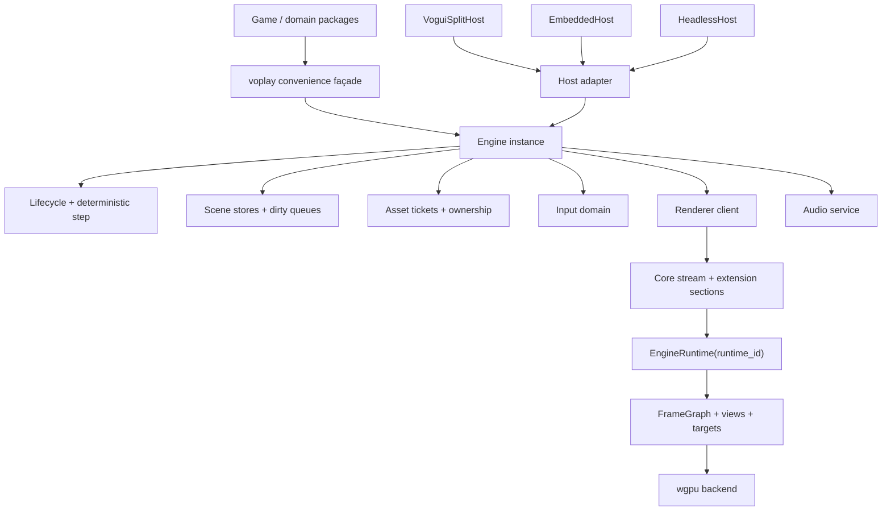

# Voplay 通用轻量多用途引擎：架构核验与演进建议

日期：2026-07-21
状态：已核验的架构评审，供后续设计和实施拆解使用

实施口径：以最终架构、完整功能和最终验收为目标。实施过程允许跨工作包并行推进、大范围重写以及暂时不可编译；旧测试和旧 CI gate 可以在迁移早期删除，架构稳定后按最终实现统一重建。

## 1. 结论摘要

Voplay 已经拥有较扎实的游戏运行时内核：Vo/Rust 分岛、严格二进制绘制协议、retained 3D scene、Primitive3D 静态 chunk、内部 FrameGraph、2D/3D 物理、资源作用域和结构化性能诊断均已落地，并且有较强的单元与合同测试保护。

当前产品形态更适合风格化 2D/3D、赛车和中小规模场景。若要正式宣称“通用、轻量、多用途”，需要优先补齐以下四类边界：

1. **可裁剪交付**：当前只有完整扩展产物，缺少 core、2D、3D、physics 等消费者可选择的构建剖面；赛车领域代码也占据 `scene3d` package 的较大比例。
2. **实例化运行时**：Rust 已有局部实例化基础，标准 `Run`、默认 extern、宿主、输入与 Vo backend 路由仍围绕单一活动实例组织。
3. **可演进能力面**：内部 FrameGraph 和 RenderTarget 基础较强，公开 API 仍缺少多视图、离屏目标、受控 shader/material/pass 扩展以及完整的导入材质语义。
4. **可运营完整性**：资源请求阻塞调用方且缺少关联 ID；真实 gamepad、IME、可恢复 Surface 错误、跨平台窗口和真实浏览器/GPU 验证尚未闭环。

建议保留 `Run(Game)` 作为零配置入口，同时增加显式 `Engine + Host + Services` 内核。场景层保留易用的 Entity façade，内部逐步迁移到组件存储、dirty queue 和 retained 2D/static chunk。渲染扩展应先采用有限挂载点和稳定 shader ABI，再考虑开放更底层的 RenderGraph 能力。

## 2. 核验范围与基线

### 2.1 版本基线

- Volang `eng/project.toml` 声明的 Voplay 权威提交为 `04c6cc0428c7611bf1ae8dd655d874732e5dc82e`。
- 本地 Voplay HEAD 为 `2950a046c04dbc5ba9a3b2d3588e30ad22c8c369`。
- 两个提交之间的变化集中在 workspace、CI、锁文件、测试和工具适配；`*.vo` 引擎实现与 `rust/src/**` 没有变化。因此实现层结论同时适用于上述两个提交。
- CI 与发布状态按本地 Voplay HEAD 核验，因为相关 workflow 在两个提交之间发生过修改。
- 权威提交的 CI 会重新构建 WASM 并与 tracked artifact 做字节比较；本地 HEAD 只在临时目录验证 source build，已经失去 tracked artifact 一致性检查。后续应恢复该门禁，或停止跟踪构建产物并统一在 tag 上生成。
- 核验开始时 Volang、Voplay 工作区均为干净状态。

权威来源：

- `volang/eng/project.toml:18-22`
- `voplay/vo.mod:1-36`
- `voplay/rust/Cargo.toml:1-66`

### 2.2 证据顺序

本评审按以下顺序判断：

1. 实现和机器可读 manifest。
2. 当前测试代码和实际测试结果。
3. 当前 CI workflow。
4. Voplay 当前架构文档。
5. Volang `lang/docs/dev-notes` 中的历史设计，仅用于解释最初产品目标。

历史设计 `lang/docs/dev-notes/2026-03-08-voplay-game-engine-design.md` 将 Voplay 定义为单模块、单 import、完整 2D 与简单 3D 的轻量引擎，并把 `vogui` 作为内部宿主。当前实现已经扩展到车辆、赛道、terrain、Primitive3D、复杂性能诊断等领域，产品范围发生了明显增长。模块边界需要随范围同步演进。

### 2.3 静态测量

| 项目 | 当前值 | 解释限制 |
| --- | ---: | --- |
| 跟踪的浏览器 WASM | 3,741,343 B | 完整、未压缩构建 |
| `gzip -9` 后 WASM | 1,445,112 B | 仅用于基线，不代表 CDN 的最终配置 |
| `Cargo.lock` package stanza | 389 | 包含可能未进入特定目标的锁定条目 |
| WASM 正常依赖树唯一 package/version | 约 219 | 使用 `wasm32-unknown-unknown + wasm-island` 口径 |
| `scene3d` Vo 代码 | 55 个文件，16,998 行 | 包含基础 3D 与领域能力 |
| 赛车命名文件 | 6,644 行，约占 39% | 统计 `track*`、`vehicle*`、`kart*`、`racing*` |

这些数字只能证明当前缺少剖面和归因。单个完整 WASM 大小无法独立证明引擎过重；后续需要 core、2D、3D、full 的可比构建以及符号级归因。

## 3. 对上一轮分析的事实修正

| 原判断方向 | 核验后的准确表述 |
| --- | --- |
| Cargo 有 389 个依赖 | `Cargo.lock` 有 389 个 package 记录；当前 WASM 正常依赖树规范化后约有 219 个唯一 package/version。锁记录不能直接等同于最终链接集合。 |
| 3.6 MB 说明体积臃肿 | 当前跟踪的完整 WASM 为 3.74 MB 未压缩、约 1.45 MB gzip。缺少各能力剖面与符号归因，现阶段只能确认“不可裁剪、不可归因”。 |
| 运行时完全依赖进程全局单例 | Vo package globals 按 island 隔离；Rust `EngineRuntime` 可实例化，物理和动画 registry 也支持多个 world。标准 Vo/FFI/Native Host 链路仍缺少端到端多实例契约。 |
| 没有 FrameGraph | 已有具备资源版本、依赖排序、环检测、生命周期和 workload 诊断的内部 FrameGraph。当前问题是固定拓扑、`pub(crate)` 可见性和单视图生产路径。 |
| 没有 RenderTarget | 内部已有 main color、depth、post color、receiver mask 等固定目标，也声明了 capture/readback 资源。缺口是公开、动态、可采样、可绑定独立视图的 RenderTarget。 |
| 2D 每帧扫描全部场景 | 2D 使用空间哈希取得视口候选。可见对象仍会每帧收集、Z 排序、编码、Rust 侧重建 DrawList 并重新上传 instance；Tilemap 缺少 retained static chunk。 |
| 透明渲染整体缺失 | Primitive3D 已有 Opaque、Cutout、Translucent 分类、透明 pass 和稳定后向前排序。普通 glTF/model 路径仍缺少 `alphaMode`、`alphaCutoff`、`doubleSided` 与正确的透明深度语义。 |
| 资源加载必然直接阻塞渲染循环 | 资源调用会同步阻塞逻辑调用方；资源服务运行在渲染岛的另一个 goroutine。若加载发生在状态回调内，lockstep worker 会等待当前帧逻辑 reply；渲染岛受影响程度仍需按资源类型实测。 |
| 游戏手柄已由输入系统支持 | Vo 层有可手动注入的 Gamepad/ActionMap/Rumble 状态；实际 wire、浏览器监听器和 Native Host API 只桥接键盘、指针和滚轮。 |

## 4. 已验证的架构基础

### 4.1 分岛与帧事务

标准路径由渲染岛掌握显示时钟：采集输入、发送 frame request、等待逻辑 reply、提交 GPU。该 lockstep 设计带来清晰的所有权、天然背压和稳定的帧诊断边界。

证据：

- `voplay/game.vo:303-359`
- `voplay/host.vo:91-127`
- `voplay/render_worker.vo:74-79, 152-209`

### 4.2 绘制协议

`draw_protocol.vo` 是 opcode 事实源；Rust `build.rs` 解析并生成 enum，同时校验重复值、宽度和头布局。解码器检查 magic、精确版本、flags、payload 长度、截断、非法 count 和未知 opcode，测试覆盖主要失败路径。

证据：

- `voplay/draw_protocol.vo:1-59`
- `voplay/rust/build.rs:6-75, 109-149`
- `voplay/rust/src/stream/reader.rs:11-43, 293-307`
- `voplay/rust/src/stream/tests.rs:30-59`

在 Vo 生产者和 Rust 消费者随同一扩展发布的当前模型下，严格版本和未知 opcode 失败有助于尽早暴露 ABI 漂移。协议可跳过扩展的需求应在第三方扩展、独立版本升级或多 profile 共用解码器出现后实施。

### 4.3 retained 3D 与 Primitive3D

3D scene 通过 snapshot 避免稳定对象重复 upsert；Rust `RenderWorld` 负责 retained mirror 和批次规划。Primitive3D 已进一步实现静态 chunk、部分更新、材质/形状表、renderer-side culling、透明分类和性能统计。

证据：

- `voplay/scene3d/draw.vo:93-158`
- `voplay/scene3d/render_sync.vo:27-60`
- `voplay/rust/src/render_world.rs`
- `voplay/rust/src/primitive_scene.rs`
- `voplay/rust/src/primitive_pipeline.rs:107-119, 482-509`

### 4.4 内部 FrameGraph 与诊断

当前 FrameGraph 已实现资源类型和版本、Pass 读写集合、依赖排序、环检测、缺失资源校验、生命周期、target backing 以及 pass workload/失败/churn 报告。性能诊断也能汇总 host、render worker、renderer pass、GPU queue 和 scene workload。

证据：

- `voplay/rust/src/renderer_frame.rs:11-61, 123-145, 396-520, 557-625`
- `voplay/rust/src/renderer_frame/resource_registry.rs:47-185`
- `voplay/perf_diagnostics.vo`
- `voplay/docs/perf-diagnostics-final-design.md`

### 4.5 资源所有权

`Assets` 和 `AssetScope` 已支持 loader 注入、作用域所有权、同资源去重和共享引用。该模型可以继续作为异步 ticket 和自动 shutdown 的上层所有权基础。

证据：

- `voplay/assets.vo:58-98, 148-189, 450-459`
- `voplay/tests/main.vo:954-1043`

## 5. 问题清单与优先级

优先级含义：

- **P0**：在正式宣称通用、轻量、多用途之前应完成。
- **P1**：完成后可显著扩大项目类型、场景规模或嵌入形态。
- **P2**：生态和高级渲染能力，可按真实项目需求推进。

| ID | 优先级 | 结论 | 主要影响 | 置信度 |
| --- | --- | --- | --- | --- |
| M1 | P0 | 缺少按能力裁剪的构建与发布剖面 | 纯 2D、卡牌、工具类项目承担完整 3D/物理/导入成本 | 高 |
| M2 | P0 | 赛车领域代码与基础 `scene3d` 同包 | 通用 API 边界持续被领域需求扩张 | 高 |
| H1 | P0 | 标准入口固定绑定 `vogui + split-island` | 无受支持的 headless、manual-step、embedded 生命周期 | 高 |
| H2 | P1 | 局部实例化能力尚未贯穿宿主/FFI/输入/backend | 多窗口、编辑器预览、并行测试隔离困难 | 高 |
| A1 | P0 | 资源 API 阻塞调用方，代理缺少 request ID、cancel、timeout | 帧停顿、并发响应串线、关闭时无限等待风险 | 高 |
| R1 | P0 | glTF 透明/双面语义与 aspect-aware culling 不完整 | 常见模型显示错误，宽屏/特殊比例可能错误裁剪 | 高 |
| I1 | P0 | Gamepad/Rumble API 没有真实宿主桥接，文本/IME 也未进入 wire | 赛车、手柄游戏、文本交互的能力声明与实际输入不一致 | 高 |
| E1 | P0 | Surface 可恢复分类在 worker 层退化为统一 panic | resize、timeout、surface 重建场景可靠性不足 | 高 |
| R2 | P1 | 内部 FrameGraph 固定拓扑、生产路径单视图 | 分屏、小地图、镜子、编辑器视图、离屏后处理受限 | 高 |
| R3 | P1 | 缺少公开且受控的 shader/material/pass 扩展面 | 新视觉能力持续修改核心协议和 renderer | 高 |
| S1 | P1 | 3D Vo 侧仍全实体扫描；2D 缺少 retained/static chunk | 静态大场景 CPU 成本随对象数增长 | 高 |
| S2 | P1 | 3D Entity 固定大结构且无 Transform hierarchy | 组合对象、组件扩展和系统调度困难 | 高 |
| U1 | P1 | Voplay 与 `vogui` overlay 的组合契约未正式定义 | 菜单、文本输入、可访问 UI 与游戏输入容易冲突 | 中高 |
| C1 | P0 | manifest 声明 Linux x64，Native surface ABI 只有 Apple surface kind | Linux 动态库可编译，仓库内缺少可见的 Linux 窗口初始化路径 | 高 |
| C2 | P1 | CI 只有 Ubuntu，缺少真实浏览器 present、macOS native surface 和 visual regression | 平台声明与可发布质量缺少证据 | 高 |
| D1 | P2 | 音频缺少 bus/effect/流式音乐/设备恢复 | 中大型游戏的混音和长音频能力有限 | 中高 |

## 6. 目标架构



核心原则：

1. `Run(Game)` 继续承担简单入口职责，内部包装 `NewEngine + VoguiSplitHost`。
2. 每个 Engine 显式拥有时钟、输入域、资源服务、Renderer endpoint、音频和 shutdown 生命周期。
3. Scene API 保持易用 façade，内部数据按组件和脏状态组织。
4. 即时绘制继续服务 HUD、debug 和小规模动态内容；静态/大规模内容使用 retained layer。
5. Core draw stream 保持严格；可选能力通过带长度 section 和 capability handshake 演进。
6. 渲染扩展先开放有限资源和挂载点，核心标准 pass 仍由引擎控制。

## 7. 详细改进方案

### 7.1 M1/M2：可裁剪交付与领域拆分

#### 已核验事实

`vo.mod` 固定依赖 `vogui`、`vopack`，只声明一个名为 `voplay` 的 extension；Rust feature 只区分 `native`、`wasm`、`wasm-island`。`wgpu`、`image`、Rapier2D、Rapier3D、`fontdue` 和 `gltf` 均为非 optional 依赖。

证据：

- `voplay/vo.mod:6-35`
- `voplay/rust/Cargo.toml:16-36`

Volang 当前 `vo.mod` schema 每个模块只持有一个 `ExtensionManifest`。因此，单纯增加 Cargo feature 只能建立内部构建剖面，无法让普通模块消费者在安装时自由选择不同扩展产物。

证据：

- `volang/lang/crates/vo-module/src/ext_manifest.rs:13-30`
- `volang/lang/crates/vo-module/src/schema/modfile.rs:50-64`

#### 建议步骤

1. **先拆源码责任**：将 `track*`、`vehicle*`、`kart*`、`racing*` 移至 `voplay/racing` package；若需要独立发布节奏，再演进为 `github.com/vo-lang/voplay-racing` 模块。
2. **建立 Rust feature**：至少增加 `render2d`、`render3d`、`physics2d`、`physics3d`、`gltf`、`audio`、`vopack`、`racing`，对应依赖改为 optional。
3. **建立内部 profile**：CI 构建 `core`、`2d`、`3d`、`full`，持续记录依赖树、冷构建时间、raw/gzip/Brotli WASM 和符号归因。
4. **确定发布策略**：
   - 短期仍发布 full extension，profile 用于识别耦合和防止体积倒退。
   - 若消费者需要真实裁剪，可以拆成多个拥有独立 extension 的模块。
   - 若希望保留一个模块名并由消费者选 profile，需要先扩展 Volang 的 extension artifact/profile 模型。

#### 验收

- `2d` profile 的依赖树不含 `gltf`、Rapier3D 和赛车后端。
- `core` profile 可在无 GPU 环境完成逻辑测试。
- 赛车 package 不再参与普通 `scene3d` package 的编译。
- 每个 profile 有 raw、gzip、Brotli 和 top-symbol 报告；预算由第一轮稳定基线确定。

### 7.2 H1/H2：Engine、Host 与实例所有权

#### 已核验事实

- `Game.Run` 只进入 split 模式。
- `useRenderIslandHost()` 固定返回 `true`。
- `runGameSplit` 固定调用 `vogui.Run`。
- 测试能够手工组装 `GameCtx`，说明核心逻辑已有一定无窗口可测性，但缺少公开生命周期构造器。
- Rust `EngineRuntime`、Renderer、物理 world 和动画 world 已具备局部实例化基础。
- 默认 extern、Native Host API、输入缓冲和同 island Vo backend 仍使用单活动实例路径。

证据：

- `voplay/game.vo:303-331`
- `voplay/host.vo:53-55, 91-127`
- `voplay/tests/main.vo:111-129`
- `voplay/rust/src/renderer_runtime.rs:22-29, 187-252`
- `voplay/rust/src/host_api.rs:34-54`
- `voplay/rust/src/input.rs:40-44`

Vo backend 全局变量按 island 隔离。同一个 island 中创建多个 Engine 时，它们仍会共享 backend。Rust registry 按 handle 保存多个 world，当前主要风险集中在 owner、锁竞争、输入域和 endpoint 贯通。

#### 建议 API

```text
NewEngine(config EngineConfig, services EngineServices) -> Engine
Engine.Start(initial State)
Engine.Step(FrameInput) -> FrameOutput
Engine.Shutdown()

Run(game Game) {
    engine := NewEngine(...)
    VoguiSplitHost.Run(engine)
}
```

`EngineServices` 至少包含：

```text
Clock
InputSource
ResourceService
RendererClient
AudioDevice
Logger / Diagnostics
```

Native extern 应携带 `runtime_id`，或为每个 Engine 建立独立 command endpoint。Host API、InputBuffer、terrain、font fallback、animation 和 audio 的生命周期都应归属某个 runtime。

#### 验收

- 公开 API 能无窗口启动、固定步进、检查绘制事务并关闭。
- 相同输入和固定时钟运行 10,000 步，状态 hash 可重复。
- 同进程创建两个 headless Engine，输入、资源 ID 和 shutdown 完全隔离。
- 后续 native 支持两个窗口；关闭其中一个后另一个继续提交帧。
- Engine shutdown 自动执行 State Exit、`OnClose`、Assets close 和 backend 释放。

### 7.3 A1：资源协议、异步状态机与生命周期

#### 已核验事实

`AssetLoader` 和 `AssetScope` API 都同步返回。跨岛代理发送请求后立即阻塞等待公共 `resResp` port；请求和响应没有关联 ID。渲染岛以独立 goroutine 处理资源服务。

证据：

- `voplay/assets.vo:13-18, 312-381, 484-504`
- `voplay/res_proxy.vo:1-21, 667-672`
- `voplay/game.vo:319-331`
- `voplay/render_worker.vo:105-110, 302-310`

同一逻辑岛若有两个 goroutine 并发请求，任一 caller 都可能从公共 response port 取到另一个请求的响应。协议同时缺少 timeout、cancel 和 port 关闭错误。

#### 第一阶段：先修相关性和关闭语义

```text
ResourceRequest {
    request_id
    runtime_id
    operation
    payload
}

ResourceResponse {
    request_id
    status
    payload
    error
}
```

逻辑岛设置唯一 response dispatcher，根据 `request_id` 唤醒 ticket。所有等待都能接收 cancelled、closed、timeout 和 backend error。

#### 第二阶段：显式资源状态机

```text
Queued -> Reading -> Decoding -> UploadQueued -> Ready
                    \-> Failed
                    \-> Cancelled
```

Vo 当前无需依赖语言级 async/await，可以先提供 ticket/poll：

```text
RequestTexture(...) -> AssetTicket[TextureID]
Ticket.State()
Ticket.Poll()
Ticket.Cancel()
Assets.Pump(uploadBudget)
```

#### 第三阶段：流式与预算

- 每帧 decode/upload 字节或任务预算。
- placeholder 资源和优先级。
- 大模型分块、避免完整 payload 多次复制。
- 开发期热重载与依赖失效传播。
- shutdown 自动取消 ticket、释放 scope 和卸载 pack。

#### 验收

- 两个 goroutine 并发加载不同资源，响应不会串线。
- 资源服务关闭或崩溃时 caller 获得明确错误，不会无限等待。
- Engine 关闭后所有 ticket 进入 terminal state。
- 大资源分阶段上传期间，frame reply wait 不超过平台基线预算。
- 现有跨 scope 去重和最终 owner 释放语义继续通过。

### 7.4 R1：先修渲染正确性

#### glTF 材质

Primitive3D 的透明路径已经成立。普通 model 的 `MeshMaterial` 未保存 glTF `alphaMode`、`alphaCutoff`、`doubleSided`、`unlit`；model draw 全部进入 opaque pass。现有模型 pipeline 虽开启 alpha blend，仍启用 depth write 和 back-face culling，也没有透明排序。

证据：

- `voplay/rust/src/model_loader.rs:428-454, 1615-1673`
- `voplay/rust/src/renderer/main_opaque_pass.rs:199-219`
- `voplay/rust/src/renderer/main_transparent_pass.rs:72-85`
- `voplay/rust/src/pipeline3d/pipeline_factory.rs:240-289`

修复应包含：

- `OPAQUE`、`MASK`、`BLEND` 分类。
- alpha cutoff 与 discard。
- transparent model depth-write off 和后向前排序。
- `doubleSided` 对应 cull mode。
- 明确 `unlit` 支持范围。

#### 3D 裁剪

Vo 侧 culling 使用与 FOV 相关的对称圆锥，没有使用 viewport aspect；Rust 投影矩阵使用真实 aspect。应统一为由 renderer 计算的 frustum planes，Vo 侧只负责 dirty object 提交。

证据：

- `voplay/scene3d/draw.vo:207-247`
- `voplay/rust/src/renderer/frame_transaction_builder.rs:262-264`
- `voplay/tests/main.vo:4114-4155`

#### 验收

- glTF fixture 覆盖 opaque、mask、blend、double-sided、unlit 组合。
- 透明模型与 opaque/primitive 相互遮挡结果正确。
- portrait、16:9、21:9 下 frustum fixture 均不误裁。
- CPU reference 和 renderer culling 对固定 fixture 得出相同结果。

### 7.5 I1：真实输入桥接

#### 已核验事实

Vo `InputState` 内含 Gamepad、ActionMap 和 Rumble 状态，也提供手动 setter。输入 wire 只定义 key、pointer、scroll 六类事件；Rust/WASM listener 与 Native Host API 没有 gamepad、text input、composition 或 rumble 输出。

已有浏览器输入基础应继续保留：WASM 使用 PointerEvent 和 active pointer ID 支持多点接触；canvas 会设置 `tabindex`、在点击后获取焦点，并过滤来自 INPUT、TEXTAREA、SELECT 和 contenteditable 的键盘事件。准确缺口集中在公开的 focus/blur、文本输入和 IME/composition wire，以及真实 gamepad/rumble 桥接。

证据：

- `voplay/input.vo:8-20, 38-95, 405-440, 488-562`
- `voplay/rust/src/input.rs:15-44, 105-147, 178-211, 227-288, 284-356`
- `voplay/rust/src/host_api.rs:24-54, 86-119`
- `voplay/tests/touch_input.vo:7-42`

#### 建议协议

- `DeviceConnected` / `DeviceDisconnected`。
- 标准化 gamepad button/axis snapshot，携带稳定 device ID。
- deadzone、轴方向和映射信息保持在 ActionMap 层。
- `RumbleRequest` 与成功/失败结果。
- `TextInput`、`CompositionStart/Update/End`、focus/blur。
- 键盘物理 key 与文本输入分开，避免 IME 被 key polling 代替。

浏览器 gamepad 适合在 display tick 轮询 `navigator.getGamepads()`，将差量合并到该帧输入 packet；原生宿主应使用平台设备事件并保持同一 wire schema。

#### 验收

- 浏览器和原生各有一个真实手柄 smoke，覆盖热插拔、button、axis 和 rumble。
- 同帧 press/release 语义在键盘和 gamepad 上一致。
- IME fixture 能输入组合文本，焦点在文本控件时不会触发游戏快捷键。
- 断开设备后 ActionMap 不保留 stuck button。

### 7.6 E1：Surface 与 Device 恢复

Surface 层已经把 Lost、Outdated、Timeout 分类为 recover/skip；worker 对任何 `submitFrame` error 都 panic。应将跨边界结果改成 typed outcome：

```text
Presented
SkipFrame
RecreateSurface
DeviceLost
Fatal(error)
```

证据：

- `voplay/rust/src/renderer/frame_surface.rs:15-46`
- `voplay/render_worker.vo:200-209`

建议：

- Timeout 返回 `SkipFrame`。
- Lost/Outdated 在 resize 后重新 configure，必要时跳过当前帧。
- zero-size surface 进入 suspended，恢复非零尺寸后继续。
- DeviceLost 重建 device、pipeline、target 和可恢复 GPU 资源；无法恢复时才进入 Fatal。
- 错误分类进入 PerfSnapshot 和 crash report。

验收应包含注入式 SurfaceError 单测、连续 resize/最小化恢复测试以及浏览器 context/device loss smoke。

### 7.7 R2/R3：多视图、RenderTarget 与受控渲染扩展

#### 当前边界

FrameGraph 类型是 `pub(crate)`，Pass 类型固定为 Depth、Shadow、Opaque、Transparent、Water、Post、Overlay、BackendSubmit，生产路径固定使用 `single_view + standard passes`。内部 TargetStore 只有固定物理槽位；Capture/Readback 已声明但没有 ready backing。公开 Texture 也没有 `RENDER_ATTACHMENT` usage。

证据：

- `voplay/rust/src/renderer_frame.rs:52-61, 269-277, 339-371, 445-520`
- `voplay/rust/src/renderer/frame_graph_plan.rs:47-63`
- `voplay/rust/src/renderer_frame/resource_registry.rs:168-184`
- `voplay/rust/src/renderer_frame/resource_registry/target_store.rs:6-87`
- `voplay/rust/src/texture.rs:213-229`

#### 第一层公开 API：视图和目标

```text
RenderTargetDesc {
    size / scale
    color_format
    depth_format
    sample_count
    sampled
    lifetime
}

RenderViewDesc {
    target
    viewport
    camera
    layer_mask
    clear
    post_profile
}
```

draw 和 retained scene draw 都应引用 `view_id`。初期允许多个 view 顺序执行；后续再优化跨视图共享和并行规划。

#### 第二层公开 API：有限扩展

- 稳定、版本化的 shader ABI 和固定 bind group 槽位。
- 预验证 vertex/fragment entry。
- `BeforeOpaque`、`AfterOpaque`、`BeforePost`、`AfterPost`、`Overlay` 等挂载点。
- Pass 显式声明资源 read/write，进入现有 FrameGraph 校验。
- Native/WASM 使用相同 WGSL 校验和诊断格式。

完整开放任意 FrameGraph 节点、任意 WGSL、compute 和底层 wgpu handle 可以延后。受控接口更容易保持轻量、安全和跨平台一致。

#### 第三层：协议扩展

Core stream 继续严格校验。可选扩展使用：

```text
extension_id
schema_version
byte_length
payload
```

启动时交换 capability。2D、3D、诊断和第三方扩展可以使用独立 section/substream。未知可选 section 可以按长度跳过，未知 core opcode 继续 fail fast。

#### 验收

- 分屏、小地图、离屏 UI preview 各有一个示例。
- 自定义 post effect 不修改 core opcode 和 renderer standard pass enum。
- FrameGraph 能拒绝未声明资源读写和环依赖。
- 同一场景可被两个 view 以不同 camera/layer mask 渲染。

### 7.8 S1/S2：场景增量化与 3D 层级

#### 已核验事实

`flushRenderScene` 每帧遍历全部 3D Entity，计算 LOD、边界、裁剪、batch key 和 snapshot。RenderSync 降低了稳定帧协议字节和 GPU mirror 更新，却仍保留 Vo 侧 O(N) 检查。现有 1000 对象测试证明第二帧 upsert 为零，没有证明第二帧跳过 1000 次检查。

2D 使用空间哈希过滤视口候选，候选仍会每帧 Z 排序和编码；Rust DrawList 再次分组并上传所有 2D instance。Tilemap 每帧编码可见 tile，没有 retained chunk/dirty tile 路径。

证据：

- `voplay/scene3d/draw.vo:93-153`
- `voplay/scene3d/render_sync.vo:27-60`
- `voplay/tests/main.vo:4088-4112`
- `voplay/scene2d/spatial.vo:149-170`
- `voplay/scene2d/draw.vo:37-115`
- `voplay/rust/src/draw_list.rs:204-273`
- `voplay/rust/src/renderer/frame_2d_upload.rs:62-81`

3D Scene/Entity 将渲染、物理、动画、音频和 `Data any` 聚合到固定结构中，缺少组件 store 和 system 注册；2D 已有 parent/children，3D 没有对应 hierarchy API。

证据：

- `voplay/scene3d/scene.vo:112-147, 162-181, 202-228`
- `voplay/scene2d/entity.vo:33-55, 62-117, 137-204`

#### 渐进方案

保留当前 Entity façade，内部拆为：

```text
EntityCore
TransformStore
RenderStore
PhysicsStore
AnimationStore
AudioStore
UserComponentStore
```

实施顺序：

1. 将公开可直接写的 render 字段迁移为 setter，或要求显式 `MarkRenderDirty`；否则 dirty queue 无法观察赋值。
2. 增加 render revision、dirty bits 和 spawn/destroy queue。
3. 静态 3D 对象进入 chunk grid、BVH 或宽松八叉树，camera motion 在 renderer 中处理可见性。
4. 增加 local/world transform、parent/children、脏传播和循环检查。
5. 增加 retained sprite layer、static tile chunk、dirty tile range 和稳定 Z bucket。
6. 即时 2D 路径继续服务 HUD、粒子和小规模动态对象。

#### 验收

- 10,000 个稳定 3D 对象的第二帧 Vo 处理量与 dirty 数相关。
- 单对象 transform/material 修改只产生目标对象的更新。
- 10,000 个静态 sprite/tile 的稳定帧不重复提交完整 instance 数据。
- hierarchy 覆盖重挂接、parent 删除、循环拒绝、物理对象约束和 world transform 精度。
- PerfSnapshot 增加 scanned、dirty、culled、encoded、uploaded 指标，防止“协议变小但 CPU 扫描仍然存在”的假优化。

### 7.9 U1/D1：UI 与音频的产品边界

Voplay 当前 UI 公共面集中在 anchor、安全区、触摸按钮和触摸摇杆；`host.vo` 固定返回单一游戏 HostWidget。`vogui` 已经是依赖，因此优先建议正式定义 overlay 组合协议：

- 游戏 canvas 与 UI overlay 的层级、尺寸、DPI 和安全区。
- pointer capture、focus、keyboard shortcut 和 IME 路由。
- overlay 可选择暂停、穿透或独占游戏输入。
- loading/error/debug overlay 的生命周期。

这样可以继续保持 Voplay 内建 HUD/触摸控件轻量，同时把表单、文本编辑、可访问性和复杂布局交给 `vogui`。

音频当前已有 one-shot、单音乐、全局 SFX/Music 音量和 3D source，并委托 `vogui` 音频引擎。后续按项目需求增加 bus、ducking/effect、流式音乐和设备断开恢复；优先级低于输入真实性、资源状态机和渲染正确性。

证据：

- `voplay/ui.vo:7-228`
- `voplay/host.vo:111-126`
- `voplay/audio.vo:17-34, 90-181`

### 7.10 C1/C2：平台、CI 与发布证据

当前 `vo.mod` 原生目标只有 `aarch64-apple-darwin` 和 `x86_64-unknown-linux-gnu`。Native surface ABI 只声明 AppKit/CoreAnimation layer kind，`create_native_renderer` 也只匹配这两类；CoreAnimation 在非 Apple 平台明确报错。仓库内没有 X11/Wayland surface kind。Linux 动态库能够编译，当前源码没有可见的 Linux 窗口 surface 初始化路径。应增加 Linux raw handle 与端到端 host 实现，或暂时收敛 manifest 的目标声明。

CI 只有 Ubuntu runner，examples 只执行 `vo check`，浏览器步骤只构建 WASM，没有真实 WebGPU present 或截图回归。Rust 测试中部分用例会在 adapter 可用时创建真实 wgpu device/pipeline；adapter 缺失时相关测试可直接返回成功，因此当前 CI 没有硬 GPU 门槛。release job 明确返回失败，等待依赖 registry release。

证据：

- `voplay/vo.mod:13-15`
- `voplay/rust/src/host_api.rs:7-21`
- `voplay/rust/src/externs/render.rs:203-255`
- `voplay/rust/src/primitive_pipeline/tests.rs:20-61`
- `voplay/rust/src/pipeline3d.rs:354-395`
- `voplay/.github/workflows/module-ci.yml:25-32, 118-189, 196-204`

建议矩阵：

| 层级 | 必需检查 |
| --- | --- |
| 每次 PR | Vo check/test、Rust fmt/test、JS check/build、WASM build、profile size report |
| Linux | headless logic、decoder、physics、offscreen pipeline 合同；声明 X11/Wayland 后增加窗口 smoke |
| macOS ARM | AppKit/CoreAnimation surface init、resize、present、输入和音频 smoke |
| Browser | Chromium WebGPU 启动、首帧 present、resize、输入、资源加载、device/surface recovery |
| Visual | 固定 fixture 的截图或离屏 checksum；覆盖 glTF alpha、shadow、post、2D/tile 和多视图 |
| Release | 干净 tag、锁定依赖、WASM/native 全产物、digest、size budget 和最小安装运行验证 |

每个 `vo.mod` declared target 都应在对应 runner 完成 Host API 安装、surface init、resize、至少三帧提交和关闭。required-GPU job 在 adapter 缺失时应失败或明确报告 unsupported，避免静默通过。full WASM 可以先按当前基线设置 raw/gzip `+2%` 回归阈值，即 3,816,170 B 与 1,474,015 B；超过阈值需要显式批准。profile 落地后再为每个 profile 建立独立预算。

当前 HEAD 还需要恢复 source-build 与 tracked WASM 的一致性检查。另一种可行策略是取消 tracked WASM，并让 release 只从同一干净 tag 生成和签名产物。

## 8. 实施策略与工作包

### 8.1 实施策略

本章中的工作包用于覆盖范围和依赖提示，不构成强制阶段或前置 Gate。实施者可以根据代码耦合、迁移成本和整体设计自由调整顺序，也可以同时重写 Vo、Rust、JS、宿主、协议和构建系统。

实施过程允许：

- 大规模移动、拆分、合并或删除代码。
- 重写未发布的内部 API、FFI、draw stream、resource protocol 和 host contract。
- 暂时保留无法编译的中间状态，待核心结构稳定后集中收口。
- 删除绑定旧架构的测试、fixture、兼容分支和 CI gate。
- 用一套新实现整体替换旧路径，避免长期维护双实现。
- 提前完成后续工作包中能够简化当前设计的部分。

实施时优先考虑：

1. 概念数量少，依赖方向清晰。
2. 每项运行时状态都有唯一 owner 和明确 shutdown 顺序。
3. 高频路径避免全量扫描、重复编码、同步往返和无意义分配。
4. 公共 API 小而完整，内部模块可以按职责充分拆分。
5. 功能闭环优先，最后统一完成兼容清理、性能打磨、测试和 CI。

迁移早期不要求维持旧测试通过。最终交付仍需满足第 10 章的验收总表，并重新建立覆盖最终架构的测试、性能、体积、平台和发布 gate。

### 8.2 工作包 A：产品边界与可裁剪交付

- 明确 `core/2d/3d/full` profile 的能力表。
- 确定赛车 package/module 边界。
- 确定单模块 extension profile 与多模块 extension 的发布方向。
- 固化 raw/gzip/Brotli、依赖树和符号归因报告。

最终应达到：每个 profile 的功能、依赖、产物和 CI owner 都有机器可读定义，实际构建能够裁剪对应依赖和产物。

### 8.3 工作包 B：正确性和生命周期

- glTF alpha/double-sided/unlit 语义。
- aspect-aware frustum。
- typed Surface outcome 和恢复。
- 让 Linux target 声明与实际 surface host 一致。
- Engine shutdown 自动清理 Assets、State 与 backend。
- 资源 request ID、dispatcher、close/timeout/error。

最终应达到：常见模型语义正确；surface timeout/resize 不终止游戏；并发资源请求、取消和 shutdown 行为稳定。

### 8.4 工作包 C：可嵌入核心与真实输入

- `Engine + Services + Host`。
- Headless/manual-step。
- runtime/input/resource endpoint 实例化。
- browser/native gamepad、rumble、text/IME/focus。
- `vogui` overlay 组合契约。

最终应达到：两个隔离 Engine 可并行运行；真实控制器与文本输入在浏览器和原生目标闭环。

### 8.5 工作包 D：规模化场景

- 3D setter/revision/dirty queue。
- renderer-side spatial culling。
- 3D hierarchy。
- retained sprite layer 与 tile chunk。
- 1k/10k steady-state 性能门禁。

最终应达到：静态场景 CPU、协议和 upload 成本均与变更量相关。

### 8.6 工作包 E：通用渲染扩展

- 公开 RenderTarget 与 RenderView。
- 多视图。
- 有限 Pass hook 与 shader ABI。
- 描述符驱动 TargetStore。
- 可选协议 section 和 capability handshake。

最终应达到：分屏、小地图和自定义 post effect 可以通过公开扩展面完成，核心标准 pass/opcode 保持稳定。

### 8.7 工作包 F：平台与生态扩展

- macOS/browser 真实渲染 CI。
- Linux surface 或目标声明收敛。
- 发布流水线恢复。
- audio bus/streaming、hot reload、asset cooker。
- 根据项目需求评估存档 snapshot、rollback/network、navigation 和编辑器能力。

## 9. 建议暂缓的事项

以下方向价值存在，当前投入会放大核心复杂度：

- 将完整 ECS 作为唯一公开编程模型。
- 直接暴露任意 wgpu handle 或完全开放 FrameGraph。
- 在基础多视图和材质扩展完成前建设通用 compute/clustered renderer。
- 在确定性 snapshot 和 headless step 完成前建设 rollback networking。
- 同时自研复杂 UI 系统和 `vogui` overlay；先完成双方契约更经济。

## 10. 最终验收总表

| 目标 | 最小可验证结果 |
| --- | --- |
| 轻量 | `2d` profile 不含 glTF、Rapier3D、赛车；CI 报告 raw/gzip/Brotli 和符号归因 |
| 通用宿主 | `Run`、Headless、Embedded 使用同一 Engine 生命周期；10,000 fixed steps 可重复 |
| 多实例 | 两个 Engine 的输入、资源、renderer 和 shutdown 无串线 |
| 资源 | 并发请求有 request ID；cancel/timeout/closed 均有 terminal result；上传有预算 |
| 渲染正确性 | glTF alpha/double-sided fixture 与多宽高比裁剪通过 |
| 场景规模 | 稳定帧 scanned/encoded/uploaded 与 dirty 数相关；2D static chunk 不全量上传 |
| 多用途渲染 | 两个 view、离屏 target、自定义 post effect 均由公开 API 完成 |
| 输入 | browser/native gamepad、rumble、IME、focus smoke 通过 |
| 恢复 | Timeout 跳帧，Lost/Outdated 重建，zero-size suspend，DeviceLost 有明确恢复或 Fatal |
| 平台质量 | 每个 declared target 有 surface smoke；Ubuntu 合同测试 + macOS native present + Chromium WebGPU present + visual fixture |
| 发布 | 干净 tag、完整 artifacts、digest、size gate、安装后 smoke |

## 11. 核验时的基线验证

本节记录评审发生时的源码基线，只证明文档中的事实建立在可工作的 Voplay 版本上。实施重构期间可以删除或替换这些测试和 gate，也允许它们暂时失败。核心架构稳定后，应围绕最终实现重建验证体系，并以第 10 章为最终完成标准。

已执行：

```text
cargo fmt --manifest-path rust/Cargo.toml -- --check
```

结果：通过。

```text
npm run check
```

结果：通过。

```text
node tools/verify_github_release.mjs --self-test
node tools/check_render_exposure.mjs --self-test
```

结果：均通过。

```text
CARGO_TARGET_DIR=/private/tmp/voplay-architecture-review-target \
  cargo test --locked --manifest-path rust/Cargo.toml --lib
```

结果：107 passed，0 failed。覆盖 stream、FrameGraph、Primitive3D、retained world、物理、材质、surface 分类与性能 packet 等内部合同。

```text
VOWORK=/Users/macm1/code/github/vo.work \
  /Users/macm1/code/github/volang/target/debug/vo check .
```

结果：通过。

```text
VOWORK=/Users/macm1/code/github/vo.work \
  /Users/macm1/code/github/volang/target/debug/vo test tests
```

结果：`ALL TESTS PASSED`。

仍需补充或未执行：

- 真实浏览器 WebGPU present 与截图回归。
- macOS AppKit/CoreAnimation surface 运行测试。
- Linux X11/Wayland surface，因为当前 Host ABI 尚未声明对应 kind。
- profile 构建、Brotli 和符号归因，因为当前尚无 profile 定义。
- 多实例、异步资源、真实 gamepad、IME、多视图和 glTF alpha fixture，因为相应能力或测试尚未落地。

## 12. 最终判断

Voplay 的内部渲染和性能工程质量已经高于一般早期轻量引擎，当前主要风险来自产品边界扩张后缺少相应的模块、实例和扩展契约。实施可以采用整体重写和交叉推进的方式，将 profile、Engine 生命周期、资源协议、输入、场景同步、多视图和渲染扩展收敛到一套简洁实现；最终再统一完成测试、性能、体积、平台和发布打磨，形成长期可维护的多用途平台。
