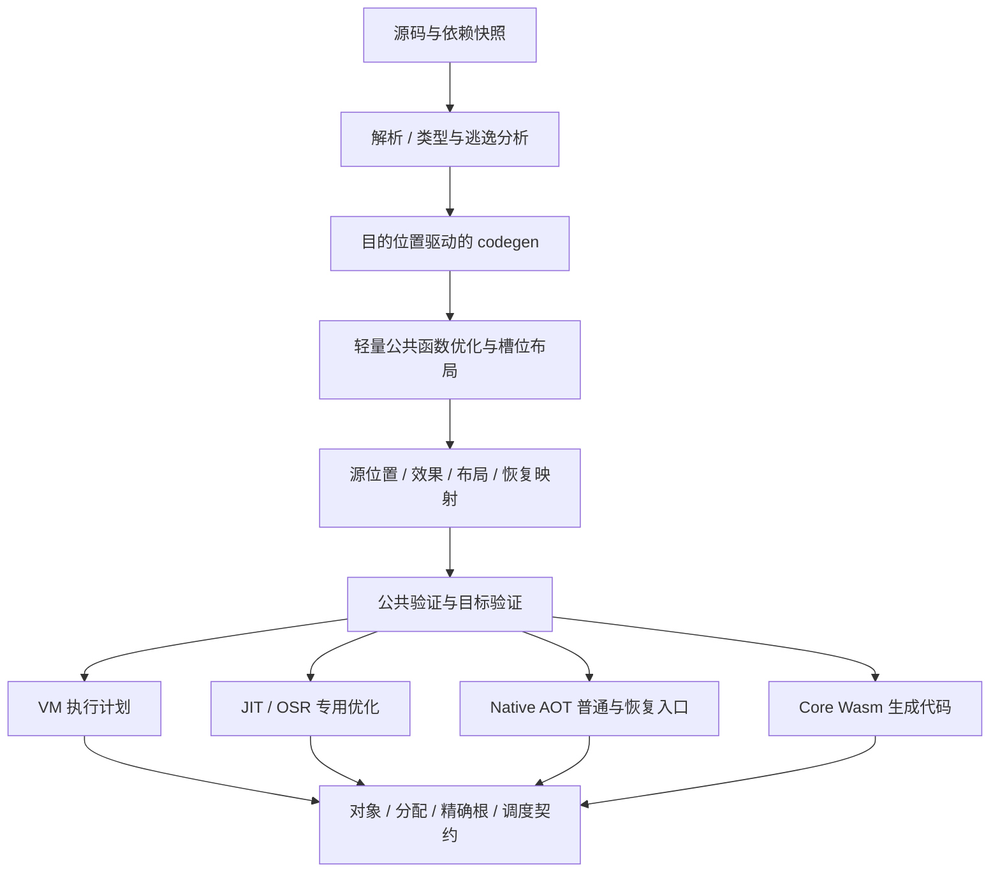

# Volang 全链路优化总计划 · 2026-09-09

## 结论与范围

本计划把前两轮架构调查、字节码反汇编、全目录 benchmark 与已经完成的修复合并去重，形成 **28 个工作包、6 个实施阶段**。范围是语言工具链：解析与分析、字节码 codegen、加载与验证、VM/no_std/Wasm VM、JIT/OSR、Native AOT、Core Wasm、对象、GC、Fiber、Island 及宿主边界。Studio/UI 产品功能不在本计划范围内。

主要收益应来自三方面：减少字节码和函数帧中的冗余，减少对象与描述符的分配，减少调用/恢复/调度/宿主边界的固定成本。共享经过验证的事实，可以让多个后端同时受益。各后端保留适合自己的执行表示。

本计划已获授权进入实施，实际进度和验收记录见[实施记录](toolchain-optimization-progress-20260909.md)。表中的优先级用于安排工作；实验对照差距不等于未来产品提速，多个差距不能相乘或相加。研究项需要先给出支持或否定方案的结果，不能默认全部进入重写。

本机本轮工作已完成，最终状态见[28 项决策](toolchain-optimization-package-decisions-20260912.md)与[最终性能报告](toolchain-final-performance-report-20260912.md)。按用户明确要求，以正确性、维护成本和主要性能收益共同决定采用范围；Core 最后的复杂探测循环实验未合入，少数场景的小幅代价明确记录。另一原生架构的实际执行仍缺环境。下文保留启动时的基线、工作包和阶段设计，未来机会不自动转成本轮待办。

## 启动时基线与证据（2026-09-09）

当前源码为 HEAD `8c9b92bfb82870d73f4854f8e289f627e9a952fd` 加现有未提交修改。最近两轮调查均未改变产品源码。已有测试与测量通过身份记录绑定到该工作树；本轮没有重新执行整套 benchmark。

| 材料 | 用途与时效 |
| --- | --- |
| [后端性能修复与验证](/Users/macm1/code/github/volang/docs/backend-performance-fixes-20260909.md) | 当前完整结果的依据：21 个负载 × 7 后端；另含 Core Wasm 热执行 |
| [全执行系统架构机会](/Users/macm1/code/github/volang/docs/backend-architecture-opportunities-20260909.md) | 392 次语言程序对照、28 次分配器实验，以及运行时架构审查 |
| [字节码 codegen 机会](/Users/macm1/code/github/volang/docs/bytecode-codegen-opportunities-20260909.md) | 实际 VOB、逐函数指令/槽位统计、VM/JIT 输出检查 |
| [早期完整 benchmark](/Users/macm1/code/github/volang/docs/backend-benchmark-report-20260909.md)、[早期根因报告](/Users/macm1/code/github/volang/docs/backend-benchmark-causes-20260909.md) | 仅用于历史对照与解释，不能把修复前的状态和 profile 当作当前状态 |

当前完整冷进程结果相对配对 HEAD 的几何平均耗时变化：VM −1.0%、JIT −0.8%、OSR −0.9%、Native AOT +7.9%、Core Wasm +78.9%。这些均值不代表每项负载相同；Core Wasm 热执行相对 HEAD 为 +117.5%。no_std/Wasm VM 缺少同口径的完整 HEAD 对照，不补造基线。

历史 Native AOT 运行库会在运行期编译 OSR；当前 Native AOT 已保持运行期函数/循环编译为零。必须同时保留“历史交付行为对照”和“当前纯静态 AOT 内部对照”两种身份。

最近的修复验证记录包含 Native AOT/Core Wasm/Wasm VM 语言用例 1,242/1,134/1,091 项，以及 JIT/VM/Core 编译器/Web 测试 240/774/20/54 项通过。后续实施发生变化后，应按受影响契约重跑，不能无限沿用这些结果。

## 已完成的事项：转为回归约束

以下内容已经存在，不重复列为新优化：

- Native AOT 静态恢复入口、按恢复 PC 的低收益退避，以及不含运行时编译器的静态运行库。
- Core Wasm 显式帧注册、帧分配/登记合并、GC 债务正确抵扣、稳定宿主句柄与视图缓存。
- Core Wasm FIFO 就绪队列、准确唤醒、取消/代际校验；此前阻塞任务的平方级轮询已修复。
- Core Wasm 可复用扫描游标、年轻对象位图与部分 span 元数据复用。
- Wasm VM/Core Wasm 的 MessageChannel 让出，以及 Wasm VM 按时间目标批量调度。
- codegen 的常量表达式折叠、自复制消除、部分自然返回位置、临时区复用、简单 ForLoop、部分静态接口调用解析。
- JIT/OSR 的 typed SSA、已有常量传播/值编号/边界检查优化、叶子内联、四路动态调用缓存、保留真实分配的标量替换。
- 公共效果与布局契约、准确 GC 根、类型化新值屏障、稳定地址 SpanHeap、共享程序镜像、编译/AOT 内容缓存、部分容器批量复制。

例如当前 Core Wasm `scheduler-spawn-peak` 热执行已由历史 HEAD 56.13 ms 降至 30.16 ms；应保持这一改善。当前 `recursive-tree` 仍有 13,572,295 次 Frame 描述符分配，`jit-slice` 仍有 500,001 次 Sequence 描述符分配，这是剩余的对象与执行状态成本。

## 证据与优先级说明

- **实测**：当前执行器上的受控耗时或工作量实验，仍需实施后的端到端验证。
- **反汇编**：当前字节码结构直接确认；指令总数包含不可达指令，不能代替运行耗时。
- **源码**：实现路径确认，尚未量化新方案的收益。
- **待测**：纳入调查与决策，当前不认定为瓶颈。
- **P0**：基线/契约基础或已经确认的严重异常成本；**P1**：第一轮重点；**P2**：已有方向但应在基础完成或专项测量后实施；**P3**：负载驱动的条件项目。

## 工作包清单

### G：测量与共享契约

| ID | 优先级 / 证据 | 工作与责任边界 | 完成判据 |
| --- | --- | --- | --- |
| G01 | P0 / 现有测量 | 将诊断程序与阶段计时纳入正式 benchmark；所有后端记录构建/产物/宿主身份。由 benchmark 目录及 `vo-dev` 维护 | 一次运行能复现规定矩阵、校验输出并保存失败、冷/热耗时、工作计数；正式计时与构建/profile 分开 |
| G02 | P0 / 源码 | 建立共享的转换结果与重映射契约：调用形状、布局、源 PC、内联来源、恢复状态、读写/别名。编译分析先留在 codegen/JIT，公共模块只承载必要的稳定事实 | 每个转换能验证其输入/输出；字节码、PC、槽位、调试位置、调用 ID 与恢复状态一起更新；同一语义有明确 owner |

### C：前端与字节码生成

| ID | 优先级 / 证据 | 优化工作 | 关键依赖与完成判据 |
| --- | --- | --- | --- |
| C01 | P0 / 反汇编 | 按类型布局复用临时区间；复用不逃逸的块局部区间，随后结合活跃区间压缩帧 | 64 组混合参数由 65 槽改为不随语句组数增长；64 个顺序块也保持有界帧宽。保留连续调用窗口、接口双槽、数组区间、goto/逃逸/返回契约 |
| C02 | P1 / 反汇编 | 按目的位置降低数组/聚合值；平铺布局直接复制；减少中间缓冲、逐元素搬运与重复初始化 | 4-int 构造/复制当前 84 指令/35 槽。先消除纯搬运冗余；直接局部构造导致的分配消除进入 R04。验证值复制、重叠、packed/flat、窄值与引用布局 |
| C03 | P1 / 反汇编 | 贯穿稳定操作数、独立快照与已检查索引证明；清理 Map key 二次复制和重复 IndexCheck | 简单 `m[k]` 的多余 key 搬运消失，单层固定数组读取保留一次必要检查或合法静态证明；嵌套 panic 和多赋值求值顺序保持一致 |
| C04 | P1 / 反汇编 | 轻量 CFG、常量/复制传播、局部重复计算消除、纯值死存储消除、不可达块与跳转整理 | 覆盖现有 10→6、11→4、10→4、7→4 指令对照；移除不可达兜底 Return。依赖 G02，优化后重新验证并压缩槽位 |
| C05 | P2 / 反汇编 | 条件上下文直接生成短路分支；switch 复用临时区间并按纯常量键的密度选择比较树/后续跳转表 | 32-case switch 当前 198 指令/67 槽；消除死跳转与逐 case 槽位增长。动态 case/fallthrough 的求值和控制流不变 |
| C06 | P1 / 反汇编 | 用循环读写/别名证明识别稳定 len 和简单上界，扩大已有 ForLoop 与边界证明的适用范围 | 对不变切片上界，两种源码写法采用同等质量循环；修改上界、调用别名、闭包及窄整数行为仍正确 |
| C07 | P1 / 实测+源码 | 按预算组合无环小型纯调用链；共享内联来源与优化后的效果，供公共字节码和后端使用 | 多层包装成本应明显收敛；维护 Caller/调试/异常的逻辑帧、代码体积与编译预算。依赖 G02/C04，不单纯扩大叶子内联阈值 |
| C08 | P2 / 反汇编 | 为 float32 提供直接运算表示，减少通过 f64 的往返 | 3 次算术当前带来 9 次转换；验证每步舍入、NaN、带符号零与位转换。新增编码必须覆盖全部消费者，不默认启用浮点重结合/FMA |
| C09 | P1 / 反汇编 | 统一整数常量发射策略，充分使用 LoadInt 的 i32 范围 | 100000 等值不再因当前 i16 限制进入常量池；覆盖符号/边界，减少池压力，无需新增 opcode |
| C10 | P2 / 源码 | 在单次编译中惰性缓存完整类型布局，减少重复遍历与 Vec 物化 | 对大数组/结构体和重复签名验证布局计算次数及编译分配下降；缓存有界、按需建立，收益由编译阶段 profile 确认 |
| C11 | P3 / 待测 | 分解输入捕获、词法/解析、导入、类型/逃逸分析、codegen、验证、缓存/加载。若变更后重复分析占主导，再设计包级增量/会话复用 | 小/中/大多包工程、缓存命中/未命中/单文件变更三类结果齐全；先给瓶颈证据再选方案。已有整次编译缓存和会话内包缓存继续复用 |

前端没有足够测量支持全盘改写 lexer/parser。C11 会覆盖它们的时间和分配；只有热点证据指向该处时，再确定扫描、AST 分配或查询缓存的具体调整。包缓存必须携带依赖身份、编译配置和源代次，并处理 TypeKey/ObjKey/ExprId 的跨会话所有权，不能直接缓存含旧 arena 索引的结果。

### R：公共对象与分配

| ID | 优先级 / 证据 | 优化工作 | 关键依赖与完成判据 |
| --- | --- | --- | --- |
| R01 | P0 / 实测 | 重设计小对象 region 的形状切换：按大小类别消费时发布精确类型，或有界多通道/高切换退避 | 262,144 个同大小对象逐个交替当前 27.467 ms，普通路径 4.741 ms，成批 region 1.538 ms。消除逐次切换的批量准备浪费，并保持单形状吞吐、准确记账与边界失效 |
| R02 | P1 / 实测+源码 | 模块/Island 生命周期内的不可变常量对象；参考 Core Wasm 静态字符串引用 | 重复字面量不再按执行次数复制字节/创建头。明确首次建立、准入、根、统计、卸载和跨 Island 规则；避免无界动态字符串驻留 |
| R03 | P1 / 实测+源码 | 紧凑字符串/切片视图；共享元素布局，将固定属性移出每个描述符 | 当前 Rust SliceData 为 80 字节；保留完整切片几何与值语义，量化每对象字节、缓存流量、GC 扫描及端到端收益。Rust/Core Wasm 的物理布局可不同，语义要一致 |
| R04 | P1 / 契约设计+实测机会 | 明确实现描述符、字面量及语言对象的内存可观察性；据此实现合法的不逃逸聚合/视图局部表示和边界物化 | 先形成跨后端规则和反例，再决定哪些分配可以消除。当前标量替换仍保留真实分配，不能静默跳过 GC/OOM/统计。依赖 G02/C04；为 C02/R02/R03 的相关步骤提供前提 |
| R05 | P1 / 源码 | 把已有类型化批量复制扩展到 append 扩容迁移，复用布局相容性判断与有界工作区 | 增长负载减少逐元素 helper/临时 Vec；保持增长策略、重叠、packed/flat、新对象发布、含引用写入和失败顺序 |
| R06 | P2 / 源码 | Map 紧凑控制区、成组探测、类型专用 hash/equality；合法时复用查找后更新的探测结果 | 先测 int/string/interface、负载率、删除/扩容、命中/未命中分布。新布局通过活跃迭代器、转发、NaN/零、GC 与宽值验证后才替换 |

append 的诊断分配流量为 48,000,112 字节，对照预设长度写入为 4,000,112 字节；重复字面量为 28,800,000 字节，对照复用为 144 字节。两组都改变了分配行为，只能作为设计机会的证据。R03 的紧凑布局与 R04 的分配消除应分别计量，避免把效果混在一起。

### X：执行后端与宿主边界

| ID | 优先级 / 证据 | 优化工作 | 关键依赖与完成判据 |
| --- | --- | --- | --- |
| X01 | P2 / 源码 | VM 消费已验证的调用/布局执行计划；缩小重复检查范围；在必要操作处服务 GC；有限指令融合 | 先测调用、算术、容器分别承担的 dispatch/check 成本，再扩展计划；保留动态守卫、预算、原始 PC 和恢复语义。覆盖 no_std/Wasm VM/JIT 解释阶段 |
| X02 | P2 / 源码 | JIT 将稳定调用目标/对象形状反馈用于带守卫的内联与专用操作；按实际工作、退出率与编译成本选择层级/区域 | 动态目标分布改变能正确回退；编译、代码页、分析、根图预算均有界。分别报告函数优化、OSR 和恢复区域，不能只看入口次数 |
| X03 | P1 / 当前 benchmark+源码 | 优化 Native AOT 静态恢复体：以各恢复点的真实 live-in 建立可优化区域，缩小无收益的多入口状态 | 当前普通入口已优化，恢复体为 baseline；不能使用首次入口才成立的事实。call-dispatch/jit-call 等恢复后计算收敛，阻塞负载保持退避，运行时编译始终为 0；同时观察静态代码大小 |
| X04 | P1 / 当前工作量+源码 | 分开 GC 根记录、逻辑调用信息与持久挂起状态；研究条件根的准确 shadow 表示，缩小整帧物化范围 | Core Wasm 普通分配调用减少持久 Frame；Native 条件根路径严格按更新后的契约收集。递归、接口、内指针、栈增长、panic/defer、预算耗尽与真实挂起均能恢复 |
| X05 | P1 / 当前工作量+源码 | Core Wasm 在生成代码内执行受准入约束的分配/帧等快速操作，按容量/预算边界进入宿主；减少重复归属查询和细粒度调用 | 当前 binary-trees 仍有 31,319,099 次内存宿主调用，recursive-tree 为 27,633,137 次。减少每对象固定跨界成本；宿主保留容量/所有权/错误控制，位图与精确统计仍是单一权威 |

X04 和 X05 相互补充：减少不必要的帧数量，同时降低仍然必须存在的帧和对象的成本。保留现有分批 GC 和年轻对象索引，不启动独立的全量 GC 重写。C07 也必须保留逻辑调用信息，避免每个后端各自发明一套内联栈。

### S：GC、调度与 Island

| ID | 优先级 / 证据 | 优化工作 | 关键依赖与完成判据 |
| --- | --- | --- | --- |
| S01 | P2 / 源码，长尾待测 | 测量整轮根扫描导致的 guest 停顿；必要时采用按 Fiber/帧版本扫描与根更新屏障，使执行和扫描更细地交错 | 大根集/深栈/多 Fiber 下 p95/p99 停顿改善；每步有界之外还证明总进展、新根不漏扫和版本安全。普通负载无明确问题时不强加屏障成本 |
| S02 | P2 / 源码，阶段耗时待测 | 同 Island 已匹配收发的有预算直接交接、短任务批处理；结合 X04 研究必要帧/任务存储复用 | channel/select/短 Fiber 的完整调度回合减少；保留 FIFO、公平性、取消、宿主进展、GC 服务及等待登记代际 |
| S03 | P3 / 源码，代表负载待测 | Island 的独立堆所有权与执行线程资源分开：大量短命/空闲 Island 适用时引入有界工作线程 | 少量 CPU 密集、大量短命和大量空闲三组负载均测；每 Island 单执行者、线程亲和、TLS/FFI、阻塞调用、回调及取消有完整规则 |
| S04 | P2 / 源码 | 对重复跨 Island 消息形状保留有界编码计划/工作区，扩展已有标量批量传输 | 减少每次打包重建布局与遍历临时状态；保持目标堆独立所有权、图引用关系、失败清理与传输预算 |

## 共同架构：把证明放在共享边界，把热路径留给执行者

G02 首先约定转换接口和映射，再按具体优化实现需要增加事实。不会为所有冷函数提前构建完整 SSA。`vo-common-core` 继续负责轻量公共契约；编译器的复杂分析不进入 compiler-free AOT runtime。

代码整洁度与冗余通过以下具体边界改善：

- 一个整数常量发射策略；一个已求值操作数/数组值的降低契约，减少调用、赋值、返回、索引各自重复判断。
- 一个 PC/槽位/元数据重映射出口；布局、效果、恢复信息由明确 owner 生成，消费者进行针对性验证。
- 字符串、切片、数组的语义与物理表示分开；公共布局事实可共享，Rust 与 Core Wasm 的发码和内存实现继续独立。
- 原生普通入口、OSR 和静态恢复入口共享分析规则，但各自显式声明入口条件。内部 API 使用具体的入口计划，避免可选字段组合产生含糊状态。
- 调度的 ready/wait/host 状态、生命周期与取消规则清楚；热路径复用已验证身份，避免反复反推对象种类。
- 新的缓存、通道、工作区都有 owner、失效时机与容量。不能用无限保留中间对象换取表面上的速度。

## 六阶段实施路线

| 阶段 | 工作包 | 交付与阶段出口 |
| --- | --- | --- |
| 0：冻结口径与契约 | G01；G02 的接口约定；R04 的语义问题清单 | 保存当前完整工作树/新增文件/产物身份；将诊断盲区纳入 catalog；确定重映射、对象/内存可观察性与测量字段。此阶段只建立实施所需的最小基础 |
| 1：消除直接冗余 | C01、C02 的纯搬运部分、C03、C09、R01、R05 | 修复类型切换病态开销、帧持续增宽、重复搬运/检查和常量编码。每个小改动独立验收，并保持已有快速路径性能 |
| 2：公共优化与恢复代码 | 完成 G02；C04、C05、C06、C07、C10、X03 | 建立可验证的函数级整理与帧布局，穿透小函数包装；在真实恢复 live-in 上优化 AOT 恢复区域。验证机器码覆盖、编译成本、体积与全部恢复边界 |
| 3：对象与执行状态架构 | R04、R02、R03、C02 的合法局部构造、X04、X05 | 先定可执行的内存规则，再处理常量、紧凑视图、根/挂起帧和 Core Wasm 快速操作。每次 ABI/布局改变按生产者与消费者同步交付 |
| 4：针对已定位负载的专用优化 | X01、X02、R06、C08、S02、S04 | 根据前面阶段的新 profile 选择执行计划、反馈、Map、f32、调度及传输优化；无显著收益的方案保留测量结论并停止扩张 |
| 5：条件性扩展与总体验收 | C11、S01、S03；全链路复核 | 给前端增量、GC 长尾与 Island 执行资源形成实施或不实施的明确结论；完成目标设备和真实宿主验证，更新全目录报告 |

阶段 0 开始就可以采集 C11/S01/S03 的数据，避免直到最后才发现重要负载。阶段表按实施依赖排序，测量结果可以提高项目优先级。R01 与 codegen 修复可以独立推进；正式计时仍串行、与构建隔离。

第一轮具体变更顺序建议：**测试/身份固定 → C09/C03 → C01 → C02 纯复制 → R01 → R05 → C04/G02 → C06/C07 → X03**。R04/X04/X05 的设计在此期间准备，避免第一轮先做一个随后被对象/恢复架构推翻的局部特例。

## 性能验收与新增负载

现有 21 项目录保留，并将以下负载组加入受治理的 benchmark，而非长期放在被忽略的诊断目录：

| 负载组 | 必须区分的情况 | 对应工作包 |
| --- | --- | --- |
| 生成质量 | 混合临时类型、顺序作用域、分支合流、长表达式、密集/稀疏 switch、数组值/引用布局 | C01–C06、C09 |
| 抽象与入口 | 1/多层包装、递归、宽参数/返回、接口目标分布；初始化调用/GC/等待后继续计算 | C07、X02–X04 |
| 对象与分配 | 同/异大小同/异类型交替、不同批量；字面量；预留容量 append 与真实扩容；短命/长命视图 | R01–R05、X05 |
| Map 与数值 | 整数/字符串/接口 key、命中率/删除/迭代/扩容、f32 舍入与位语义 | R06、C08 |
| 调度与根 | 多 Fiber/深栈/大宿主根、短通道任务、select、取消、宿主 timer/fetch、不同存活期 Island | S01–S03、X04 |
| 传输 | 相同/变化消息形状、宽聚合、嵌套引用图、小/大消息、失败路径 | S04 |
| 编译与加载 | 单文件/多包/大聚合/重复签名；冷编译、命中缓存、单文件变更；VOB 验证与 Web 初始化分阶段 | G01、C10、C11 |

正式报告至少分开记录：

1. **冷启动**：进程、输入捕获/编译/验证/加载/初始化以及首轮执行。
2. **热执行**：机器码编译完成后的执行；Core Wasm 保留现有“模块复用但新建实例”口径，并单独分解初始化和执行。适合持续运行的负载可增加同实例热循环测量，不把新建实例称为纯热执行。
3. **工作量**：字节码数、local_slots、对象/分配字节、宿主调用、VM/原生移交、JIT 编译与退出、GC 扫描、调度/让出次数。
4. **资源**：VOB/机器码/恢复代码大小、编译耗时与峰值、managed committed/live、宿主元数据、整个进程 RSS。不同口径不混用。
5. **响应性**：guest 停顿、宿主取得进展、取消、调度延迟的分位数与最坏样本；尾延迟测试需要足够事件数，不能从五个总耗时样本推算 p99。

先校准同机噪声，正式采样使用交替/平衡顺序、预热及足够重复次数，保留单次记录。5% 可作回退初筛，最终判断结合重复测量和区间；不将平均值的小幅变化直接认定为收益。不能用扩大 GC/调度预算、关闭准确检查、改动工作负载或删除慢项来达标。

每阶段先用计数确认预期的冗余工作消失，再跑受影响后端的针对性测量，阶段出口跑完整 7 后端目录。Node 与真实浏览器分开验收，至少在现有 arm64 与受支持的另一原生架构执行相关生成代码测试；性能数字只归属实际测量设备。

## 正确性、兼容与完成定义

- 公共字节码变化覆盖编码、元数据、序列化、验证、VM/JIT/OSR/Native AOT/Core Wasm；Wasm VM 使用其真实宿主路径。
- 每次转换保留求值顺序、异常与返回行为、准确根、类型化屏障、单 Island 独立稳定堆、增量 GC 有界进展，以及 sticky OOM 后不再执行后续 guest 效果。
- ABI/对象布局变化同步更新格式/缓存版本、静态运行库、SDK/FFI、Web 宿主、规范和受治理的生成文档。Native AOT 运行库保持不含运行时编译器。
- 先运行 owning crate 与有意义的反例，再覆盖相关语言/后端矩阵；生成机器码的测试记录真实入口，不用解释回退代替覆盖。
- 每个工作包的记录包括：问题与证据、改变了什么工作量、语义/资源边界、源码身份、测试、前后采样、体积/内存/长尾代价、是否保留。
- 工作包以“实现并通过验收”或“实验否定收益/适用性，附明确理由不实施”关闭。仅有草图、单个好看的样本或尚未验证的猜测不能标为完成。

目标是证明所选负载上的架构改进，并控制其他负载的回退；当前证据支持若干很大的局部空间，尚不能承诺所有应用统一提高某个倍数，也不能预先宣称全局最优。

## 本轮额外核对的源码入口

除了两份机会报告中的逐项源码引用，本轮还核对了：

- [Native AOT 恢复体仍使用 baseline 计划](/Users/macm1/code/github/volang/lang/crates/vo-jit/src/aot.rs:335)、[多入口恢复约束](/Users/macm1/code/github/volang/lang/crates/vo-jit/src/func_compiler.rs:143)。
- [Core Wasm 分配仍调用宿主](/Users/macm1/code/github/volang/lang/crates/vo-wasm-aot/src/codegen/heap.rs:4)。
- [编译内容缓存与输入快照](/Users/macm1/code/github/volang/lang/crates/vo-engine/src/compile/cache.rs:97)、[分析会话与包缓存](/Users/macm1/code/github/volang/lang/crates/vo-analysis/src/project.rs:328)。
- [当前 benchmark 自动化](/Users/macm1/code/github/volang/cmd/vo-dev/src/dev_bench.rs)、[benchmark catalog](/Users/macm1/code/github/volang/benchmarks/manifest.toml)、[测试目标与矩阵](/Users/macm1/code/github/volang/eng/tests.toml)。
